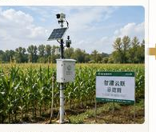
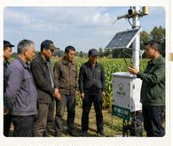
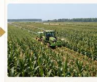
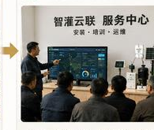
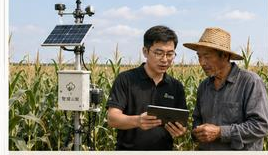
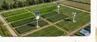
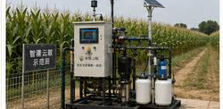
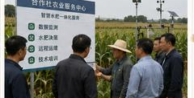
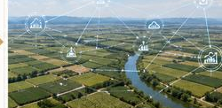

# zhiguan_yunlian_beautify_20260830_170518

- Source: `zhiguan_yunlian_beautify_20260830_170518.pptx`
- Total slides: 5

## Slide 1

PART 01 · 推广路径

市场推广路径

从示范田切入，逐步复制到合作社与规模农场

01

02

03

04

示范田验证

合作社复制

区域农场推广

服务网络拓展

小范围示范，验证效果与收益

与合作社合作，批量复制推广

向周边大户与规模农场推广

建设服务网络，提供持续支持

先示范

再复制

后扩张

推广不是一次卖出，而是靠口碑和效果持续扩散

## Slide 2

PART 02 · 应用场景

应用场景

围绕玉米生产全过程，覆盖田间管理与远程运维

规模农场管理

精准灌溉

降本增产

过程可控

远程监控运维

合作社示范田

远程看控

异常预警

运维高效

节水增效

方案可复制

带动增收

看得见

管得住

用得起

从设备落地到数据回流，形成真正可用的应用场景

## Slide 3

PART 03 · 核心团队

核心团队

机械 + 自动化 + 通信 + AI，构成跨学科协同团队

机械研发

嵌入式控制

AI算法

通信与物联

市场调研

跨学科

能研发

懂田间

一个能把想法做成设备的团队，才有资格谈落地

## Slide 4

PART 04 · 导师与资源

导师与资源

高校导师、实验平台与试验田资源，共同支撑项目成长

导师阵容

资源支撑

黑龙江大学

农艺指导

节水灌溉

实验平台

工程实现

项目管理

合作社

试验田

项目不是单兵作战，而是建立在持续资源支撑之上

## Slide 5

PART 05 · 发展规划

发展规划

以示范验证为起点，逐步走向区域复制与规模推广

2026

2027

2028

示范验证

区域复制

规模推广

落地示范基地，验证效果与模式

拓展合作伙伴，复制服务模式

实现规模化推广，服务更多农田

200亩示范

区域复制

持续迭代

让每一亩玉米田，都能用得上、用得好智能水肥决策
