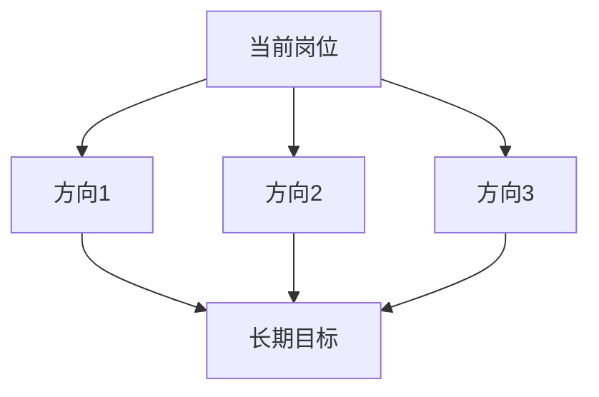

# 📋 工作SOP与业务线整理 Skill

> 将入职后的工作内容整理为结构化的 SOP 文档、业务线全景图和跳槽方向分析。

---

## 📂 文件结构

```
工作SOP与业务线整理/
├── SKILL.md                    ← 主指令（当前文件）
├── references/
│   └── 知识库参考路径.md        ← 知识库中可参考的文件索引
├── scripts/
│   └── generate_excel.py       ← Excel 表格生成脚本
└── templates/
    ├── sop_template.md         ← SOP 文档模板
    ├── business_template.md    ← 业务线文档模板
    └── career_template.md      ← 跳槽方向分析模板
```

---

## 📌 默认工作目录

该 skill 的所有操作（新建、读取、编辑、更新）默认针对以下目录中的文件：

> **`总结好的大纲以及笔记/实习就业/创业黑马——数智科技部门/`**
>
> （对应绝对路径：`F:\积昌的知识库 - 副本\总结好的大纲以及笔记\实习就业\创业黑马——数智科技部门\`）

### 默认路径规则

| 情况 | 行为 |
|------|------|
| 用户**未指明**具体文件路径 | 默认在该目录下搜索对应的 `.md` 文件和 `.xlsx` 表格进行编辑 |
| 用户**明确说"新建"** 或 **"新文件"** | 在该目录下创建新文件 |
| 用户**指明了**其他路径或文件名 | 按用户指定的路径操作 |

> ⚠️ **例外**：跳槽方向分析文档的默认路径为该目录下的 `跳槽/` 子目录。

---

## 🎯 功能概述

该 skill 用于帮助用户（已入职**创业黑马——数智科技部门**，新媒体运营/内容运营岗）整理日常工作中的内容，输出四种文档类型：

| 类型 | 内容 | 格式 | 存储路径（相对于知识库根目录） |
|------|------|------|-----------------------------|
| **A. 工作流程 SOP** | 每项任务的标准化操作流程 | `.md` + `.xlsx` | `总结好的大纲以及笔记/实习就业/创业黑马——数智科技部门/SOP/` |
| **B. 工作流程 Excel 表格** | SOP 的表格化展示 | `.xlsx` | 同上（与 SOP 同目录） |
| **C. 业务线及公司业务详情** | 当前业务线如何运转、公司业务架构 | `.md` + `.xlsx` | `总结好的大纲以及笔记/实习就业/创业黑马——数智科技部门/业务线/` |
| **D. 跳槽方向分析** | 实习后可跳槽的行业/岗位分析 | `.md` | `总结好的大纲以及笔记/实习就业/创业黑马——数智科技部门/跳槽/` |

---

## ⚙️ 核心工作流

### Step 0：前置提问（如有疑问）

在用户提供的信息不完整或不清晰时，**必须先询问以下问题**，得到答案后再继续：

**关于 SOP：**
1. 这个任务的名称是什么？
2. 具体的操作步骤有哪些？每一步怎么做？
3. 每个步骤的负责人是谁？
4. 每个步骤完成后需要向谁汇报？
5. 需要用到什么工具或平台？
6. 这个流程大概需要多长时间？
7. 有什么注意事项或需要避免的坑？

**关于业务线：**
1. 这条业务线的名称是什么？
2. 它在公司整体业务中的定位是什么？
3. 业务从起点到终点的完整流程是什么？
4. 涉及哪些部门或人员？
5. 使用了哪些关键资源和工具？

> ⚠️ **重要：在完全理解之前，不要自行猜测整理内容。提问清楚再动手。**

---

### Step 1：根据需求类型确定任务

根据用户需求，判断属于以下哪种类型：

| 用户说 | 执行任务 |
|--------|---------|
| "整理SOP" / "总结工作流程" / "帮我做流程文档" | 执行 **SOP 整理流程** |
| "总结业务线" / "业务详情" / "公司业务怎么运转" | 执行 **业务线整理流程** |
| "跳槽方向" / "跳槽分析" / "之后能去哪" | 执行 **跳槽方向分析流程** |
| "更新SOP" / "流程变了" / "更新文档" | 执行 **更新流程** |
| 发送内部文档 / 工作手册 / 培训资料 | 执行 **内部文档整合流程** |

---

### Step 2：第一次整理

根据用户提供的内容，进行第一遍完整整理，**但暂不保存到知识库**。

整理时遵循以下原则：
1. **流程图式展示**：先用 Mermaid 画出流程图，再用文字详细说明每一步
2. **步骤清晰**：每个步骤独立成段，包含"做什么、怎么做、用什么工具、谁负责、向谁汇报"
3. **保留案例**：用户提供的任何案例、示例都必须完整保留
4. **不做猜测**：遇到不确定的内容，用 `> [!QUESTION]` 标注并向用户确认

---

### Step 3：调用 /会议笔记整理 skill 进行二次整理

以第一遍整理的资料为输入内容，调用 **/会议笔记整理** skill 进行二次整理，确保格式规范、结构清晰、层级分明。

---

### Step 4：写入文件

将整理后的内容写入对应的存储路径。

#### 4.1 创建目录（如不存在）

```bash
mkdir -p "{{知识库根目录}}/{{对应路径}}"
```

#### 4.2 写入 Markdown 文档

使用 Write 工具写入 `.md` 文件。

> 📌 **默认路径**：如用户未指定文件路径，按以下规则存放：
> - SOP 文档 → `.../创业黑马——数智科技部门/SOP/`
> - 业务线文档 → `.../创业黑马——数智科技部门/业务线/`
> - 跳槽分析 → `.../创业黑马——数智科技部门/跳槽/`
>
> 具体路径参见末尾的 [[#📂 存储路径速查|存储路径速查]] 表。

#### 4.3 生成 Excel 表格

使用 `scripts/generate_excel.py` 脚本生成对应的 `.xlsx` 文件。

```bash
python3 "{{skill目录}}/scripts/generate_excel.py" \
  --type sop \
  --output "{{目标路径}}/{{文件名}}.xlsx" \
  --data '{{JSON格式的表格数据}}'
```

如果生成失败，需在 Markdown 文档中保留完整表格，并提示用户。

---

### Step 5：建立双向链接

1. **SOP 文档** → 添加指向业务线文档的链接
2. **业务线文档** → 添加指向 SOP 文档和相关笔记的链接
3. **跳槽分析文档** → 添加指向知识库「实习就业」相关内容的链接
4. **在相关笔记中追加反向链接** → 指向新创建的文档

---

### Step 6：更新流程（精准编辑，不覆盖全文）

> ⚠️ **核心理念**：更新文档时，**禁止使用 Write 工具覆盖整个文件**。必须使用 **Edit 工具**进行精准的局部修改，最小化 Token 消耗。

当用户说"更新SOP"或发送新的工作文档时，按以下步骤操作：

#### 6.1 确定目标文件并读取

先确定要修改的文件：
- **用户指定了文件名或路径** → 直接读取该文件
- **用户未指定具体文件** → 在默认工作目录（`创业黑马——数智科技部门/`）下搜索匹配的 `.md` 文件。通过 Grep 工具或 Glob 工具查找与更新内容相关的文件

读取原 SOP/业务线文档，完整理解文档结构和已有内容。对于较长的文档，先定位到需要修改的具体区域。

#### 6.2 判断修改类型

| 场景 | 操作方式 | 说明 |
|------|---------|------|
| **新增内容**（补充步骤、添加注意事项等） | 使用 **Edit 工具**在对应位置插入 | 找到目标章节末尾，在已有内容后插入新内容 |
| **修正错误**（步骤描述有误、数据更新等） | 使用 **Edit 工具**替换错误内容 | 找到错误片段，将其替换为正确内容 |
| **新增章节**（全新的步骤集、业务环节等） | 使用 **Edit 工具**在适当位置插入新章节 | 在文档末尾或对应父章节下插入 |

#### 6.3 执行编辑的规范

1. **定位精准**：通过读取原文档（或文档的特定区域），找到要修改的精确位置（章节标题、段落开头/结尾等）
2. **Edit 工具操作**：使用 `Edit` 工具的 `old_string` 和 `new_string` 参数完成局部修改：
   - **新增内容**：`old_string` 设为目标位置的末尾原文，`new_string` 设为"末尾原文 + 要新增的内容"。例如，在"## 三、详细步骤"末尾添加新步骤时，`old_string` 设为该章节最后一个步骤的全文，`new_string` 设为该步骤原文 + 新增步骤。
   - **修正错误**：`old_string` 为错误内容，`new_string` 为正确内容，直接精准替换。
3. **分批操作**：如有多个位置的修改需求，分多次 Edit 调用完成，每次只改一个位置。
4. **唯一性检查**：使用 Edit 工具时，确保 `old_string` 在文档中是唯一的。如果可能匹配到多个位置，增加前后文以唯一确定修改点。
5. **仅在文档结构需彻底重组时才使用 Write**：如果文档从"无章节"结构改为"多章节"结构等根本性调整时，才考虑使用 Write 工具覆盖全文，并在修改后说明原因。

#### 6.4 更新 Excel 表格

使用 `scripts/generate_excel.py` 脚本更新或重新生成对应的 `.xlsx` 文件。

#### 6.5 更新 frontmatter

使用 Edit 工具更新文档 frontmatter 中的 `updated` 日期字段：
```yaml
updated: {{YYYY-MM-DD}}
```

---

### Step 7：引用知识库内容

在整理业务线文档时，**必须参考**以下知识库文件：
- `总结好的大纲以及笔记/浪尖训练营/实习训练营/课程里面的其他东西/JD深度剖析/创业黑马的新媒体运营岗位剖析.md`
- `总结好的大纲以及笔记/浪尖训练营/实习训练营/课程里面的其他东西/数据平台的使用/新媒体运营数据分析平台全景指南.md`
- `总结好的大纲以及笔记/实习就业/创业黑马——数智科技部门/账号数据分析/数据分析.md`

在整理跳槽分析文档时，**必须搜索**知识库中 `总结好的大纲以及笔记/浪尖训练营/实习训练营/` 目录下的相关内容进行综合分析。

---

## 📝 各类文档格式规范

### A. SOP 文档格式

```
---
title: "{{任务名称}} SOP"
date: {{YYYY-MM-DD}}
tags:
  - 笔记整理
  - SOP
  - 工作流程
  - {{岗位}}
updated: {{YYYY-MM-DD}}
---

# 📋 {{任务名称}} 标准操作流程

> [!INFO] 📌 流程概览
> - **任务名称**：{{任务名称}}
> - **所属业务线**：{{业务线名称}}
> - **更新日期**：{{YYYY-MM-DD}}
> - **负责人**：{{负责人}}
> - **向谁汇报**：{{汇报对象}}

## 📑 目录

1. [[#一、流程概述]]
2. [[#二、流程图]]
3. [[#三、详细步骤]]
4. [[#四、注意事项]]
5. [[#五、相关文档]]

---

## 一、流程概述

{{用2-3句话描述这个流程的目的和整体逻辑}}

## 二、流程图

```mermaid
graph TD
    A[开始] --> B[Step 1: {{步骤1名称}}]
    B --> C[Step 2: {{步骤2名称}}]
    C --> D{判断条件?}
    D -->|是| E[Step 3: {{步骤3名称}}]
    D -->|否| F[Step 4: {{步骤4名称}}]
    E --> G[结束]
    F --> G
```

## 三、详细步骤

### Step 1：{{步骤1名称}}

- **具体操作**：{{怎么做}}
- **所需工具/平台**：{{工具名}}
- **预计耗时**：{{时间}}
- **负责人**：{{谁做}}
- **向谁汇报**：{{向谁汇报}}

> [!TIP] 💡 操作要点
> {{关键技巧或注意事项}}

### Step 2：{{步骤2名称}}

...

## 四、注意事项

- {{注意点1}}
- {{注意点2}}

## 五、相关文档

- [[{{相关SOP文档路径}}]] — {{说明}}
- [[{{业务线文档路径}}]] — {{说明}}

## 🔗 相关笔记

- [[{{相关知识库链接}}]]
```

#### Excel 表格列定义

| 步骤序号 | 步骤名称 | 具体操作方法 | 所需工具/平台 | 注意事项 | 预计耗时 | 负责人 | 向谁汇报 |
|---------|---------|------------|-------------|---------|---------|-------|---------|
| Step 1 | ... | ... | ... | ... | ... | ... | ... |

表头格式：加粗、浅蓝色背景（RGB: 200, 220, 240）

---

### B. 业务线文档格式

```
---
title: "{{业务线名称}}业务详情"
date: {{YYYY-MM-DD}}
tags:
  - 笔记整理
  - 业务线
  - {{岗位}}
  - 公司业务
updated: {{YYYY-MM-DD}}
---

# 🏢 {{业务线名称}}业务全景

> [!INFO] 📌 业务概览
> - **所属公司**：创业黑马科技集团股份有限公司
> - **业务线名称**：{{业务线名称}}
> - **更新日期**：{{YYYY-MM-DD}}

## 一、业务定位

{{该业务线在公司中的定位和作用}}

## 二、业务流程全貌


## 三、各环节详解

### 3.1 {{环节1名称}}

- **职责**：{{做什么}}
- **涉及人员**：{{谁参与}}
- **输入**：{{需要什么}}
- **输出**：{{产出什么}}
- **向谁汇报**：{{汇报对象}}

### 3.2 {{环节2名称}}

...

## 四、关键资源与工具

| 资源/工具 | 用途 | 访问方式 |
|----------|------|---------|
| {{工具名}} | {{用途}} | {{链接或路径}} |

## 五、公司整体业务架构

{{描述该业务线在公司整体业务中的位置，与其他业务线的协作关系}}

## 六、关联文档

- 📄 详见 [[{{相关SOP文档路径}}]] — 具体操作流程
- 📄 详见 [[{{相关业务文档路径}}]] — 补充资料

## 🔗 相关笔记

- [[创业黑马的新媒体运营岗位剖析]] — 岗位深度分析
- [[{{相关知识库链接}}]]
```

#### 业务线 Excel 列定义

| 环节序号 | 环节名称 | 职责描述 | 涉及人员 | 输入资源 | 输出成果 | 所需工具 | 注意事项 | 向谁汇报 |
|---------|---------|---------|---------|---------|---------|---------|---------|---------|

---

### C. 跳槽方向分析文档格式

```
---
title: "实习后跳槽方向分析"
date: {{YYYY-MM-DD}}
tags:
  - 笔记整理
  - 跳槽分析
  - 职业发展
  - {{岗位}}
created: {{YYYY-MM-DD}}
---

# 🚀 实习后跳槽方向分析

> [!INFO] 📌 文档说明
> 基于知识库「实习就业」相关内容及当前岗位经验，分析实习后可选择的跳槽方向。

## 一、当前岗位能力拆解

| 能力维度 | 具体能力 | 可迁移性 | 对应岗位 |
|---------|---------|---------|---------|
| {{能力1}} | {{详情}} | ⭐⭐⭐ | {{目标岗位}} |

## 二、可跳槽方向

### 方向1：{{岗位名称}}

- **适合公司类型**：{{公司类型}}
- **薪资范围参考**：{{薪资}}
- **能力匹配度**：{{匹配度}}
- **需要补充的能力**：{{差距}}

### 方向2：{{岗位名称}}

...

## 三、跳槽路径规划



## 四、关键建议

- {{建议1}}
- {{建议2}}

## 🔗 相关笔记

- [[{{相关知识库链接}}]]
```

---

## 📎 关联附件与超链接

当用户提供内部文档、工作手册、培训资料等文件时：

1. **读取文件内容** → 理解核心要点
2. **提取关键信息** → 补充到对应的 SOP 或业务线文档中
3. **创建超链接** → 使用 `[[文件名.pdf#page=页码]]` 或 `[[文件名.md]]` 格式
4. **形成双向链接** → 在相关文档中互相引用

---

## 🧩 边界情况处理

| 情况 | 处理方式 |
|------|---------|
| 用户信息不完整 | **先询问清楚再开始整理**，不自行猜测 |
| 用户发送内部文档/手册 | 读取文档内容，提取关键信息补充到对应文档中，并创建超链接 |
| 用户未指定存储位置 | 按默认路径（SOP/业务线/跳槽）存储 |
| 首次创建 | 按完整流程：第一次整理 → /会议笔记整理 → 写入文件 |
| 更新内容 | 读取原文件 → 判断新增/修正类型 → 使用 **Edit 工具**精准修改（禁止覆盖全文） → 同步更新 Excel |
| 用户未指定具体文件（更新时） | 在默认工作目录 `创业黑马——数智科技部门/` 下通过 Grep/Glob 搜索与更新内容匹配的 `.md` 文件，确认后编辑 |
| Excel 生成失败 | 在 Markdown 文档中保留完整表格，提示用户手动执行脚本 |
| 找不到对应知识库内容 | 跳过引用，在文档中注明"待补充" |
| 涉及多个任务流程 | 分别创建独立的 SOP 文档，在文档间建立链接 |

---

## 📂 存储路径速查

知识库根目录：`F:\积昌的知识库 - 副本`

### 默认工作目录（未指定路径时自动使用）

**`总结好的大纲以及笔记/实习就业/创业黑马——数智科技部门/`**

### 各类型文档存放路径

| 文档类型 | 相对路径（相对于知识库根目录） |
|---------|-----------------------------|
| ⭐ **默认工作目录**（SOP、业务线文档、Excel 等） | `总结好的大纲以及笔记/实习就业/创业黑马——数智科技部门/` |
| SOP 文档 + Excel | `.../创业黑马——数智科技部门/SOP/` |
| 业务线文档 + Excel | `.../创业黑马——数智科技部门/业务线/` |
| 跳槽方向分析 | `.../创业黑马——数智科技部门/跳槽/` |
