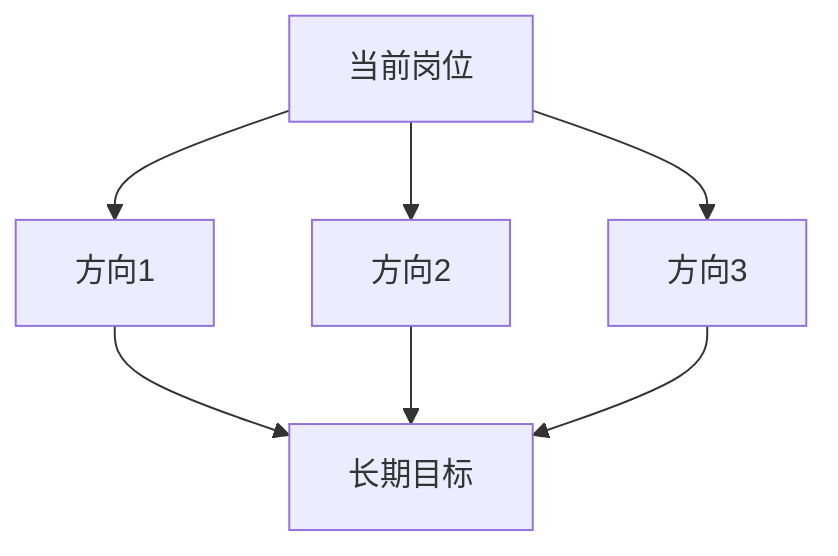

# 🚀 实习后跳槽方向分析

> [!INFO] 📌 文档说明
> 基于知识库「实习就业」相关内容及当前岗位经验，分析实习后可选择的跳槽方向。

## 一、当前岗位能力拆解

| 能力维度 | 具体能力 | 可迁移性 | 对应岗位 |
|---------|---------|---------|---------|
| {{能力1}} | {{详情}} | ⭐⭐⭐ | {{目标岗位}} |
| {{能力2}} | {{详情}} | ⭐⭐ | {{目标岗位}} |

## 二、可跳槽方向

### 方向1：{{岗位名称}}

- **适合公司类型**：{{公司类型}}
- **薪资范围参考**：{{薪资}}
- **能力匹配度**：{{匹配度}}
- **需要补充的能力**：{{差距}}

### 方向2：{{岗位名称}}

- **适合公司类型**：{{公司类型}}
- **薪资范围参考**：{{薪资}}
- **能力匹配度**：{{匹配度}}
- **需要补充的能力**：{{差距}}

### 方向3：{{岗位名称}}

- **适合公司类型**：{{公司类型}}
- **薪资范围参考**：{{薪资}}
- **能力匹配度**：{{匹配度}}
- **需要补充的能力**：{{差距}}

## 三、跳槽路径规划

## 四、关键建议

- {{建议1}}
- {{建议2}}

## 🔗 相关笔记

- [[{{相关知识库链接}}]]
