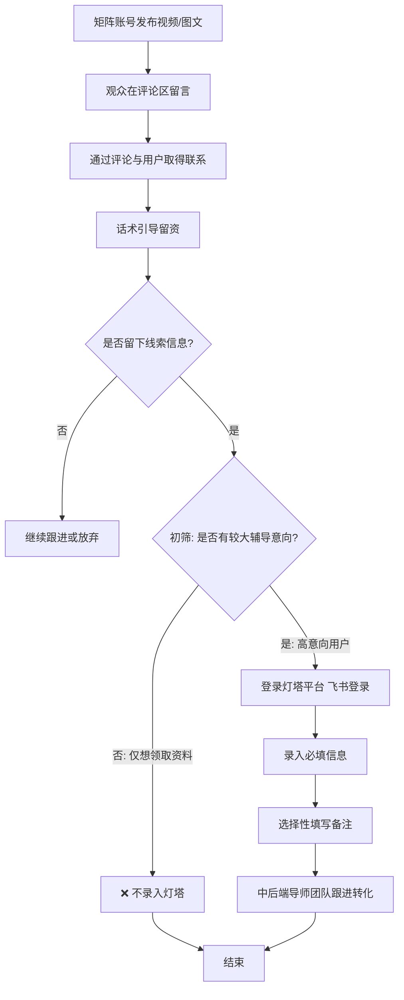

# 📋 灯塔平台线索录入标准操作流程

> [!INFO] 📌 流程概览
> - **任务名称**：线索筛选与灯塔平台录入
> - **所属公司**：创业黑马科技集团股份有限公司
> - **所属业务线**：图灵学术（科研/论文辅导方向）
> - **平台链接**：[灯塔平台](https://dengta.tulingxueshu.com/)（**仅支持飞书登录**）
> - **负责人**：运营人员（本人）
> - **向谁汇报**：韩玲（mentor）
> - **更新日期**：2026-08-04

## 📑 目录

1. [[#一、流程概述]]
2. [[#二、流程图]]
3. [[#三、详细步骤]]
4. [[#四、注意事项（红线）]]
5. [[#五、相关文档]]

---

## 一、流程概述

本流程是[[总结好的大纲以及笔记/实习就业/创业黑马——数智科技部门/业务线/科研论文辅导方向业务全景.md|图灵学术]]业务线**上游引流获客**的关键环节：矩阵账号（搞科研的华哥、华哥聊论文、发论文的华哥、科研华哥）发布视频/图文后，观众在评论区留言，运营人员通过评论与用户取得联系，用话术引导观众留下**线索信息**（想发表的论文区位、当前研究方向、目前研几、微信号或手机号）；对线索进行**初筛**，只将**有较大辅导意向**的用户录入创业黑马官方平台 **「灯塔」**，由中后端导师团队跟进私域转化。

📌 **核心原则**：宁可少录，不可滥录——只有真实需要论文/科研辅导的意向用户才录入灯塔，单纯领取资料的"白嫖"用户一律不录。

## 二、流程图

## 三、详细步骤

### 🔍 Step 1：评论区识别意向用户

- **具体操作**：巡查矩阵账号视频/图文评论区，识别留下评论的观众（评论互动、扣关键词领资料、提问、私信咨询等）
- **所需工具/平台**：抖音（4 个矩阵账号，运营全流程见 [[总结好的大纲以及笔记/实习就业/创业黑马——数智科技部门/SOP/矩阵账号日常运营SOP.md|矩阵账号日常运营SOP]]）
- **预计耗时**：视评论量而定（日常约每小时巡查 1 次）
- **负责人**：运营人员
- **向谁汇报**：无需汇报

> 💡 **操作要点**：视频结尾"发资料"钩子会引来大量领资料观众，评论区数量多**不等于**意向用户多，需结合留言内容初步判断意向。

### 🔍 Step 2：通过评论与用户取得联系

- **具体操作**：通过私信或评论互动，与留言用户取得联系
- **所需工具/平台**：抖音（私信/评论功能）
- **预计耗时**：视情况而定
- **负责人**：运营人员
- **向谁汇报**：无需汇报

> [!WARNING] ⚠️ 抖音监管规避（红线）
> - ❌ 禁止在评论区/私信直接说"微信"——会触发平台监管，导致信息屏蔽或账号限流
> - ✅ 将"微信"说成 **"卫星"** 或 **"\/"**，可绕过监管关键词过滤
> - ✅ 可将用户引导至**抖音粉丝群**，群内放置企业微信二维码，让粉丝扫码进入私域
> - ⏱ 陌生人私信回复有 **50 条上限**（一段时间内），超限后信息发不出去；应对：① 切换多个矩阵账号轮换回复 ② 分段间隔回复

### 🔍 Step 3：话术引导留资

- **具体操作**：使用私信话术引导观众留下以下 **4 项线索信息**：
  1. **想发表的论文区位**：一区、二区、三区等
  2. **当前研究方向**：具体研究方向/专业领域
  3. **目前的研几**：研一/研二/研三等年级阶段
  4. **微信号或手机号**：用于后续添加联系
- **所需工具/平台**：抖音私信（话术模板见 [[总结好的大纲以及笔记/实习就业/创业黑马——数智科技部门/SOP/矩阵账号日常运营SOP.md|矩阵账号日常运营SOP]] 发布后运营章节）
- **预计耗时**：视情况而定
- **负责人**：运营人员
- **向谁汇报**：无需汇报

> 💡 **操作要点**：话术中提到的课题名称需根据当前发布的脚本内容变化（如"网安相关的课题资料"），不可固定不变。

### 🔍 Step 4：线索初筛（关键环节）

- **具体操作**：对收集到的线索逐一筛选，判断用户是否**有较大辅导意向**
- **筛选标准**：
  - ✅ **录入灯塔**：真实需要论文/科研辅导、有较大意向的用户
  - ❌ **不录入**：单纯想领取资料（"白嫖"）的用户
- **所需工具/平台**：无（人工判断）
- **预计耗时**：视线索量而定
- **负责人**：运营人员
- **向谁汇报**：无需汇报

> [!CAUTION] 🔴 部门明确要求
> 视频结尾"发资料"钩子会吸引**大部分观众**来领资料，但能记录进灯塔的用户必须确保**已有很大的辅导意向**。若单纯将领取资料的人员录入灯塔，销售团队很难转化——既浪费时间，也浪费销售团队的精力。

### 🔍 Step 5：登录灯塔平台

- **具体操作**：在浏览器中打开灯塔平台，使用飞书账号登录
- **平台链接**：https://dengta.tulingxueshu.com/
- **登录方式**：**仅支持飞书登录**（飞书扫码/授权登录，无其他登录方式）
- **所需工具/平台**：灯塔平台（网页端）+ 飞书
- **预计耗时**：约 1-2 分钟
- **负责人**：运营人员
- **向谁汇报**：无需汇报

### 🔍 Step 6：录入线索信息

在灯塔平台中录入以下线索信息：

| 字段 | 必填 | 内容说明 |
|------|:---:|---------|
| **联系方式** | ✅ 必填 | 手机号或微信号（**二选一**） |
| **微信昵称** | ✅ 必填 | 防止销售团队添加时加错到其他人 |
| **专业方向与研几** | ✅ 必填 | 便于添加用户后有话题可聊，开门见山直接说明来意，避免尬聊 |
| **备注** | ❌ 选填 | 记录学员当前遇到的问题或其他论文相关内容，方便销售团队使用**针对性话术**转化 |

- **所需工具/平台**：灯塔平台
- **预计耗时**：约 2-5 分钟/条
- **负责人**：运营人员
- **向谁汇报**：无需汇报

> [!WARNING] 🔴 线索合格线
> **三大必填信息缺一不可：微信号/手机号、微信昵称、专业方向**——只要缺失任一项，这条线索就是**不合格**的。

### 🔍 Step 7：中后端跟进转化

- **具体操作**：录入完成后，中后端导师/销售团队根据灯塔平台记录继续跟进意向用户
- **岗位边界**：本岗位工作到"录入灯塔"为止，后续私域转化（论文辅导/科研辅导成交）由其他小组负责
- **所需工具/平台**：灯塔平台（供销售团队查看）
- **负责人**：中后端导师团队
- **向谁汇报**：韩玲（mentor）

> 💡 **岗位定位**：本岗位处于[[总结好的大纲以及笔记/实习就业/创业黑马——数智科技部门/业务线/科研论文辅导方向业务全景.md|图灵学术]]业务流程的**上游引流环节**，核心职责是获客与初步筛选，深度转化由中后端负责。

---

## 四、注意事项（红线）

1. 🔴 **仅支持飞书登录**：灯塔平台（https://dengta.tulingxueshu.com/）目前只能通过飞书账号登录，没有其他登录方式
2. 🔴 **只录高意向用户**：能记录进灯塔的用户必须确保已有**很大的辅导意向**；单纯领取资料（"白嫖"）的用户不录入，否则销售团队难以转化，浪费时间与精力
3. 🔴 **三大必填信息缺一不可**：**微信号/手机号、微信昵称、专业方向**——缺失任何一项，线索不合格
4. ✅ **微信昵称必填原因**：防止销售团队添加时加错到其他人
5. ✅ **专业方向与研几必填原因**：便于添加用户后有话题可聊，可直接开门见山说明来意，而不是尬聊
6. 💡 **备注（选填）价值**：记录学员当前处于什么问题或其他论文相关内容，方便销售团队使用针对性话术转化
7. ⚠️ **抖音监管规避**：在抖音公共区域（评论区、私信）禁止直接提及"微信"，使用 **"卫星"** 或 **"\/"** 替代；私信回复注意 50 条上限，多账号轮换/分段回复
8. 📌 **岗位边界**：本岗位职责到"录入灯塔"为止，后续转化由中后端导师团队负责

---

## 五、相关文档

- [[总结好的大纲以及笔记/实习就业/创业黑马——数智科技部门/SOP/矩阵账号日常运营SOP.md|矩阵账号日常运营SOP]] — 上游内容运营全流程（评论区运营、私信话术、内部客单转化登记）
- [[总结好的大纲以及笔记/实习就业/创业黑马——数智科技部门/业务线/科研论文辅导方向业务全景.md|科研论文辅导方向业务全景]] — 图灵学术业务全景（含中后端导师团队介绍）

## 🔗 相关笔记

- [[总结好的大纲以及笔记/实习就业/创业黑马——数智科技部门/SOP/矩阵账号日常运营SOP.md|矩阵账号日常运营SOP]] — 上游引流与线索来源
- [[总结好的大纲以及笔记/实习就业/创业黑马——数智科技部门/业务线/科研论文辅导方向业务全景.md|科研论文辅导方向业务全景]] — 业务线全景
- 📅 **工作日报**（本 SOP 的每日执行记录）：[[2026-07-27 日报]] · [[2026-07-28 日报]] · [[2026-07-29 日报]] · [[2026-07-30 日报]] · [[2026-08-03 日报]] · [[2026-08-04 日报]] · [[2026-08-05 日报]]
