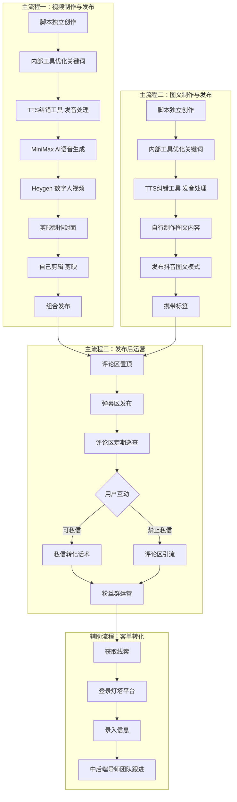

> [!summary] 概要
> 本文档是图灵学术矩阵账号「华哥系列」的**日常运营标准操作流程（SOP）**。核心定位：本岗位处于业务线上游引流获客阶段，从脚本创作到内容制作再到发布运营**全流程独立完成**。文档涵盖三大主流程（视频制作与发布、图文制作与发布、发布后运营）、辅助流程（内部客单转化登记）、每日工作量基准、工具平台速查、21 条注意事项与办公环境使用指南。**最新变化**：2026-07-30 升级全流程独立运作；2026-08-04 脚本查重与去同质化红线、视频结构表单规范、矩阵账号方向规划；2026-08-06 选题不脱题红线；2026-08-20 私信话术分类逻辑更新（垂直急需/刚需两类打法）+ 特殊情况处理（信任建立但不愿留联系方式→同步韩玲，勿追问）+ 粉丝群运营重构（新成员进群/定期重复发送）+ 粉丝群人满扩容方案（新建群聊/200人小群可扩500人中群/1K大群难达成）+ 脚本创作理念迭代（答案不唯一/爆款有骨架/AI同质化需人工修改/模仿一周内爆款/脚本8分剪辑2分）。

## 📑 索引

- 🏗️ [[#一、整体流程架构]] — 岗位定位、最新变化与全流程架构图
- 🎬 [[#二、主流程一：视频制作与发布]] — 脚本创作 → 工具优化 → TTS 纠错 → AI 语音 → 数字人 → 剪辑 → 发布
- 🖼️ [[#三、主流程二：图文制作与发布]] — 图文脚本创作、内容制作与发布
- 📣 [[#四、主流程三：发布后运营]] — 评论区置顶、弹幕、巡查、私域转化、粉丝群运营
- 📝 [[#五、辅助流程：内部客单转化登记]] — 线索获取与灯塔平台录入
- 📊 [[#六、每日工作量基准]] — 视频 4 条 / 图文 6 篇 / 脚本 10 条 / 4 账号
- 🧰 [[#七、工具与平台速查]] — 工具与平台速查表
- ⚠️ [[#八、注意事项]] — 20 条注意事项（含抖音监管规避、脚本查重红线、选题不脱题红线）
- 🖥️ [[#九、日常办公环境与基础工具使用]] — 飞书使用指南与钉钉说明

---

# 📋 矩阵账号日常运营标准操作流程

> [!INFO] 📌 流程概览
> - **所属公司**：创业黑马科技集团股份有限公司
> - **所属业务线**：图灵学术（科研/论文辅导方向）
> - **产品形态**：论文辅导、科研辅导（通过私域转化盈利）
> - **创始人**：雷勤
> - **运营账号**：搞科研的华哥、华哥聊论文、发论文的华哥、科研华哥（4个矩阵号）
> - **所属地区**：北京（总部）/ 湖南（分公司）
> - **汇报对象**：韩玲（mentor）
> - **更新日期**：2026-08-04

---

## 一、整体流程架构

> 📌 **核心定位**：本岗位处于**图灵学术**业务线的**上游引流获客阶段**，从脚本创作到内容制作再到发布运营全流程独立完成，通过矩阵账号的内容运营获取意向用户，将线索录入内部系统后由中后端导师团队通过**私域转化**完成论文/科研辅导的成交。
>
> 📌 **最新变化（2026-07-30）**：工作模式已从"接收 mentor 脚本→执行发布"升级为**全流程独立运作**，包括自主脚本创作、视频/图文制作与发布一条龙，以及发布后运营全由自己完成。
>
> 📌 **最新变化（2026-08-04）**：
> 1. **脚本查重与去同质化**：上周五一条 1万+ 播放的视频被官方以"内容重复"贴标签限流，自本周起脚本创作必须**先查重再动笔**，杜绝与历史脚本、竞品脚本的高度重合（4 个矩阵号月初统一生成，同质化风险最高），防止被抖音平台打上抄袭标记；
> 2. **视频结构表单规范**：mt 发布《短视频内容结构+钩子结构表》，脚本创作严格遵循「黄金三秒开头钩子 → 中间七步信息点 → 结尾钩子引导」结构（详见 [[#🔍 Step 1：脚本独立创作|Step 1]]）；
> 3. **矩阵账号方向规划**：mt 开会确定矩阵账号长期发展方向——账号调整（名字/简介/置顶/清理）、四条内容线配比（40/25/20/15）、三阶段执行节奏，详见《受众报告》与《三人小分队云文档纲要》。

---

## 二、主流程一：视频制作与发布

### 🔍 Step 1：脚本独立创作

> 📌 **工作模式升级**：当前阶段已从"接收 mentor 脚本→执行发布"升级为**完全独立创作**，从选题到脚本撰写全部自行完成。
>
> 📌 **最新变化（2026-08-04）**：mt 开会确定矩阵账号长期方向规划（见《受众报告》：账号调整清单/四条内容线/执行节奏），并发布《短视频内容结构+钩子结构表》规范脚本结构；同时因上周五 1万+ 播放视频被官方贴"内容重复"标签限流，脚本创作必须**先查重再动笔**，杜绝与往期脚本、竞品脚本的同质化。

- **具体操作**：
  1. **创作前查重**：对照「已覆盖主题清单」与历史脚本库（[[总结好的大纲以及笔记/实习就业/工作文件/脚本&推文撰写/脚本资料库/创作好的脚本/]] 按日期归档）确认选题未与往期脚本重复；再对照竞品爆款库（《三人小分队云文档纲要》：鱼哥不水科研、近期爆款）确认不与近期爆款内容高度重合
  2. 根据**科研/论文辅导方向**自行确定选题（热点论文话题、科研方法分享、学术干货等）
  3. 按四条内容线配比（技术痛点 40% / 方向判断 25% / 案例故事 20% / 筛选劝退 15%）确认本条脚本归属的内容线，选题对齐《受众报告》爆款选题库（技术卡点类/方向选择类/学术策略类 12 条）
  4. 独立撰写脚本内容，严格遵循**视频结构表单规范**（黄金三秒开头钩子 → 中间七步信息点 → 结尾钩子引导），详见下方「脚本结构规范」
  5. 脚本完成后在飞书上提交给 mentor **韩玲**审核确认
  6. 根据 mentor 反馈修改定稿
  7. **创作后登记**：将新选题登记到「已覆盖主题清单」，作为后续创作的查重基线，避免重复选题
- **选题来源建议**（⚠️ 所有选题必须与论文/科研相关，不得脱题）：
  - 当前科研热点（AI、大模型、计算机视觉等方向的前沿论文）
  - 学术写作常见问题（选题技巧、投稿流程、审稿回复等）
  - 论文辅导成功案例（客户故事、逆袭经历等）
  - 学术干货分享（工具推荐、科研方法、时间管理等）
- **脚本结构规范（2026-08-04 表单版，来源：《短视频内容结构+钩子结构表.xlsx》）**：
  - **黄金三秒开头钩子**：参考「爆款短视频开头前 5 秒钩子模板」**10 类钩子**任选其一开篇，前 3-5 秒内必须抓住注意力——好奇/悬念类、痛点/需求类、价值承诺/利益输送类、逆向/反转类、挑战/极限类、借势/热点类、数据/数字类、盘点/列表类、代入/场景类、互动/提问类
  - **中间信息点**：按「短视频内容结构」**七步结构**推进——① 抓人眼球（抓人肯定/否定/反问）→ ② 呈现结果（塑造1）→ ③ 制造反差（划分割线）→ ④ 塑造价值（塑造2）→ ⑤ 给出指导（划分割线）→ ⑥ 举例佐证（三点式干货：首先…然后…最关键的是）→ ⑦ 临门一脚（启发行动：信息启发/观点启发/行动启发）
  - **结尾钩子**：三条钩子类型按需选用——**内容钩子**（拉留存）、**资料钩子**（评论区扣关键词进资料粉，如扣"进阶/秘籍"领资料）、**咨询钩子**（私信咨询进精准咨询粉，含 9 种话术模板：诊断导向型、方案导向型、解惑导向型、规划导向型、"对症下药"型、"时间VS机会成本"型、"1v1拆解"型、"目标差距评估"型、"导师价值预告"型）
- **脚本创作理念迭代（2026-08-20，重要 ⚠️ 先读这段）**：
  - 🔑 **脚本创作答案不唯一，但爆款有共同骨架**。多种多样的脚本都可以火，但能火的脚本基本都有下面这些结构——这些结构就是**爆款脚本的骨架**，可以在这个骨架基础上**添加血肉**，让内容更饱满、更有自己的味道。
  - ⚠️ **给 AI 创作的最大问题：同质化**。这块内容可以给 AI，但后果是每个脚本同质化非常严重——用不同的大模型给出的脚本几乎都千篇一律，不管用多少字提示词都无法避免。这可能是骨架的问题，又或者是相关附件资料（如上级领导之前给的结构表）的问题。但不可否认：当前这个爆款脚本结构**还是不够好、还是可以优化**——可以继续和韩玲沟通，一起**优化迭代这个脚本的结构**。
  - ⚠️ **AI 表达缺少"七情六欲"**。AI 的表达不像人一样有七情六欲，所以把爆款骨架丢给 AI 创作时，会出现**同质化严重**、表达上各个脚本基本都一样的问题，这个无法避免——这也是为什么一直强调：**利用 AI 创作脚本时的注意点和注意事项，一定要守住**。
  - ✅ **结构固定，表达自主**。脚本结构确实有一套固定套路，用这个套路的确能一直创作出爆款脚本；但**表达方式需要你自己来定**——可以让 AI 先创作一版，然后自己慢慢改。**千万不要把 AI 创作的内容直接用于生产，必须经过修改**，否则"AI 味"会非常严重。
  - ✅ **推荐做法：模仿 / 抄爆款**——跟练字一样，大家一开始都是模仿别人的字，模仿多了自己的字形也就出来了。把别人的爆款脚本整理出来，**扔给 AI 洗稿**，再拿来使用。
  - ⚠️ **时效性**：视频创作讲究**时效性**，不同时间段的爆款不同。要抄就抄**一周内的爆款**；超过一周的，看看就行。
  - 📌 **目前不推荐**再按下面表单版固定结构写脚本（下面的结构模板**看看即可、作为参考**），可继续与韩玲沟通，一起迭代升级脚本的内容创作。
  - 🔥 **脚本 8 分、剪辑 2 分**：好的脚本能让一个"白板视频"都成为爆款；但好的剪辑哪怕剪得再吸引眼球也成不了爆款。务必在脚本上下功夫——**剪辑用 2 分心思，脚本一定要用 8 分！**
- **查重与去同质化红线（2026-08-04）**：
  - ⚠️ 上周五一条视频播放 1万+ 后**被抖音官方以"内容重复"贴标签限流**——高播放不保险，内容原创性是硬指标
  - 4 个矩阵号脚本在**月初统一生成**，同质化风险最高：同一选题不得在多个账号用相近结构、相近话术重复发布；同一内容线内部及各内容线之间选题互不重复
  - 与往期脚本（创作好的脚本/ 目录按日期归档）重复的选题必须更换切入角度或放弃
  - 查重参照：已覆盖主题清单（创作基线）+ 自有脚本库（朱柏达/谢积昌脚本）+ 竞品爆款库（鱼哥不水科研、近期爆款-3人小组）
- **选题不脱题红线（2026-08-06 mt 明确要求）**：**无论大选题还是小选题，内容都必须与论文、科研相关，一律不得脱题**——大选题为流量型（比较泛，里面什么都谈）、小选题为干货型，但都不能偏离"论文、科研"主题；曾有稿件内容主体变成"验证导师口头承诺 / 防导师画饼"被判定严重脱题。快速判断口诀：话题泛可以，方向不能偏。完整规则与脱题反例/正例见 [[总结好的大纲以及笔记/实习就业/创业黑马——数智科技部门/业务线/选题不脱题规则与案例.md|选题不脱题规则与案例]]
- **矩阵账号方向规划（2026-08-04，mt 开会确定）**：账号长期发展按《受众报告》执行——
  - **账号调整清单**：账号名带方向标签（用户一眼知道方向）、简介写明服务边界（不接本科毕设/不接急单，私信说明"方向+学历+卡点"）、置顶三件套（人设+筛选+信任）、清理泛流量旧内容
  - **内容策略**：精准用户 > 泛观众，判定内容好坏标准为**私信质量 > 播放量**
  - **执行节奏**：第 1-2 周清旧立新（四条线各拍 1 条 + 投 DOU+）→ 第 3-4 周测出爆款方向 → 第 5 周起稳定获客（每周 3-4 条，目标每月 30-50 精准微信、3-5 单）
- **所需工具**：飞书（与 mentor 沟通审核）、《受众报告》、《三人小分队云文档纲要》、《短视频内容结构+钩子结构表.xlsx》
- **预计耗时**：约 20-40 分钟/条（视脚本长度和难度而定）
- **负责人**：运营人员
- **向谁汇报**：mentor 韩玲（审核脚本）

> 💡 **关键要点**：脚本不仅是视频的文案基础，后续的评论区关键词、私信话术中的课题名称也都需要从脚本中提取。脚本创作时要**提前规划好**哪些关键词可用于评论区置顶、哪些钩子可用于结尾引导。

---

### 🔍 Step 2：内部优化工具优化脚本

- **具体操作**：
  1. 将**自行创作的脚本逐字稿**粘贴到内部优化工具的指定区域
  2. 点击"修改"按钮，工具自动一键优化关键词语
  3. 复制修改后的内容
- **所需工具**：部门自研网页工具
- **预计耗时**：约 2-5 分钟/条
- **负责人**：运营人员
- **向谁汇报**：此步骤无需汇报

> 💡 **注意**：AI 自动润色功能目前还不需要使用，仅使用关键词优化功能即可。

---

### 🔍 Step 3：TTS 纠错工具 — 发音预处理

> 📌 **新增工具**（2026-07-30）：本工具由 mentor 韩玲提供，用于预处理脚本文字，确保 MiniMax AI 语音合成时不会读错专业术语。

- **具体操作**：
  1. 在浏览器中打开 `lark-resources/数字人口播脚本发音处理.html`（或将该 HTML 文件保存在浏览器收藏夹中）
  2. 将优化后的脚本内容粘贴到工具的文本输入框中
  3. 工具会自动应用预设的纠错规则（如 "C刊" → "C 刊"、"SSCI" → "S S C I" 等），将容易读错的词汇转换为 TTS 能正确朗读的格式
  4. 点击"处理文本"按钮，查看处理结果
  5. 点击"复制结果"，将处理后的文本复制到剪贴板
  6. 将处理后的文本用于下一步的 MiniMax 语音生成
- **工具功能说明**：
  - **纠错词典管理**：可自行添加/删除/导入/导出纠错规则，所有规则自动保存在浏览器本地
  - **默认纠错规则**：C刊→C 刊、SSCI→S S C I、SCI→S C I、EI→E I、中稿→众稿、行当→航当、角色→决色、重创→重窗、处分→触分、校对→叫对、都督→督都
  - **自定义规则**：如发现其他容易被 TTS 读错的词汇，可自行添加规则
- **所需工具**：TTS纠错工具（本地 HTML 文件，`lark-resources/数字人口播脚本发音处理.html`）
- **预计耗时**：约 1-3 分钟/条
- **负责人**：运营人员
- **向谁汇报**：此步骤无需汇报

> 💡 **使用要点**：该工具的核心价值在于修正 AI 语音对**专业术语**的误读。学术论文脚本中常常出现 "C刊"、"SCI"、"SSCI" 等缩写，MiniMax 直接朗读时容易读成字母组合而不是正确发音，TTS工具通过替换规则让 AI 语音朗读更自然。

---

### 🔍 Step 4：MiniMax AI 语音生成

- **具体操作**：
  1. 打开 MiniMax 平台：[https://www.minimax.io/audio](https://www.minimax.io/audio)
  2. 登录账号：**xiaoyuanhua6@gmail.com** / 密码：**h18373497407**（mentor 韩玲提供的共享账号）
  3. 将 TTS 纠错工具处理后的脚本粘贴进去
  4. 在脚本中添加朗读标记（停顿、语气等标注）
  5. 生成音频
  6. 下载 MP3 文件
- **所需工具**：MiniMax 平台（[https://www.minimax.io/audio](https://www.minimax.io/audio)）
- **预计耗时**：约 3-8 分钟/条
- **负责人**：运营人员
- **向谁汇报**：此步骤无需汇报

---

### 🔍 Step 5：Heygen 数字人视频制作

- **具体操作**：
  1. 打开 Heygen 平台：[https://app.heygen.com/login](https://app.heygen.com/login)
  2. 如需登录，联系 mentor **韩玲**协助登录（Heygen 账号需 mentor 操作授权）
  3. 导入上一步下载的 MP3 音频文件
  4. 选取对应的数字人形象
  5. 生成数字人虚拟视频
- **所需工具**：Heygen 平台（[https://app.heygen.com/login](https://app.heygen.com/login)）
- **预计耗时**：约 5-10 分钟/条
- **负责人**：运营人员
- **向谁汇报**：此步骤无需汇报

---

### 🔍 Step 6：剪映制作视频封面

- **具体操作**：
  1. 使用剪映软件
  2. 根据自行创作的脚本内容制作对应的视频封面
  3. 在视频正式完成前制作好即可（时序灵活，可与剪辑并行）
- **所需工具**：剪映（桌面端）
- **预计耗时**：约 5-10 分钟/条
- **负责人**：运营人员
- **向谁汇报**：此步骤无需汇报

---

### 🔍 Step 7：自己剪辑（剪映完整流程）

> 📌 **当前模式**：已从"外包为主"升级为**全部自己完成**，不再使用外包剪辑服务。所有视频使用剪映桌面端进行完整剪辑。

使用 **剪映（桌面端）** 进行完整剪辑，包含以下子步骤：

##### ① 添加字幕

- **具体操作**：使用剪映的"智能字幕"功能自动识别视频语音，生成字幕
- **检查修正**：逐句核对字幕准确性，修正 AI 识别错误的文字（尤其是专业术语、人名等）
- **字幕样式**：选择合适的字体、大小和颜色，确保清晰可读
- **预计耗时**：约 3-5 分钟/条
- **负责人**：运营人员

##### ② 添加特效或画中画

- **具体操作**：根据视频内容需求，添加对应的特效或画中画元素
- **画中画用途**：如需展示论文截图、图表、数据等内容，可通过画中画方式叠加显示
- **特效选择**：选择合适的转场特效和画面特效，增强视频观赏性
- **预计耗时**：约 3-5 分钟/条
- **负责人**：运营人员

##### ③ 添加背景音乐

- **具体操作**：选择适合视频风格和节奏的背景音乐
- **音量调整**：确保背景音乐音量不盖过 AI 人声，建议背景音乐音量调至 10%-20%
- **音乐来源**：剪映自带音乐库
- **预计耗时**：约 1-2 分钟/条
- **负责人**：运营人员

##### ④ 添加"黑板"贴纸

- **具体操作**：在视频画面中添加黑板样式的贴纸元素
- **贴纸用途**：用于配合讲解内容展示关键信息（如关键词、公式、标题等）
- **贴纸来源**：剪映自带的贴纸库，搜索"黑板"关键词即可找到
- **预计耗时**：约 1-2 分钟/条
- **负责人**：运营人员

##### ⑤ 结尾添加钩子

- **具体操作**：在视频结尾添加吸引观众互动的钩子内容
- **钩子来源**：钩子由**自行创作的脚本**中设计，在脚本创作阶段已规划好
- **钩子内容方向**（共 3 个）：
  - **科研方向**：引导用户咨询科研辅导相关服务
  - **拆解方向**：引导用户观看更多拆解类内容
  - **指令方向**：引导用户执行特定操作（如"评论区留言"等）
- **预计耗时**：约 1 分钟/条
- **负责人**：运营人员

> 💡 **剪辑规范备注**：具体的剪辑时长要求、片头片尾格式等，待 mentor 进一步明确后补充。

---

### 🔍 Step 8：组合与发布

- **具体操作**：
  1. 将剪辑好的视频与制作好的封面组合
  2. 选择发布方式：
     - **方式 A（定时发布）**：使用抖音自带的"定时发布"功能，设定时间自动发布
     - **方式 B（直接发布）**：手动立即发布
- **所需工具**：抖音平台
- **预计耗时**：约 2-3 分钟/条
- **负责人**：运营人员
- **向谁汇报**：此步骤无需汇报

---

### 🔍 Step 9：携带标签

- **具体操作**：
  1. 按《脚本大纲》中指定的标签选取
  2. 或自行选取当前热度高的标签
- **选取原则**：哪个标签的热量高就选取哪个
- **所需工具**：抖音平台
- **负责人**：运营人员

---

## 三、主流程二：图文制作与发布

> 📌 **图文模式说明**：与视频流程的区别在于，图文无需进行数字人制作、剪映视频剪辑、视频封面制作等环节，更加简洁。当前图文内容已升级为**自行创作**，不再依赖 mentor 提供。
>
> 📌 **最新变化（2026-07-30）**：图文脚本同样由运营人员独立创作，与视频脚本的选题方向保持一致，内容以学术干货、科研方法分享为主。

### 🔍 Step 1：脚本独立创作

同主流程一 [[#🔍 Step 1：脚本独立创作|Step 1]]，自行撰写图文内容脚本，注意图文模式需要更精炼的文字表达和更吸引人的配图。

### 🔍 Step 2：内部工具优化关键词

同主流程一 [[#🔍 Step 2：内部优化工具优化脚本|Step 2]]，使用内部工具优化脚本关键词。

### 🔍 Step 3：TTS 纠错工具发音处理（可选）

同主流程一 [[#🔍 Step 3：TTS 纠错工具 — 发音预处理|Step 3]]，如图文内容包含专业术语需要朗读，可选择性使用。

### 🔍 Step 4：自行制作图文内容

- **具体操作**：
  1. 根据自行创作的脚本内容，制作图文素材
  2. 选择合适的配图（论文截图、图表、场景图等）
  3. 将文字内容与图片组合，形成抖音图文模式
- **配图来源建议**：
  - 论文首页截图（展示论文标题、作者、摘要）
  - 数据图表（实验结果、统计图等）
  - 学术场景图（实验室、大学校园等）
  - 自制干货总结图（重点内容提炼成图片）
- **所需工具**：抖音平台（图文发布功能）
- **预计耗时**：约 10-15 分钟/篇
- **负责人**：运营人员

### 🔍 Step 5：携带标签

同主流程一 [[#🔍 Step 9：携带标签|Step 9]]。

---

## 四、主流程三：发布后运营

### 🔍 Step 1：评论区置顶

- **具体操作**：
  1. 根据《脚本大纲》确定需要置顶的关键词（当前阶段如"投稿"）
  2. 在视频评论区发布该评论并置顶
- **评论内容示例**：
  > 评论"投稿"两个字，我一个一个发[呲牙][呲牙]

---

### 🔍 Step 2：弹幕区发布信息

在弹幕区发布以下 3 条信息：

| 序号 | 弹幕内容 |
|:---:|---------|
| ① | 点赞接 Accept！本周必中！ |
| ② | 听说第一秒点赞的，都发顶会了。 |
| ③ | 文件比较大，看我主页，进群领取哈[比心][比心] |

---

### 🔍 Step 3：评论区定期巡查

- **频率**：约每小时查看 1 次（根据自身情况灵活调整，无固定时间限制）
- **巡查内容**：查看用户的评论回复以及评论区底下的互动信息
- **目的**：与观众互动，维护用户粘性

---

### 🔍 Step 4：用户回复与私域转化

> 📌 **核心目标**：获取意向用户的**微信联系方式**和**专业/研究方向**，将其转化为私域流量。

> [!WARNING] ⚠️ 抖音监管注意事项
>
> **核心原则：不要在抖音公共区域直接提及"微信"，避免触发平台监管机制。**
>
> 抖音平台对私域引流行为有严格的监管机制，以下行为可能导致信息被屏蔽，严重时会触发账号限流：
>
> **违规行为：**
> - ❌ 在评论区直接说"留下你的微信"
> - ❌ 在私信中直接说"微信"
>
> **规避方式：**
> - ✅ 将"微信"说成 **"卫星"** 或 **"\/"**，可绕过监管关键词过滤
> - ✅ 将用户引导至**抖音粉丝群**，在群内放置**企业微信二维码**（下游对接人员的企业微信），让粉丝扫码后直接进入私域
> - ✅ 在私信中用隐晦的方式询问联系方式，避免使用敏感词
>
> **回复私信的策略：**
>
> 抖音平台存在以下**陌生人回复限制**：
> - ⏱ 一段时间内最多可回复 **50 个**陌生人的消息
> - 超过 50 条后继续发送会失败（信息发不出去）
>
> **应对措施：**
>
> **措施 ①：切换多个矩阵账号回复**
> 通过不同账号交叉回复，提高效率同时避免触发监管。例如：
> - 13:00 使用 **"科研华哥"** 账号回复
> - 十几分钟后切换为 **"不水论文的华哥"** 继续回复
> - 以此类推，通过矩阵号轮换来分散回复量
>
> **措施 ②：分段间隔回复**
> 当某个矩阵号待回复消息较多时：
> - 13:00 开始回复，回复到差不多时暂停
> - 等到 15:00 再继续回复
> - 通过时间间隔避免触发平台的短时高频回复限制
>
> > 💡 **mentor 提示**：实际上日常工作中并不会有那么多的消息需要回复，不至于触发抖音的监管功能，以上策略作为备用预案即可。

#### 情况 A：用户可接收私信

> 📌 **私信分类逻辑（2026-08-20 更新）**：私信回复分**两种情况**处理——先判断用户是否"垂直且急需"，再选对应打法。两类用户的打法**完全不同**，用错会劝退。

**第一种：用户非常垂直且对论文需求"急需"** —— 直接用下面 10 条话术：
直接表明身份，**不用层层包装**，直接让留 \/ 和研究方向、目标区位、当前年级。

1. 哈喽呀，我是华哥。因为🫘有限制，需要资料的话。点我主页进公开群，资料在群里海报上喔。我们是专门做ai+科研论文辅导的机构，叫图灵学术，是上市公司。师资覆盖1000+学者，最近半年170+学生成功中稿。方便的话，可以留下你的【研究方向】和【留个\/信】，我加你，咱们细聊。
2. 我们是专门做论文辅导的机构，叫图灵学术，是上市公司。如果您想辅导论文的话，可以发个\/，还有读的专业，我专门联系您[感谢] 如果想领取资料的话，因为文件比较大，可以看我主页，进群领取哈[比心][比心]
3. 宝子好！想发AI方向的Paper吗 咱们上市公司有1000+导师和成熟Idea，已助千名学员快速中稿 ✅ 文章不录用不收费，上市公司多重监管有保障 👉留【方向+\/信】，为你精准匹配同领域的大牛导师喔
4. 早上好，你是研究哪个细分方向的？想辅导一篇什么级别的paper？
5. 目标想辅导一篇什么级别的paper？
6. Ai+医学这个细分领域是我们擅长的领域之一，中稿过多篇高区位的 paper 这里发不了文件，你留个\/，我把Ai+气象相关的课题资料和老师介绍整理一下发你
7. 没问题，这个细分领域是我们擅长的领域之一，中稿过多篇高区位的 paper
8. 没问题，这个细分领域是我们擅长的领域之一，中稿过多篇高区位的 paper 抖音有些限制，你可以留个\/，我联系你
9. 可以呀咱们是研究哪个细分领域的呢 抖音有些限制，你可以留个\/，我联系你
10. 收到，你之前发过paper吗？你现在研几？

> 💡 **特点**：直接表明身份，不用层层包装，直接让留 \/ 和研究方向、目标区位、当前年级。

**第二种：大部分情况下遇到的用户（刚需）** —— 用基础版话术引导留资：

**为什么不能直接表明定位**：
1. **明显营销气息，用户反感**（类比校园卡虚假营销生态）
2. **私信含"咨询" / "辅导"两词会导致下意识拒绝**（实例：含"咨询"的回复一周无线索，剔除后两天就有新线索）
3. **直接表明定位的优缺点**：吸引精准，但大部分白嫖

**适用话术（基础版）**：
> 宝子，你留下对应的＼/和研究方向，我这边整理下文件发你[比心] 平台不能直接发送文件理解下

**话术特点**：
1. 说我们有资料但**平台不能发文件**，让用户留微信
2. **不提"咨询" & "辅导"**，只说免费"资料"
3. **利他角度**（成全白嫖）

**优化方向**：话术要**更细腻、更有人味**（学姐的聊天细腻，自己的机械死板）

**两个核心思想**：
- ① **换位思考**：站在用户视角想——什么信息会回复 / 有聊下去的欲望
- ② **善于使用 AI 润色**后再调整发送

> 💡 **注意**：话术中的课题名称（如示例中的"网安"）应根据《脚本大纲》中的规定变化，不是固定的。

> ⚠️ **特殊情况处理（2026-08-20 补充：信任建立但不愿留联系方式）**：对于**第一种**与**第二种**用户，都存在一种特殊情况——**已经取得用户信任，但用户并不想留下联系方式**。此时按以下方法处理：
> - ① **不要强求**他们留联系方式，把情况**同步给韩玲**，由她来解决，**不要私自解决**；
> - ② **一定不要再追问对方联系方式**，否则用户会直接产生厌恶，然后直接跑路。
>
> ![[第6部分第三类用户示例插图.png]]
>
> > ❌ **反面例子（错误示范）**：上图就是取得信任后对方两次婉拒留联系方式、仍在反复追问，导致这个精准用户直接流失的真实案例。
> >
> > ✅ **正确做法**：对方不愿留就**不追问**，把情况**同步给韩玲**由她解决；**绝对不要再追问**，否则用户会直接厌恶跑路。

#### 情况 B：用户设置了"禁止私信"

由于无法将私信发送给用户，直接在评论区回复引流：
> 看上我主页进群领取资料哈
> （后面附带抖音群链接）

---

### 🔍 Step 5：粉丝群运营

由于抖音群的新成员无法看到历史消息，当群人数增加时需重复发送：

#### 新成员进群时

发送以下内容 + 一张科研资料图片：
> 刚进群的小伙伴，可以扫码领取科研资料，直接图片点开，长按识别就好了，如果有其他论文问题也可以点我头像咨询哟！

**要发的这张图（科研资料汇总图）**：点开长按识别领资料。

![[6.5节插图.png]]

> 💡 这张图在抖音的粉丝群里面都会发有，可以直接复制粘贴使用。

> 这个图片在抖音的粉丝群里面都会发有，可以自己去复制粘贴。

#### 定期重复发送

> 文件比较大，是视频，抖音有些限制，还有没领到资料的，上面的【图片点开，长按识别】，领取就好！[呲牙]

> 💡 **发布节奏**：当群人数进得差不多的时候，就需要重复发送以上内容，让新进群的人能够看到。

#### 粉丝群人满怎么办

新建一个群聊，但是**还不能将其直接挂在首页**，具体可以询问韩玲。

**操作步骤如下**（图片按序号对应操作步骤）：

**步骤 ①**：点击「我」，打开「全部功能」

![[抖音粉丝群建群流程/1.png]]

**步骤 ②**：在「全部功能」中点击「我的群聊」

![[抖音粉丝群建群流程/2.png]]

**步骤 ③**：在「我的群聊」点击右上角的「创建」

![[抖音粉丝群建群流程/3.png]]

**步骤 ④**：点击「创建公开群」

![[抖音粉丝群建群流程/4.png]]

**步骤 ⑤**：填写群名称/简介，开启「个人主页展示」（名称/简介直接抄旧群格式，保持统一）

![[抖音粉丝群建群流程/5.png]]

> 💡 **群人数上限（2026-08-20）**：建群时初始群人数是 **200 人的小群**，可以直接扩充至 **500 人的中群**，这个条件很容易完成；而 500 人满后想要继续扩充，人数将来到 **1K**，就需要一定的条件，这个条件**还挺苛刻的，基本上满足不了**。目前运营的所有账号也没有出现过 1K 人的大群，全是 500 人的中群。

---

## 五、辅助流程：内部客单转化登记

### 🔍 Step 1：获取意向用户线索

从评论互动或私信对话中获取用户的：
- **微信联系方式**
- **专业 / 研究方向**

> 📌 这些信息就是"意向用户"的判断标准——留下了微信和专业信息的用户需要录入系统。

> 📌 **线索定义（2026-08-04）**：观众刷到矩阵账号视频后在**评论区留言**，运营通过评论与用户取得联系，用话术引导观众留下：**想发表的论文区位**（一区/二区/三区等）、**当前研究方向**、**目前的研几**、**微信号或手机号**——这 4 项信息即构成一条"线索"。
>
> 📌 **初筛标准（2026-08-04）**：只有**已有较大辅导意向**的用户才能记录进灯塔；单纯因结尾"发资料"钩子来领取资料的用户**不录入**，否则销售团队难以转化。完整流程详见 [[总结好的大纲以及笔记/实习就业/创业黑马——数智科技部门/SOP/灯塔平台线索录入SOP.md|灯塔平台线索录入SOP]]。

### 🔍 Step 2：登录"灯塔"平台

- **平台类型**：网页端登录
- **账号来源**：公司提供（**仅支持飞书登录**）
- **链接**：[https://dengta.tulingxueshu.com/](https://dengta.tulingxueshu.com/)

### 🔍 Step 3：录入信息

在灯塔平台中录入以下信息：

| 字段 | 必填 | 内容 |
|------|:---:|------|
| 联系方式 | ✅ | 用户留下的手机号或微信号（二选一） |
| 微信昵称 | ✅ | 防止销售团队添加时加错到其他人 |
| 专业方向与研几 | ✅ | 便于添加用户后有话题可聊，避免尬聊 |
| 备注 | ❌ | 选填：学员当前问题/论文相关情况，便于销售针对性话术转化 |
| 登记时间 | — | 当前时间 |

> [!WARNING] 🔴 线索合格线（2026-08-04）
> **三大必填信息缺一不可：联系方式（微信号/手机号）、微信昵称、专业方向**——缺失任一项，线索即不合格。完整录入流程详见 [[总结好的大纲以及笔记/实习就业/创业黑马——数智科技部门/SOP/灯塔平台线索录入SOP.md|灯塔平台线索录入SOP]]。

### 🔍 Step 4：后续跟进

- 录入完成后，其他小组的人员会根据灯塔平台的记录继续跟进意向用户
- 本岗位的工作到此完成，后续转化由其他小组负责

> 💡 **岗位定位**：本岗位处于**图灵学术**业务流程的**上游引流环节**，核心职责是获客和初步筛选，后续的私域转化（论文辅导/科研辅导成交）由其他小组负责。

---

## 六、每日工作量基准

| 指标 | 数量 | 说明 |
|------|:----:|------|
| **视频（含脚本创作→发布全流程）** | 至少 **4 条** | 4 个矩阵账号总量，自行创作脚本并完成全流程制作 |
| **图文（含脚本创作→发布全流程）** | 至少 **6 篇** | 4 个矩阵账号总量，自行创作图文内容并发布 |
| **脚本独立创作** | 约 **10 条/天** | 视频 4 条 + 图文 6 篇的脚本均为自行撰写 |
| **运营账号** | **4 个** | 搞科研的华哥、华哥聊论文、发论文的华哥、科研华哥 |
| **评论区巡查** | 约 **1 次/小时** | 根据自身情况灵活调整，无固定时间限制 |

---

## 七、工具与平台速查

| 工具/平台 | 用途 | 访问方式 |
|----------|------|---------|
| **内部优化工具** | 脚本关键词一键优化 | 部门自研网页工具 |
| **TTS纠错工具** | 脚本发音预处理，确保AI语音正确朗读专业术语 | 本地HTML文件（`lark-resources/数字人口播脚本发音处理.html`），浏览器打开即可使用 |
| **MiniMax** | AI语音朗读脚本 → 下载MP3 | [https://www.minimax.io/audio](https://www.minimax.io/audio)（账号：xiaoyuanhua6@gmail.com / 密码：h18373497407） |
| **Heygen** | 数字人视频生成 | [https://app.heygen.com/login](https://app.heygen.com/login)（首次登录需 mentor 韩玲协助） |
| **剪映** | 视频封面制作 + 自己剪辑（字幕/特效/画中画/BGM/贴纸/结尾钩子） | 桌面端软件 |
| **抖音** | 视频/图文发布、评论互动、粉丝群管理 | 平台（4个矩阵号） |
| **灯塔** | 客单转化信息登记（线索录入） | [https://dengta.tulingxueshu.com/](https://dengta.tulingxueshu.com/)（**仅支持飞书登录**，详见 [[总结好的大纲以及笔记/实习就业/创业黑马——数智科技部门/SOP/灯塔平台线索录入SOP.md|灯塔平台线索录入SOP]]） |
| **飞书** | 日常通讯（与 mentor 韩玲沟通）、脚本审核提交、文档协作 | 飞书客户端（桌面端 + 移动端） |
| **钉钉** | 考勤打卡 | 钉钉客户端（⚠️ 暂未启用打卡功能） |
| **受众报告** | 矩阵账号方向规划参考：4 类画像 / 8 大痛点 / 四条内容线 / 账号调整清单 / 执行节奏 | [[总结好的大纲以及笔记/实习就业/创业黑马——数智科技部门/工作文件/脚本&推文撰写/脚本资料库/参考的资料/受众报告/受众报告]] |
| **短视频内容结构+钩子结构表** | 脚本结构表单：黄金三秒 10 类开头钩子 + 中间七步内容结构 + 结尾钩子 9 种话术模板 | [[总结好的大纲以及笔记/实习就业/创业黑马——数智科技部门/工作文件/脚本&推文撰写/脚本资料库/参考的资料/案例文件/脚本结构与目前的案例/短视频内容结构+钩子结构表.xlsx]] |
| **三人小分队云文档纲要** | 账号体系 / 竞品爆款库（查重基线）/ 自有脚本库 / 运营闭环地图 | [[总结好的大纲以及笔记/实习就业/创业黑马——数智科技部门/工作文件/脚本&推文撰写/脚本资料库/参考的资料/三人小分队云文档纲要]] |

---

## 八、注意事项

1. **脚本创作**：脚本由**自行独立创作**，从选题到撰写全部自己完成。创作完成后通过飞书提交 mentor 韩玲审核
2. **选题方向**：围绕科研/论文辅导方向，关注当前科研热点、学术写作常见问题、成功案例等；**无论大选题（流量型/泛）还是小选题（干货型），内容必须与论文/科研相关，一律不得脱题**（2026-08-06 mt 明确要求）
3. **封面制作**：每条视频的封面必须自己制作，使用剪映完成
4. **全部自剪**：当前已**不再使用外包剪辑**，所有视频自己用剪映完成，需提前规划好时间排期
5. **TTS工具使用**：每次 MiniMax 语音生成前，务必先使用 TTS 纠错工具处理脚本，避免专业术语读错
6. **话术更新（2026-08-20）**：私信话术遵循**两分类逻辑**——① 用户垂直且需求"急需"→ 用 10 条直接表明身份的话术（直接留 \/ 和研究方向/目标区位/年级）；② 大部分刚需用户 → 用"有资料但平台不能发文件"的基础版话术，不提"咨询"&"辅导"只说免费"资料"，利他角度引导留 \/；话术中的课题名称需根据**自行创作的脚本内容**变化，不可固定不变；**特殊情况**（信任建立但用户不愿留联系方式）→ 不强求、同步韩玲解决、不追问，避免用户流失
7. **群运营节奏**：粉丝群新成员看不到历史消息，需在人数增加时重复发送资料信息；群满后**新建群聊**（不能直接挂首页，询问韩玲），初始 200 人小群可扩至 500 人中群，1K 大群条件苛刻基本达不到
8. **岗位边界**：本岗位的职责是引流获客和初步线索登记，深度转化由中后端导师团队负责
9. **剪辑规范**：具体的剪辑规范（时长、片头片尾、字幕格式等）待 mentor 明确后补充
10. **飞书通讯**：脚本审核、工作沟通均通过飞书进行。**每日上班先查看飞书**，确认 mentor 是否有新安排或脚本反馈。如有紧急事项，mentor 会通过飞书直接联系。
11. **脚本提交流程**：脚本创作完成后，通过飞书发送给 mentor **韩玲**审核。根据反馈意见修改定稿后再进入制作流程。
12. **文档存放**：工作文件目前暂存在飞书聊天记录中，无固定存放位置。建议后续建立文件夹分类归档，方便查找历史文件。
13. **抖音监管规避**：在抖音公共区域（评论区、私信）禁止直接提及"微信"，应使用 **"卫星"** 或 **"\/"** 替代，避免触发平台监管机制导致信息被屏蔽或账号限流
14. **私信回复限制**：抖音对陌生人回复有 **50 条上限**（一段时间内），超过后信息无法发送。应对方式：① 切换多个矩阵账号交叉回复（如"科研华哥"与"不水论文的华哥"轮换）；② 分段间隔回复（如 13:00 和 15:00 分两批回复）
15. **结尾钩子**：每条视频结尾必须添加钩子，钩子内容在**自行创作的脚本**中设计，方向包括：科研方向、拆解方向、指令方向
16. **剪辑细节**：自己剪辑时需依次完成字幕添加、特效/画中画、背景音乐（音量 10%-20%）、"黑板"贴纸等步骤
17. **MiniMax 账号**：共享账号为 xiaoyuanhua6@gmail.com，密码 h18373497407，注意不要修改密码或账号设置
18. **脚本查重红线（2026-08-04）**：所有脚本创作前必须先查重——对照已覆盖主题清单、历史脚本库（创作好的脚本/）与竞品爆款库，杜绝与往期脚本内容重复或高度同质化；4 个矩阵号月初统一生成的脚本更需逐条查重，防止被抖音平台打上"内容重复/抄袭"标记
19. **视频结构表单规范（2026-08-04）**：脚本创作严格遵循《短视频内容结构+钩子结构表》——黄金三秒开头钩子（10 类模板选一）、中间七步信息点（抓眼球→呈现结果→制造反差→塑造价值→给出指导→举例佐证→临门一脚）、结尾钩子（内容钩子/资料钩子/咨询钩子按需选用）
20. **矩阵账号方向规划（2026-08-04）**：账号长期发展按《受众报告》执行——账号名带方向标签、简介写明服务边界、置顶三件套（人设+筛选+信任）、清理泛流量旧内容；四条内容线配比 40/25/20/15 严格执行，判定标准"私信质量 > 播放量"
21. **脚本创作理念迭代（2026-08-20）**：脚本创作答案不唯一，但爆款脚本有共同骨架——骨架是基础，可在此基础上添加血肉、用自己的方式表达。**AI 产出同质化严重**（不同大模型几乎千篇一律、无法避免），**严禁把 AI 内容直接用于生产，必须人工修改**，否则"AI 味"严重；当前结构仍可优化，可继续与韩玲沟通迭代。推荐**模仿/抄一周内的爆款**（整理给 AI 洗稿），超过一周的看看即可。**脚本用 8 分心思、剪辑用 2 分**——好脚本能让白板视频成爆款，好剪辑却成不了爆款

---

## 九、日常办公环境与基础工具使用

> [!INFO] 📌 章节说明
> 本章节涵盖日常工作中使用的办公软件及其使用场景，是对主流程各环节中"工具"维度的补充说明。当前阶段主要使用**飞书**进行日常沟通和文档协作，**钉钉**暂未启用。

### 9.1 办公软件概览

| 软件 | 用途 | 使用状态 |
|:----|:----|:--------|
| **飞书** | 日常通讯、文档协作、文件传输 | ✅ **正在使用** |
| **钉钉** | 考勤打卡 | ⏳ **暂未使用**（待公司正式安排） |

### 9.2 飞书使用指南

飞书在当前工作中的使用涵盖以下三个场景：

#### 场景一：与 mentor 的日常沟通

- **用途**：通过飞书与 mentor 进行日常即时通讯，包括工作反馈、问题咨询、任务安排确认等
- **沟通对象**：mentor **韩玲**
- **沟通方式**：飞书即时消息（非结构化沟通，无固定格式要求）
- **预计耗时**：视情况而定，即收即回
- **负责人**：运营人员
- **注意事项**：
  - 目前属于**日常即时通讯**，无固定的汇报流程或格式要求
  - 如后续 mentor 建立固定汇报机制（如每日汇报、周报等），再补充更新

> 💡 **建议**：与 mentor 的沟通记录会自动保存在飞书聊天记录中，重要的安排或确认信息建议保留聊天记录，便于后续追溯。

#### 场景二：脚本审核与工作文档

- **用途**：向 mentor 提交脚本审核、接收 mentor 的工作安排和反馈
- **具体操作**：
  1. 脚本创作完成后，通过飞书发送给 mentor **韩玲**审核
  2. 等待 mentor 的反馈意见（修改建议/确认通过）
  3. 根据反馈修改脚本，重新提交直至定稿
  4. 定稿后进入制作流程
- **文件类型**：工作安排说明、参考文档、脚本反馈意见等
- **存放位置**：📌 **目前无固定存放位置**，文件暂存在飞书聊天记录中
- **负责人**：运营人员
- **向谁汇报**：mentor（脚本审核）

> [!TIP] 💡 改进建议
> 后续可考虑在飞书云空间中建立固定的文件夹结构（如 `脚本存档/`、`工作文档/` 等），便于归档和查找历史文件。

#### 场景三：文档创建与编辑

- **用途**：根据需要自行创建或编辑工作文档（如工作记录、问题汇总等）
- **操作方式**：使用飞书文档（在线文档）或本地文档工具
- **当前状态**：🔄 **偶尔使用**，尚未形成固定习惯
- **建议**：如后续工作中需要记录每日工作日志、问题汇总等内容，可优先使用飞书文档创建，便于与 mentor 共享和协作编辑

### 9.3 钉钉使用说明

> [!NOTE] ⏳ 暂未启用
> 目前**尚未启用**钉钉的考勤打卡功能，此部分待公司正式安排后再补充完善。

| 项目 | 内容 |
|:----|:----|
| **用途** | 考勤打卡 |
| **当前状态** | ❌ 尚未使用 |
| **预计启用时间** | 待公司正式安排 |

---

## 🔗 相关笔记

- [[07擅用AI]]
- [[08剪映的进阶与实战]]

- [[总结好的大纲以及笔记/实习就业/创业黑马——数智科技部门/SOP/灯塔平台线索录入SOP.md]] — 线索筛选与灯塔平台录入流程
- [[总结好的大纲以及笔记/浪尖训练营/实习训练营/课程里面的其他东西/JD深度剖析/创业黑马的新媒体运营岗位剖析.md]] — 岗位深度分析
- [[总结好的大纲以及笔记/实习就业/创业黑马——数智科技部门/账号数据分析/数据分析.md]] — 数据分析指南
- [[总结好的大纲以及笔记/实习就业/创业黑马——数智科技部门/业务线/科研论文辅导方向业务全景.md]] — 图灵学术业务全景（含中后端导师团队介绍）
- [[创业黑马数智科技流量课]] — 创业黑马数智科技流量课（矩阵获客方法论、服务流程与用户洞察六框架）
- [[总结好的大纲以及笔记/实习就业/创业黑马——数智科技部门/业务线/选题不脱题规则与案例.md]] — 选题不脱题规则与案例
- [[总结好的大纲以及笔记/实习就业/创业黑马——数智科技部门/业务线/图灵学术产品与定价详解.md]] — 图灵学术产品与定价详解
- [[lark-resources/数字人口播脚本发音处理.html]] — TTS纠错工具（发音预处理）
- [[总结好的大纲以及笔记/实习就业/创业黑马——数智科技部门/工作文件/脚本&推文撰写/脚本资料库/参考的资料/受众报告/受众报告]] — 受众报告（矩阵账号方向规划：画像/痛点/内容线/调整清单/执行节奏）
- [[总结好的大纲以及笔记/实习就业/创业黑马——数智科技部门/工作文件/脚本&推文撰写/脚本资料库/参考的资料/三人小分队云文档纲要]] — 三人小分队云文档纲要（账号体系/竞品库/自有脚本库/查重基线）
- [[总结好的大纲以及笔记/实习就业/创业黑马——数智科技部门/工作文件/脚本&推文撰写/脚本资料库/参考的资料/案例文件/脚本结构与目前的案例/短视频内容结构+钩子结构表.xlsx]] — 视频结构表单（黄金三秒/七步结构/钩子类型）
- 📅 **工作日报**（本 SOP 的每日执行记录）：[[2026-07-27 日报]] · [[2026-07-28 日报]] · [[2026-07-29 日报]] · [[2026-07-30 日报]] · [[2026-08-03 日报]] · [[2026-08-04 日报]] · [[2026-08-05 日报]]
