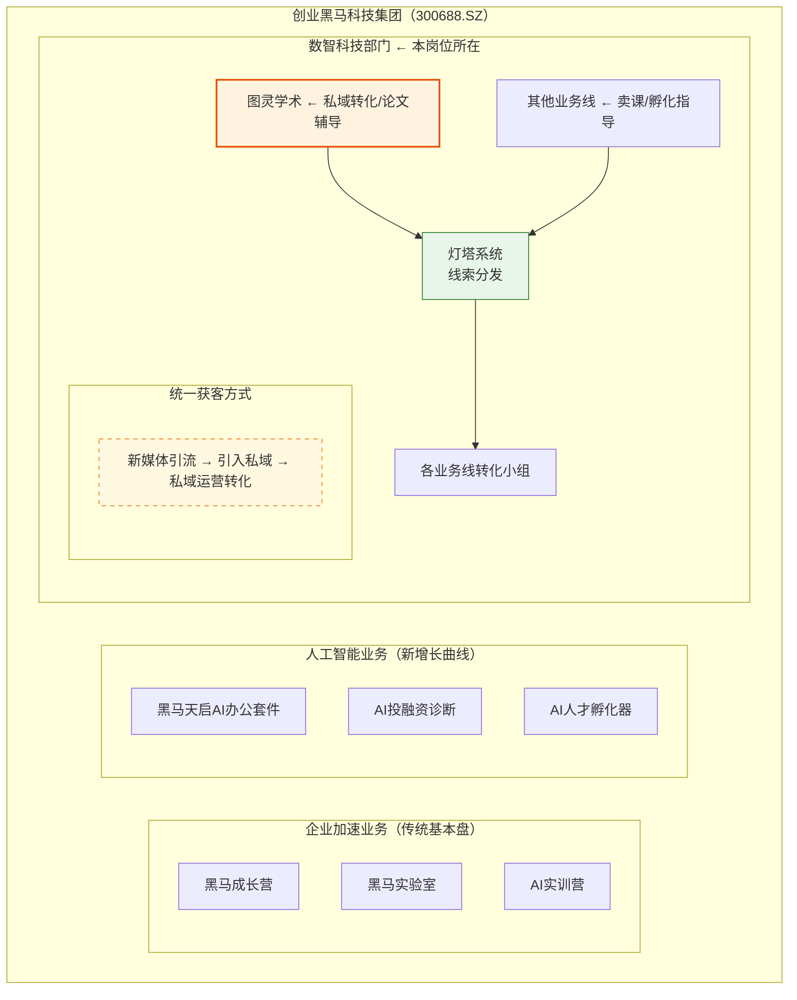

> [!summary] 概要
> 本文档是图灵学术科研/论文辅导业务线的**业务全景总览**，覆盖业务定位、前端矩阵账号方向规划（四条内容线配比、查重红线、选题不脱题红线）、私域转化盈利模式、前端引流组织架构（4 个小组 20+ 账号）、业务流程全貌，以及各环节详解（内容制作 → 矩阵发布 → 互动引流 → 初步筛选 → 灯塔录入 → 私域筛选转化 → 导师交付）。**核心数据**：产品客单价 **¥32,800 — ¥688,000**（6 档引荐价）、团队城市分布 **北京 / 成都 / 长沙**。

## 索引

- 🏢 [[#一、业务定位]] — 业务定位、矩阵账号方向规划、盈利模式、前端引流组织架构
- 🔀 [[#二、业务流程全貌]] — 从内容制作到导师交付的完整链路图
- 🔬 [[#三、各环节详解]] — 3.1-3.7 各环节（内容制作 → 私域筛选转化 → 合同结账 → 交付）
- 🧰 [[#四、关键资源与工具]] — 工具与平台速查
- 🏗️ [[#五、公司整体业务架构中本业务线的位置]] — 业务线分工、统一转化链路、对本岗位的启示
- 💡 [[#六、商业思维与职业发展启示]] — 商业闭环、二八定律、求职策略与面试技巧
- 📄 [[#七、关联文档]] — 关联文档与相关笔记

---

# 🏢 图灵学术 · 科研/论文辅导业务全景

> [!INFO] 📌 业务概览
> - **所属公司**：创业黑马科技集团股份有限公司（300688.SZ）
> - **所属部门**：数智科技部门
> - **业务线名称**：图灵学术
> - **创始人**：雷勤
> - **产品形态**：论文辅导、科研辅导（私域转化盈利）
> - **产品客单价**：<span style="color:#e67e22">**¥32,800 — ¥688,000**</span>（引荐价，6 档分区定价；2026-08-06 mt 提供，详见 [[总结好的大纲以及笔记/实习就业/创业黑马——数智科技部门/业务线/图灵学术产品与定价详解.md|图灵学术产品与定价详解]]）
> - **业务定位**：上游引流获客阶段 — 通过矩阵账号内容运营获取意向用户，引入私域（企业微信）后由北京总部团队完成提纯筛选与转化
> - **前端引流组织**：矩阵号宣传 + 私域引流，前端整体 **<span style="color:#2980b9">20+ 矩阵账号</span>**、**4 个小组**分工运营（齐发发组/敏敏子组/韩玲组/小七组，2026-08-05 更新）
> - **团队城市分布**：<span style="color:#e67e22">**北京、成都、长沙**</span>（2026-08-06 确认）
> - **更新日期**：2026-08-06

## 一、业务定位

### 1.1 图灵学术的业务定位

**图灵学术**是创业黑马数智科技部门旗下的一个业务方向，由**雷勤**负责，核心产品为**论文辅导**和**科研辅导**。

本业务线处于**上游引流获客阶段**（业务线最前端），核心模式是：

通过抖音矩阵账号持续输出科研/论文辅导相关内容（**前端引流整体 20+ 矩阵账号**，由 4 个小组分工运营；本组运营华哥系列 4 个账号），吸引有论文发表需求的硕博研究生、科研人员等目标用户 → 通过评论区/私信/粉丝群引导用户留下微信联系方式 → 将线索录入内部灯塔系统 → 由**北京总部团队**在企业微信私域中完成**多轮提纯筛选**（**筛选与销售咨询为两个分开的环节**）→ 通过销售 1对1 沟通建立信任与需求 → 签订合同、分步结账 → 由中后端导师团队完成论文辅导交付。

> 📌 **前后端分工（2026-08-04 更新）**：运营岗位处于业务线**最前端（引流端）**，引流来的客户多为**未筛选或仅完成初筛**的原始流量；客户的进一步提纯与筛选由**北京总部部门**在私域（企业微信）中完成，采用**多轮筛选机制**（非一次性表单筛选）逐步缩小受众范围，最终由真正的销售团队跟进转化。

> 📌 **工作模式升级（2026-07-30）**：运营岗位已从"接收 mentor 脚本→执行发布"升级为**全流程独立运作**，包含脚本独立创作、视频/图文制作与发布一条龙，以及发布后运营全由运营人员独立完成。

### 1.2 矩阵账号方向与长期规划（2026-08-04 mt 开会确定）

> 📌 2026-08-04 会议上 mt（韩玲）与团队将矩阵账号的长期发展方向与规划一一确定下来，作为账号运营与脚本创作的基准。完整方法论沉淀在《受众报告》与《三人小分队云文档纲要》。

**① 账号调整方向（精准过滤）**

- **账号名带方向标签**：让用户一眼就知道账号方向（如"华哥｜AI论文辅导"式），名字本身完成第一轮精准筛选
- **简介写明服务边界**：不接本科毕设、不接急单；咨询请私信说明「方向 + 学历 + 卡在什么阶段」（私信筛选核心三要素）
- **置顶三件套**：人设（我是谁 + 为什么只做 AI 方向）/ 筛选（什么情况该找我，什么情况别找我）/ 信任（最成功的学员案例）
- **清理泛流量旧内容**：隐藏"通用论文技巧"类泛内容，避免稀释账号人群标签、导致系统推流给不对的人

**② 内容策略：四条内容线配比（严格执行）**

| 内容线 | 占比 | 定位 |
|--------|:----:|------|
| 技术痛点型 | <span style="color:#e67e22">**40%**</span> | 主力转化（让被同样问题卡住的人觉得"这个人真的懂，他能帮我"） |
| 方向判断型 | <span style="color:#e67e22">**25%**</span> | 展示战略眼光（选方向比写论文本身重要一百倍） |
| 案例故事型 | <span style="color:#e67e22">**20%**</span> | 建立信任（用真实学员案例证明"我能带你中稿"） |
| 筛选劝退型 | <span style="color:#e67e22">**15%**</span> | 精准过滤（5 万客单价必须做，主动把不对的人挡在门外） |

- 判定内容好坏的标准：**<span style="color:#e74c3c">私信质量 > 播放量</span>**（核心结论：不需要很多"泛观众"，需要更加精准的用户）

**③ 绩效要求（单月）**

- 单月更新 **160 条视频**（新选题或新内容形式）
- 新增**案例类选题占比 30 条**（案例类内容是信任建设的核心，有硬性数量要求）
- 有新方向测试的杰出表现额外赋分（鼓励尝试新方向、新打法）
- 加强 **GMV 业绩标的赋分权重**——绩效向真实成交倾斜，而不是向播放量倾斜

**④ 执行节奏（三阶段）**

1. **第 1-2 周：清旧立新**——隐藏泛内容，按四条内容线各拍 1 条共 4 条，每条投 100 DOU+（定向 18-30 岁，兴趣"人工智能/深度学习/计算机科学"）
2. **第 3-4 周：测出爆款方向**——看四条线哪条数据最好（私信质量 > 播放量），数据好的方向加大产量每周 3 条，开始积累精准私信
3. **第 5 周起：稳定获客**——每周 3-4 条保持节奏，打磨"私信 → 微信 → 电话诊断"转化 SOP，目标**每月稳定加 30-50 个精准微信、成交 3-5 单**

**⑤ 内容原创性红线（查重与去同质化）**

- ⚠️ **触发背景**：上周五一条 1万+ 播放的视频被抖音官方以"内容重复"<span style="color:#e74c3c">贴标签限流</span>——平台会对同质化内容打标，影响矩阵账号权重
- **查重机制**：脚本创作前对照「已覆盖主题清单」+ 历史脚本库（创作好的脚本/）+ 竞品爆款库（鱼哥不水科研、近期爆款-3人小组）查重
- **去同质化要求**：4 个矩阵号脚本在月初统一生成，同质化风险最高——同一选题不得在多个账号用相近结构、相近话术重复发布；同一内容线内部及各内容线之间选题互不重复
- **脚本结构统一**：按《短视频内容结构+钩子结构表》执行——黄金三秒开头钩子（10 类模板）+ 中间七步信息点（抓眼球→呈现结果→制造反差→塑造价值→给出指导→举例佐证→临门一脚）+ 结尾钩子（内容钩子/资料钩子/咨询钩子）

**⑥ 选题不脱题红线（2026-08-06 mt 明确要求）**

- ⚠️ mt 明确要求：**无论大选题还是小选题，视频内容都必须与论文、科研相关，<span style="color:#e74c3c">一律不得脱题</span>**——大选题是流量型选题（比较泛，里面什么都谈），小选题是干货型选题，但两者都不能偏离"论文、科研"主题
- **脱题示例**：曾有一篇稿件内容主体变成"如何验证导师口头承诺 / 防导师画饼"，与论文、科研无关，被判定为**<span style="color:#e74c3c">严重脱题</span>**；mt 要求以后避免此类情况发生
- **快速判断口诀**：<span style="color:#e74c3c">话题泛可以，方向不能偏</span>；把"华哥/学员"换成任意职场博主内容依然成立 = 已脱题
- 完整规则、脱题反例 / 改后正例与自查清单，详见 [[总结好的大纲以及笔记/实习就业/创业黑马——数智科技部门/业务线/选题不脱题规则与案例.md|选题不脱题规则与案例]]

### 1.3 盈利模式：私域转化

与其他业务线通过"卖课"变现不同，**图灵学术的核心盈利模式是私域转化**：

- **引流端**：通过新媒体内容吸引意向用户
- **转化端**：将用户引入私域（微信），通过1对1沟通了解需求
- **产品端**：提供个性化的论文辅导/科研辅导服务
- **交付端**：由专业导师团队完成服务交付

> 💡 **一句话概括**：内容获客 → 私域引流 → 1对1转化 → 论文/科研辅导交付

### 1.4 前端引流组织架构（2026-08-05 更新）

> 📌 图灵学术前端引流统一走"**矩阵号宣传 + 私域引流**"模式：公域通过抖音矩阵账号内容宣传获客，私域通过企业微信承接引流。前端整体**已知共有 20+ 矩阵账号**（"目前已知"口径，实际可能更多），由多个小组分工运营。

**前端小组分布（目前已知 4 个小组）**：

| 小组 | 城市 | 人数 | 运营账号/分工 |
|------|------|:----:|------|
| 齐发发组 | 长沙 | 3-5 人 | 视频内容以**真人实拍出镜**为主 |
| 敏敏子组 | 北京 | 2-3 人 | 鱼哥系列矩阵号 |
| 韩玲组 ← **本岗位所在** | 北京 | 3 人 | 华哥系列矩阵号 4 个账号（搞科研的华哥、华哥聊论文、发论文的华哥、科研华哥） |
| 小七组 | 北京 | 3 人 | 待补充（推测运营七哥系列，待确认） |

- 4 个小组合计约 **11-14 人**，分布在**长沙（1 组）+ 北京（3 组）**两地

> 📌 **团队城市分布（2026-08-06 确认）**：图灵学术业务线团队主要分布在 <span style="color:#e67e22">**北京、成都、长沙**</span> 3 个城市——前端矩阵运营小组集中在 **北京**（敏敏子组/韩玲组/小七组）与 **长沙**（齐发发组）；**中后端导师 / 交付团队**在 **成都** 等地（详见 [[#3.7 服务交付 — 中后端导师团队|3.7 服务交付]]）

**韩玲组内分工（2026-08-05 确认）**：

| 成员 | 角色 | 负责账号 |
|------|------|---------|
| 韩玲 | mentor | 日常巡视 4 个华哥账号，**不主动参与运营** |
| 谢积昌（本岗位） | 运营实习生 | 「科研华哥」「发论文的华哥」 |
| 另一位实习生 | 运营实习生 | 「搞科研的华哥」「华哥聊论文」 |

**矩阵账号与负责人对照表（2026-08-05 更新，目前已知 12 个账号）**：

| 系列 | 账号 | 负责人 |
|------|------|--------|
| 华哥系列（韩玲组） | 科研华哥 | 谢积昌（本岗位） |
| 华哥系列（韩玲组） | 发论文的华哥 | 谢积昌（本岗位） |
| 华哥系列（韩玲组） | 搞科研的华哥 | 另一位实习生 |
| 华哥系列（韩玲组） | 华哥聊论文 | 另一位实习生 |
| 七哥系列 | 科研七哥 | 邱情 |
| 七哥系列 | 七哥懂论文 | 邱情 |
| 七哥系列 | 七哥不水科研 | 邹阳 |
| 七哥系列 | 七哥聊论文 | 邹阳 |
| 七哥系列 | 七哥不水论文 | 邹阳 |
| 鱼哥系列（敏敏子组） | 发论文的鱼哥 | 敏敏子 |
| 鱼哥系列 | 鱼哥不水科研 | 待补充 |
| 鱼哥系列 | 鱼哥不水论文 | 待补充 |

> 📌 前端 20+ 账号中，目前**已知具体名单 12 个**（华哥系列 4 + 七哥系列 5 + 鱼哥系列 3），其余待补充；七哥系列所属小组（推测为小七组）待确认。

**线索流转链路（2026-08-05 确认）**：

```
前端矩阵号获客（20+ 账号，4 个小组）
        ↓
私域承接：统一进入企业微信
        ↓
小组间线索统一记录到飞书表格
        ↓
mentor（韩玲）判断筛选
        ↓
正式录入灯塔系统（dengta.tulingxueshu.com）
```

> 📌 **关键规则（2026-08-05 确认）**：前端获客后的私域承接方**统一为企业微信**；小组间的线索**统一记录到飞书表格**（不直接录入灯塔），由 **mentor 判断**是否正式记录进灯塔系统。

> 📌 **引流范围界定（2026-08-05 确认）**：前端引流对象仅为**学员**（有论文辅导/科研辅导需求的硕博研究生等）；**导师引流**（招募/对接辅导导师）部分**不归本组管理**，由其他团队负责。

## 二、业务流程全貌

```mermaid
graph LR
    A[内容制作<br/>视频+图文] --> B[抖音矩阵发布<br/>前端20+账号]
    B --> C[评论/私信互动<br/>引导留资]
    C --> D[意向用户筛选<br/>微信+研究方向]
    D --> E[灯塔系统录入<br/>线索登记]
    E --> F[私域初筛话术<br/>企业微信·北京总部]
    F --> G[表单筛选提纯<br/>学历/方向/时间]
    G --> H[资料钩子+需求预热<br/>扣1进入下一轮]
    H --> I[销售1对1通话<br/>信任+需求建立]
    I --> J[流程说明+导师对接<br/>合同签订·分步结账]
    J --> K[博士后导师交付<br/>论文/科研辅导]
    
    style A fill:#E3F2FD,stroke:#1565C0
    style B fill:#E3F2FD,stroke:#1565C0
    style C fill:#FFF3E0,stroke:#E65100
    style D fill:#FFF3E0,stroke:#E65100
    style E fill:#E8F5E9,stroke:#2E7D32
    style F fill:#F3E5F5,stroke:#6A1B9A
    style G fill:#F3E5F5,stroke:#6A1B9A
    style H fill:#FCE4EC,stroke:#C62828
    style I fill:#FCE4EC,stroke:#C62828
    style J fill:#FCE4EC,stroke:#C62828
    style K fill:#FCE4EC,stroke:#C62828
```



## 三、各环节详解

### 3.1 内容制作（视频 + 推文）

- **职责**：将 mentor 提供的《脚本大纲》，通过内部工具优化关键词 → MiniMax AI语音生成 → Heygen数字人视频制作 → 剪映封面+剪辑，产出完整视频内容；推文则简化流程直接发布
- **涉及人员**：运营人员、mentor（提供脚本）、外包剪辑公司（可选）
- **输入**：mentor 提供的《脚本大纲》
- **输出**：制作完成的视频（4条/天）/ 推文（6篇/天）
- **向谁汇报**：mentor

> 📌 **各小组内容制作模式（2026-08-05 确认）**：前端各小组的视频制作方式不同——
> - **本组（韩玲组/北京）**：视频全部为**数字人视频**，全流程**流水线化操作**——脚本优化 → MiniMax AI语音 → Heygen数字人 → 剪映封面+剪辑，标准化流水线作业
> - **长沙组（齐发发组）**：视频内容以**真人实拍出镜**为主，与本组的数字人流水线模式不同

### 3.2 抖音矩阵发布

- **职责**：在本组负责的 4 个华哥系列矩阵账号（搞科研的华哥、华哥聊论文、发论文的华哥、科研华哥）上按计划发布内容；**本岗位手头负责其中「科研华哥」「发论文的华哥」2 个账号**；**前端引流整体共 20+ 矩阵账号，由 4 个小组（齐发发组/敏敏子组/韩玲组/小七组）分工运营**（详见 [[#1.4 前端引流组织架构（2026-08-05 更新）|1.4 前端引流组织架构]]）
- **涉及人员**：运营人员
- **输入**：制作完成的视频/推文 + 封面 + 标签
- **输出**：在抖音平台完成内容发布
- **向谁汇报**：无需汇报

### 3.3 评论/私信互动引流

- **职责**：评论区置顶引导、弹幕区信息发布、每小时巡查评论区、私信话术转化、粉丝群运营
- **涉及人员**：运营人员
- **输入**：已发布的内容 + 脚本大纲中的关键词/话术
- **输出**：获取意向用户的微信联系方式和专业/研究方向
- **向谁汇报**：无需汇报

> 📌 **私信话术分类逻辑（2026-08-20 更新）**：私信回复分**两种情况**——① 用户垂直且需求"急需"→ 用 10 条直接表明身份的话术（直接留 \/ 和研究方向/目标区位/年级）；② 大部分刚需用户 → 用"有资料但平台不能发文件"的基础版话术（<span style="color:#e74c3c">不提"咨询"/"辅导"，只说免费"资料"</span>，利他角度引导留 \/）。完整话术、原因分析与优化方向详见 [[总结好的大纲以及笔记/实习就业/创业黑马——数智科技部门/SOP/矩阵账号日常运营SOP.md|矩阵账号日常运营SOP]]「情况 A：用户可接收私信」。

### 3.4 意向用户筛选（初步筛选）

- **职责**：从互动中识别有真实需求的用户，获取其微信和研究方向信息
- **涉及人员**：运营人员
- **输入**：评论/私信中的用户信息
- **输出**：用户微信号 + 专业/研究方向
- **向谁汇报**：无需汇报

> 📌 **筛选边界（2026-08-05 确认）**：本组仅负责**前端引流 + 初步筛选**（识别意向用户、获取联系方式与研究方向等初步信息）；**进一步的筛选与提纯工作本组不做**，交付给其他团队（北京总部筛选团队）完成。

### 3.5 灯塔系统录入

> 📌 **平台信息（2026-08-04）**：灯塔为创业黑马官方平台，链接 https://dengta.tulingxueshu.com/ ，**仅支持飞书登录**；完整录入流程详见 [[总结好的大纲以及笔记/实习就业/创业黑马——数智科技部门/SOP/灯塔平台线索录入SOP.md|灯塔平台线索录入SOP]]。

> 📌 **线索流转（2026-08-05 确认）**：小组间线索**先统一记录到飞书表格**（不直接录入灯塔），由 **mentor 判断筛选**后，才正式录入灯塔系统。

- **职责**：将用户线索先记录到飞书表格，经 mentor 判断筛选后，正式登记到公司内部的灯塔平台
- **涉及人员**：运营人员（记录飞书表格）、mentor（判断筛选）；**正式录入灯塔可由运营人员或 mentor 执行**（2026-08-05 确认）
- **输入**：获取到的用户信息
- **输出**：灯塔系统中的线索记录
- **向谁汇报**：无需汇报

**录入筛选标准（2026-08-04）**：

- ✅ **录入**：真实需要论文/科研辅导、**已有较大辅导意向**的用户
- ❌ **不录入**：单纯因"发资料"钩子领取资料（白嫖）的用户——录入后销售团队难以转化，浪费时间与精力
- 录入必填：**联系方式（手机号/微信号二选一）、微信昵称、专业方向与研几**；备注选填（学员当前问题，便于销售针对性话术）

### 3.6 私域筛选与转化（北京总部）— 客户提纯全流程

> 📌 **筛选与销售咨询分开（2026-08-05 确认）**：**筛选**与**销售咨询**是两个**分开的环节**，并非合并进行——筛选提纯（3.6.1-3.6.3）由**筛选团队**独立完成，销售咨询与转化（3.6.4-3.6.7）由**销售团队**独立跟进。前端（本组）只做引流 + 初步筛选，不参与后续任何筛选提纯环节。

> 📌 **前后端分工（2026-08-04 更新）**：前端引流获取的客户**未经筛选或仅完成初筛**，进入私域（企业微信）后，由**北京总部部门**负责客户提纯与筛选。该团队处于销售团队的最前端，采用**多轮筛选机制**——不是通过一张表单一次性筛完，而是通过多次筛选逐步缩小受众范围，将提纯后的高意向用户逐步移交真正销售团队跟进转化。

> 📌 **私域承接（2026-08-05 确认）**：前端 4 个小组（齐发发/敏敏子/韩玲/小七）获客后的私域承接方**统一为企业微信**；各组线索先统一记录到飞书表格，经 mentor 判断后再正式录入灯塔（见 [[#3.5 灯塔系统录入|3.5 灯塔系统录入]]）。

> 💡 图灵学术的核心盈利模式就是**私域转化**——不是卖标准化课程，而是根据每位用户的具体研究方向，提供个性化的论文辅导或科研辅导服务。

#### 3.6.1 私域初筛 — 企业微信添加话术

- **职责**：对进入私域的用户发送标准开场话术，引导其做出第一轮选择
- **涉及人员**：北京总部初筛团队（销售团队最前端）
- **输入**：前端引流进入企业微信私域的用户（未筛选/初筛）
- **输出**：用户回复选项，进入表单填写环节
- **向谁汇报**：团队负责人

**添加好友后的第一句话术**（原文保留）：

> 同学你好，我是图灵学术的资深顾问。
>
> 我们图灵学术是科研赛道唯一一家上市公司，专注SCI/CCF保录辅导，合作老师1000+，累计帮助上千名学员拿到论文录用，一直信奉用利他之心做教育！
>
> 同学是想了解哪方面内容？回复我序号即可哦👇
>
> 1、咨询paper保录辅导
> 2、跟同方向的大牛导师 1v1meeting沟通
> 3、辅导硕博毕业论文
> 4、想要领取适合自己的资料
>
> 回复序号后，我会马上加鞭为你解答哦！

**关键规则**：话术提供 4 个选项，**无论用户选择哪一个，结果都是引导其填写同一份表单**（初筛表单），填写完成后进入筛选判断。

#### 3.6.2 表单筛选 — 提纯逻辑详解

- **职责**：通过表单问题对用户进行初步提纯筛选
- **涉及人员**：北京总部初筛团队
- **输入**：用户在私域中填写的初筛表单
- **输出**：通过筛选的用户（进入下一步）/ 被筛走的用户
- **向谁汇报**：团队负责人

**表单问题**（原文保留）：

| # | 表单问题 | 填写要求 |
|---|---------|---------|
| 1 | (微信昵称) | — |
| 2 | 您的称呼是? | 请输入您的称呼 |
| 3 | 您目前的最高学历? | 请选择您的最高学历 |
| 4 | 本次为了实现您的目标，您需要/您想要发表的论文区位? | 请选择发表的论文的区位 |
| 5 | 您研究的方向细分主题 | 还未确定的可填感兴趣的方向或选题 |
| 6 | 您论文需要录用的时间节点是什么(x年x月) | — |
| 7 | 您的联系方式(手机号/微信号) | 请输入您的联系方式 |

**筛选逻辑逐项解析**：

| 表单字段 | 是否筛选项 | 筛选逻辑 / 用途 |
|---------|-----------|----------------|
| **最高学历** | ✅ 筛选项 | **研究生以下 → 直接筛走**（不属于目标人群） |
| **论文区位** | ❌ 非筛选项 | 用于**获取用户真实需求**：为后续精准营销提供依据；用户当前需求不强时，通过后续营销策略逐步加深，当需求达到阈值时即产生购买意愿 |
| **研究方向细分主题** | ✅ 筛选项 | 见下方"可接/不接方向"规则 |
| **录用时间节点** | ✅ 筛选项 | 要求**极短时间录用**（如当年 9 月）的单子**不接**；正常交付周期约 5 个月 |
| **联系方式** | ❌ 非筛选项 | 通过前面筛选后，由**真正的销售团队**据此继续跟进 |

**可接/不接方向规则**：

- ✅ **可接**：
  - **科班类方向**：计算机、深度学习、Transformer 架构等计算机领域方向
  - **一切可与 AI 结合的方向**：AI+医学、AI+光学、AI+机械等，一切能与 AI 沾边的都可以
  - **理工科均可**：都可实现"AI+专业方向"结构——图灵学术以 AI 论文辅导撰写为本
- ❌ **不接**：**文科方向**（政治、党史、经管类等）——论文内容纯主观、无理工科"数据集"等概念、无法与 AI 挂钩，无法进行辅导

**正常交付周期（约 5 个月）**：

1. **指导老师匹配**：学员可自选心仪的导师；中途不喜欢可以随时更换，直到满意为止
2. **idea 选择**：指导老师手中的 idea 供选择，确定想做的方向后开题
3. **手把手教学**：导师从入门到精通逐步指导——从 idea 到整篇论文的全过程（模块选择、数据集采集、实验等），写作中遇到的所有问题都会得到指导

#### 3.6.3 资料钩子 — 多轮筛选的典型案例（用户视角）

> 📌 以用户视角体验"如何被一步步转化"。以大部分观众选择的**选项 4（领取资料）**为例：

**第一轮：资料发放话术**（原文保留）：

> 好的，资料必须有🙌🏻
>
> 我们找了十几个顶级名校的大牛开发了好多资料，覆盖了科研全流程，希望对你有帮助～
>
> 你扫码填写下资料申请表，填完后告诉我你的昵称，我会根据你的情况推荐适合你的资料，都是free 的，只需要花大概30s噢

**关键规则**：这份资料申请表**无论怎么填写都会发放资料**（非筛选用途），将填写完毕的表格截图返回即可。

**第二轮：发放资料 + 留下钩子**（原文保留）：

> 好的哈，我看到了，这边先发你资料，资料持续更新中，注意保存哈
>
> https://my.feishu.cn/wiki/G3vHwn80Ci73rzksFtqch3TwnFh?fromScene=spaceOverview
>
> 你先看第 1 份就行，太多了容易学不过来 hh。
> 你用电脑打开最好，然后左边侧边栏打开就有目录啦
>
> 我们现在有一次免费的科研梳理机会，如果你论文上的问题不知道怎么解决，
> 需要扣个「1️⃣」，我可以给你安排噢~

**分支逻辑**：

- 用户**不需要**论文指导 → 不扣 1，本轮转化结束
- 用户**扣 1** → 进入下一轮筛选、需求建立与营销环节

> ⚠️ **注意**：扣 1 后对接用户的是**销售团队**（不是指导老师），此时用户从最初的"筛选前端"进入"中前端"环节。

#### 3.6.4 销售1对1通话 — 信任与需求建立

- **职责**：通过电话与用户建立类似"面对面"的沟通，介绍产品、建立信任、放大需求
- **涉及人员**：销售团队（对接人非指导老师）
- **输入**：通过筛选并扣 1（或表达意向）的用户
- **输出**：信任建立、需求放大的意向客户
- **向谁汇报**：销售团队负责人

**第一轮通话的两大内容**：

**① 介绍自家产品优势**：

- 产品**包录用**
- **审核制态度**：并非一次性结账，而是**分多个步骤结账**（先支付）；若学员在某个环节态度有问题或不配合导师却又要求论文录用 → **直接终止合作，已交费用返还一部分**
- 将"如何录用的全流程"完整说明给用户

**② 建立信任、需求与性价比**：

- **信任背书**：创业黑马旗下品牌（上市公司全网可查）、录用率高达 95% 以上、王牌导师团队（均来自顶尖名校的博士及博士后团队、大牛课题组）
- **需求放大**：即便用户起初只是奔着"领资料"而来，经过营销后可能因产品内容产生信任与好感，需求增大
- **折扣话术**：使用"折扣"类话术增强用户需求，推动一部分"咨询"用户转化为真正的"需要"，从而进入下一步筛选

#### 3.6.5 正式流程说明与导师对接

- **职责**：将整个辅导论文的流程正式讲明白，并正式对接真正的导师进行 1对1 meeting
- **涉及人员**：销售团队 + 中后端导师团队
- **输入**：通过通话建立信任的意向客户
- **输出**：明确购买意向、已对接导师的用户
- **向谁汇报**：销售团队负责人

**说明内容**：

1. 完整的论文辅导流程（学员该怎么做）
2. 产品售价及结账方式（分步结账，见 3.6.6）
3. 学员应持有的态度（勤奋跟进等）
4. 正式对接真正的导师进行 1对1 沟通 meeting

#### 3.6.6 合同签订与分步结账 — 高客单价产品设计

- **职责**：与确定购买意向的学员签订合同，明确单价、分期与履约条款
- **涉及人员**：销售团队 + 学员
- **输入**：确定购买意向的用户
- **输出**：签订合同、分阶段收款
- **向谁汇报**：销售团队负责人

**① 分步结账设计（高客单价的必然选择）**：

- 产品定位为**高客单价**（引荐价 **<span style="color:#e67e22">¥32,800 — ¥688,000</span>**，共 6 档分区定价，2026-08-06 mt 提供，详见 [[总结好的大纲以及笔记/实习就业/创业黑马——数智科技部门/业务线/图灵学术产品与定价详解.md|图灵学术产品与定价详解]]），一次性付清不现实
- **买车类比**：5 千的车基本可全款；5 万勉强能接受；50 万的车就不一定能一次性结清
- **客户群体是学生**：研究生/博士生与上班族不同，大部分没有固定收入，课题组科研补贴最多约 3K/月，能一次性结清的人并不多
- **解决方案**：**分步结账（分期付款）**，类比房贷车贷的分期付款，大大降低学生党的经济压力

> 💡 **名词解释**：**引荐价**（经推荐/引荐渠道购买的价格，即"推荐优惠价"）· **保发**（保证论文被录用发表）· **分步结账**（分期付款，分多个阶段结账，降低高客单价产品的付款压力）

**② 合同制签订**：

- 合同详细标明产品**完整单价**（6 档引荐价，RMB）：EI 会议/EI 期刊 <span style="color:#e67e22">¥32,800</span> · SCI 四区 <span style="color:#e67e22">¥39,800</span> · SCI 三区/CCF C <span style="color:#e67e22">¥49,800</span> · SCI 二区/CCF B <span style="color:#e67e22">¥89,800</span> · SCI 一区/CCF A <span style="color:#e67e22">¥128,000</span> · CCF A 类 Oral 论文（共同创作）<span style="color:#e74c3c">¥688,000</span>
- 合同标明**当前阶段**：处于哪个阶段、需要付款多少
- 合同明确**履约条款**（大意）：
  - 学员态度端正，论文从开始到发表录用的全过程**勤奋跟进**、**定期汇报情况**
  - 学员**品格良好**，不得辱骂、诬陷导师等
  - 若学员不勤奋（包括但不限于"什么都不想干又想要求论文录用"）或品格出现问题 → **终止交付，当前阶段已交付的经费返还一部分**

#### 3.6.7 销售团队的核心作用

> 📌 补充说明：用户可能一开始对论文辅导的意向不强烈，甚至厌恶辅导人员、对产品及人员产生偏见，此时由销售团队负责转化。

- **拉近距离**：通过打电话建立类似"面对面"的沟通交流，避免只靠线上信息聊天（线上文字聊天易被用户下意识认为是骗子）
- **销售话术**：通过成熟的话术让用户对产品有大致的了解，逐步营造用户的真实需求，完成从"不想下单"到"想要下单"的转变

### 3.7 服务交付 — 中后端导师团队

> 📌 **交付端信息更新（2026-07-30）**

- **团队构成**：中后端团队由**各高校博士后导师**组成，涵盖多个学科领域。其中包括南京理工大学等知名高校的老师。
- **城市分布**：导师团队分布在多个城市，除北京总部外，在<span style="color:#e67e22">**成都**</span>等城市也有成员分布。
- **服务模式**：
  1. 运营人员在抖音平台获取意向用户线索
  2. 录入灯塔系统后，由中后端团队跟进对接
  3. 导师根据用户的研究方向匹配对应专业的博士后导师
  4. 由导师提供 1对1 的论文辅导或科研辅导服务
- **团队优势**：
  - **专业性强**：导师均为高校在职博士后或教师，拥有丰富的科研经验和论文发表经历
  - **覆盖面广**：涵盖理工科、人文社科等多个学科领域
  - **分布广泛**：多地分布便于服务不同区域的客户

> 💡 **岗位衔接**：本岗位（新媒体运营）处于业务流程的**上游引流端**，核心职责是通过内容运营获取意向用户并将其录入灯塔系统。中后端导师团队负责**后续的转化与交付**，这是两个独立的环节，运营人员无需参与导师团队的日常工作。

## 四、关键资源与工具

| 资源/工具 | 用途 | 访问方式 |
|----------|------|---------|
| **内部优化工具** | 脚本关键词一键优化 | 部门自研网页工具 |
| **TTS纠错工具** | 脚本发音预处理，确保AI语音正确朗读专业术语 | 本地HTML文件（`lark-resources/数字人口播脚本发音处理.html`） |
| **MiniMax** | AI语音朗读脚本 → 下载MP3 | https://www.minimax.io/audio（账号：xiaoyuanhua6@gmail.com） |
| **Heygen** | 数字人视频生成 | https://app.heygen.com/login（需 mentor 协助登录） |
| **剪映** | 视频封面制作 + 自己剪辑 | 桌面端软件 |
| **抖音** | 视频/图文发布、评论互动、粉丝群管理 | 平台（4个矩阵号） |
| **灯塔** | 客单转化信息登记（线索录入） | [https://dengta.tulingxueshu.com/](https://dengta.tulingxueshu.com/)（**仅支持飞书登录**，详见 [[总结好的大纲以及笔记/实习就业/创业黑马——数智科技部门/SOP/灯塔平台线索录入SOP.md|灯塔平台线索录入SOP]]） |
| **企业微信** | 私域筛选与转化主阵地（北京总部初筛/销售团队使用） | 企业微信客户端 |
| **初筛表单 / 资料申请表** | 客户提纯筛选：学历/方向/时间筛选 + 获取真实需求 | 扫码填写（随话术发放） |
| **飞书资料知识库** | 发放给用户的科研资料（wiki 链接，含目录） | https://my.feishu.cn/wiki/G3vHwn80Ci73rzksFtqch3TwnFh |
| **飞书** | 日常通讯、脚本审核提交、文档协作 | 飞书客户端 |
| **钉钉** | 考勤打卡 | 钉钉客户端（暂未启用） |
| **中后端导师团队** | 博士后导师团队（含南京理工大学等高校），分布在成都等城市，负责私域转化与论文/科研辅导交付 | 通过灯塔系统获取线索，由团队负责人协调分配 |

## 五、公司整体业务架构中本业务线的位置

### 5.1 数智科技部门内的业务线分工

数智科技部门下有多条业务线，虽然产品形态和盈利模式不同，但**获客方式高度统一**——都是通过新媒体矩阵（抖音为主）进行引流。

| 业务线 | 产品形态 | 盈利模式 | 获客方式 |
|-------|---------|---------|---------|
| **图灵学术** ← 本岗位 | 论文辅导、科研辅导 | **私域转化**（1对1沟通成交） | 新媒体引流→私域→转化 |
| **其他业务线** | 大课实训、培训方案、孵化指导 | **卖课**（标准化课程/培训方案收费） | 新媒体引流→私域→转化 |

### 5.2 统一的转化链路

> 📌 **核心洞察**：所有业务线都遵循相同的底层转化逻辑——

```
新媒体平台宣传（抖音内容/直播）
        ↓
   引入私域（微信/粉丝群）
        ↓
   私域运营与转化
        ↓
    ┌────┴────┐
    ↓         ↓
图灵学术     其他业务线
（私域转化）  （卖课/孵化指导）
```

各业务线的差异在于**转化后的交付方式**不同：
- **图灵学术**：1对1论文/科研辅导（定制化服务，按项目收费）
- **卖课型业务**：标准化大课实训、培训方案（按课程/方案收费）
- **孵化型业务**：孵化指导服务（按孵化周期收费）

### 5.3 在公司整体架构中的位置



### 5.4 对本岗位的启示

| 维度 | 分析 |
|------|------|
| **所处层级** | 数智科技部门下**图灵学术**业务线，聚焦论文/科研辅导垂直领域 |
| **业务阶段** | 引流获客 — 处于**业务线最前端（引流端）**；引流客户为未筛选/初筛原始流量，私域提纯筛选由北京总部完成 |
| **盈利模式** | 通过私域转化实现盈利（不做标准化卖课） |
| **工作模式** | **全流程独立运作**：脚本独立创作→内容制作→发布运营一条龙，不再依赖 mentor 提供脚本 |
| **内容策略** | 矩阵账号按 mt 开会确定的方向规划执行：账号调整（名带方向/简介边界/置顶三件套/清理泛内容）、四条内容线配比 40/25/20/15、三阶段执行节奏；脚本结构统一按《短视频内容结构+钩子结构表》 |
| **选题不脱题红线** | 无论大选题（流量型/泛）还是小选题（干货型），选题必须与论文/科研相关，<span style="color:#e74c3c">一律不得脱题</span>（2026-08-06 mt 明确要求，详见 [[总结好的大纲以及笔记/实习就业/创业黑马——数智科技部门/业务线/选题不脱题规则与案例.md|选题不脱题规则与案例]]） |
| **原创红线** | 脚本创作前必须查重（已覆盖主题清单+历史脚本库+竞品爆款库），4 矩阵号月初统一生成脚本逐条去同质化，防止被抖音平台打"内容重复/抄袭"标记 |
| **协作关系** | 上游独立创作脚本（需 mentor 审核）；线索经**飞书表格 → mentor 判断 → 灯塔系统**流转（本岗位归属韩玲组，手头运营「科研华哥」「发论文的华哥」2 个账号）；**引流对象仅为学员**（导师引流不归本组）；本组仅做**前端引流+初步筛选**，进一步筛选提纯交付其他团队；**筛选与销售咨询为两个分开的环节**（筛选团队 → 销售团队），中后端导师团队完成交付 |
| **统一打法** | 所有业务线共用"新媒体引流→私域→转化"的获客模型 |
| **岗位价值** | 处于统一获客链路的起点，为所有业务线输送潜在客户 |
| **交付团队** | 中后端导师团队由高校博士后导师组成（南京理工大学等），分布在成都等城市 |

> 💡 **实习本质与工作要求（2026-08-05 整理）**：
>
> 1. **实习的本质**不是待了多少个月，而是在于你是否**了解整条业务线是怎么转换的**（引流 → 筛选 → 销售 → 交付的完整链路），以及你**当前是在这个业务线的哪个位置**（本岗位处于最前端的引流端）——**了解业务全貌 + 认清自身定位**，比实习时长更重要，这也是本文档存在的意义
> 2. **工作要求**：你的工作**能不能正常的完成**，**是否可以做到熟练**——工作完成度与熟练度是衡量实习质量的硬标准，对应到本岗位即：脚本创作、内容制作、矩阵运营、线索录入等全流程任务能否稳定、熟练地独立交付

## 六、商业思维与职业发展启示

> 📌 **分享时间**：2026-08-08（mt 与两位实习生的 QA 对话）
>
> 从"实习的本质"出发，mt 分享了商业闭环思维、二八定律、求职策略与面试技巧，以及对大厂/行业的核心认知。mt 的个人工作经历详见 [[总结好的大纲以及笔记/实习就业/创业黑马——数智科技部门/个人自述/mt（韩玲）工作经历自述.md|mt（韩玲）工作经历自述]]。

### 6.1 实习的本质：理解整条业务线的商业闭环

- **实习的本质**不是待了多少个月，而是你是否**了解整条业务线是怎么转换的**——引流 → 筛选 → 销售 → 交付的完整链路，以及你**当前是在这条业务线的哪个位置**（本岗位处于最前端的引流端）
- **为什么要懂业务全貌**：在大厂面试中，面试官不仅会问你自己做的具体工作（内容、工具等），还会**大量询问你这条业务线的上下游是什么、有哪些细节**——只有对整条业务线有真实体感，面试才能答得流畅不"疵"
- **AI 的局限**：即便 AI 可以辅助面试、哪怕是没做过的岗位也能通过 AI 一次次试出答案，但**面试是一个很主观的内容**，问题非常多、可偏可正，固定套路覆盖不了——**真实实习体感不可替代**

### 6.2 二八定律在图灵学术业务线中的体现

- **图灵学术现状**：虽然很多销售看起来"不怎么干活"，但业务线实际是 **2 成的销售卖出了 100% 的业绩**，剩下的都在摸鱼
- **mt 当舵手时的印证**：20 个项目试测只有 **8 个跑出来**（田忌赛马），而这 8 个项目赚的钱就是整个项目组的总业绩——这正是二八定律的体现
- **二八定律的"公司信号"**：

| 部门发力 | 公司状态 |
|---------|---------|
| **销售全员发力** | 公司**欣欣向荣**，业绩持续往上涨 |
| **人力资源部门发力** | 公司在**走下坡** |
| **运营部门发力** | 经济水平**不升不降，稳定** |

### 6.3 新媒体运营技能的可迁移性

- 无论是开课吧、量子之歌，还是图灵学术，本质都是**咨询和卖课服务类**业务线；但只要掌握了新媒体运营的技巧——包括但不限于**数字人生成、剪辑、运营**等——道理都是相通的
- **跨行业**：凭借这些技能，在以后的职业生涯中可以去到很多不同的地方、行业实习/工作，不仅限于咨询、卖课公司

### 6.4 求职与职业发展策略（mt 分享）

**① 上市公司实习的含金量**：

- 创业黑马是**上市公司**，这段实习对以后投递大厂（美团、字节、腾讯等）**非常有含金量，足以抹平学历差距**
- 如果没有实习投递，公司会直接看学历；大厂招聘逻辑：**简历优先看有没有大厂实习** → 第一段大厂实习 = 大厂通行证 → 可跳其他大厂来回刷（大厂A → 大厂B → 大厂C）；若第一段是中小厂，也可一步步堆实习升到大厂

**② 学历贬值趋势**：

- 学历在持续贬值，仅靠学历求职越来越难，许多公司更看重简历中的实习经历
- mt 以本次招聘为例：人事将候选人**全部筛选至北京及周边 + 要求几天内到岗**，筛掉了大量人后剩下全是硕士；最终选择两位实习生，是因为其他硕士候选人对岗位/行业**理解不深、没有实习经历**——公司不想花心思培养"什么都不会的实习生"
- 行业现状：研发岗从"本科即可"过渡到"研究生"，现在大厂实习生清一色博士及以上，且光有博士学历只是敲门砖；产品经理岗也因内卷从本科要求卷到硕士及以上——**但学历并非决定一切**

**③ 面试技巧（地区与到岗）**：

- 面试官问"**你现在在哪里**"其实是为了**筛选能否立即到岗**——公司大多需要立即到岗的人，不能接受到岗后再花几天甚至一周租房的时间成本
- **应对**：回答在公司所在城市、**已有住处、可立即到岗**，让面试官放心，录用率会大大提升

**④ 实习生工作建议**：

- 不要有"**学生思维**"：不要只埋头手头的工作，要多**主动汇报**、多了解整个业务线逻辑——手头工作做得好坏在其次，重要的是跳出"学生思维"、培养商业思维
- **上一任实习生案例**：上一任实习生通过**社招进入字节跳动**（面试时其 +2 恰是 mt 认识的人，还为她内推过）——再次印证大厂看的是**工作经历与过往履历**，可与 92 学历相媲美

### 6.5 公司与行业认知

- **大厂 vs 中小厂**：流传"**大厂一年，外面三年**"——大厂很累；顶尖大厂每隔一段时间就要"更新"学习新东西，30 往上的人已失去可塑性、逐渐躺平；mt 建议实习生可去大厂干两三年试试，但**不适合长期干**，之后可去这些厂的下级"养老"
- **员工年龄结构**：字节平均年龄约 **26 岁**（年轻人多、竞争大），创业黑马约 **35 岁**（基本处于养老状态）
- **序列号体系**：越大的厂越有序列号，**序列号越小 → 层级越高 → 薪资越高**；以字节为例，**2-3 序列号的薪资待遇可跟 4-1 掰手腕**（不绝对）
- **行业案例——细分赛道**：新东方在 2021 年双减后靠直播从水深火热中活过来，抛弃 K12 转向**英语赛道（雅思、托福等）**并越走越深、开辟众多细分赛道——当下创业越来越难，**只有细分赛道才能创下去**，泛的广的赛道已人满为患

## 七、关联文档

- 📄 详见 [[总结好的大纲以及笔记/实习就业/创业黑马——数智科技部门/个人自述/mt（韩玲）工作经历自述.md]] — mt（韩玲）工作经历自述（mentor 的个人经历与职业选择逻辑）
- 📄 详见 [[总结好的大纲以及笔记/实习就业/创业黑马——数智科技部门/SOP/矩阵账号日常运营SOP.md]] — 具体操作流程（含脚本独立创作、TTS纠错工具使用等最新更新）
- 📄 详见 [[总结好的大纲以及笔记/实习就业/创业黑马——数智科技部门/SOP/灯塔平台线索录入SOP.md]] — 线索筛选与灯塔平台录入流程（含平台链接、飞书登录、必填字段、初筛标准）
- 📄 详见 [[总结好的大纲以及笔记/实习就业/创业黑马——数智科技部门/账号数据分析/数据分析.md]] — 数据分析指南
- 📄 详见 [[总结好的大纲以及笔记/浪尖训练营/实习训练营/课程里面的其他东西/JD深度剖析/创业黑马的新媒体运营岗位剖析.md]] — 岗位深度分析
- 📄 详见 [[总结好的大纲以及笔记/实习就业/创业黑马——数智科技部门/工作文件/脚本&推文撰写/脚本资料库/参考的资料/受众报告/受众报告]] — 受众报告（矩阵账号方向规划：画像/痛点/内容线/账号调整清单/执行节奏）
- 📄 详见 [[总结好的大纲以及笔记/实习就业/创业黑马——数智科技部门/工作文件/脚本&推文撰写/脚本资料库/参考的资料/三人小分队云文档纲要]] — 三人小分队云文档纲要（账号体系/竞品库/脚本库/运营闭环）
- 📄 详见 [[总结好的大纲以及笔记/实习就业/创业黑马——数智科技部门/工作文件/脚本&推文撰写/脚本资料库/参考的资料/案例文件/脚本结构与目前的案例/短视频内容结构+钩子结构表.xlsx]] — 视频结构表单（黄金三秒/七步结构/钩子类型）
- 📄 详见 [[总结好的大纲以及笔记/实习就业/创业黑马——数智科技部门/业务线/图灵学术产品与定价详解.md]] — 图灵学术产品与定价详解（品牌介绍/服务项目/六大环节/VIP学习计划/五大承诺/客单价表/竞品对比/Meeting审核机制）
- 📄 详见 [[总结好的大纲以及笔记/实习就业/创业黑马——数智科技部门/业务线/选题不脱题规则与案例.md]] — 选题不脱题规则与案例（大/小选题定义/脱题反例与正例/自查清单）

## 🔗 相关笔记

- [[创业黑马的新媒体运营岗位剖析]] — 公司整体业务与岗位定位
- [[总结好的大纲以及笔记/实习就业/创业黑马——数智科技部门/个人自述/mt（韩玲）工作经历自述.md]] — mt（韩玲）工作经历自述
- [[总结好的大纲以及笔记/实习就业/创业黑马——数智科技部门/业务线/图灵学术产品与定价详解.md]] — 图灵学术产品与定价详解
- [[总结好的大纲以及笔记/实习就业/创业黑马——数智科技部门/业务线/选题不脱题规则与案例.md]] — 选题不脱题规则与案例
- [[总结好的大纲以及笔记/实习就业/创业黑马——数智科技部门/SOP/矩阵账号日常运营SOP.md]] — 日常运营标准操作流程（含飞书与钉钉使用说明）
- [[创业黑马数智科技流量课]] — 创业黑马数智科技流量课（获客要素/服务流程/用户成功轨迹/卡点/默认常识/引起重视六框架）
