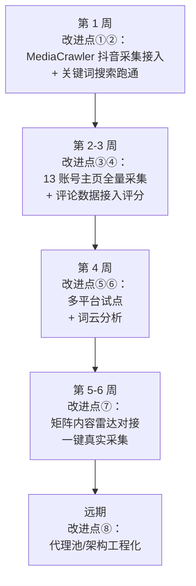

# 🔍 MediaCrawler 深度分析与结合改进方案

> [!note] 实施进度
> MediaCrawler 与妙搭、云端采集节点及口播稿转录的实际开发状态见 [[0809-爬虫开发日志]]。

> [!summary] 📌 文档说明
> - **分析对象**：开源项目 MediaCrawler（NanmiCoder/MediaCrawler，下载于 2026-08-05，本地位置 `E:\全自动爬取短视频、推文爆款程序\MediaCrawler`）
> - **分析目的**：① 说清楚 MediaCrawler 的全部主要功能；② 与我们的「自动爆款视频采集分析系统 / 矩阵内容雷达」对比；③ 找出可用 MediaCrawler 改进我们项目的具体方案
> - **结论速览**：🔥 **<span style="color:#e74c3c">MediaCrawler 是免费的多平台采集器，我们项目是爆款分析大脑——两者互补性极强</span>**，用 MediaCrawler 替代付费第三方 API 采集层，**📊 <span style="color:#e67e22">每年可省 ~¥400</span>**，并解锁"关键词搜索发现新爆款""创作者主页全量采集""评论采集"三大能力

## 相关笔记

- [[Coze（抖音API）+Codex共同开发（本地）.md]] — 方案 v1（Coze 采集）
- [[第三方抖音API/第三方抖音API+DeepSeek开发(云端).md]] — 方案 v2（云服务器 + Web 后台）
- [[第三方抖音API/第三方抖音API+DeepSeek开发(本地).md]] — 方案 v3（最终落地方案）
- [[本地部署短视频分析程序介绍文档]] — 项目全貌介绍
- [[矩阵号爆款数据分析与标准定义]] — 爆款基准线定义（改进点③的直接受益者）
- [[口播稿转录]] — 采集到视频后如何转成口播稿的高Star开源项目汇总（姊妹篇）

## 索引

- 🎯 [[#一、MediaCrawler 项目全景]] — 项目定位、架构与 7 平台采集能力
- 🧩 [[#二、MediaCrawler 核心功能详解]] — 亮点功能、技术栈与关键配置项
- 🏠 [[#三、我们项目现状梳理]] — 自家系统架构、核心优势与痛点
- ⚖️ [[#四、两大项目对比总览]] — 14 个维度能力对比与结论
- 🚀 [[#五、结合改进方案（核心）]] — 8 大改进点详案、收益与优先级
- 🗺️ [[#六、改进优先级路线图]] — 分阶段实施计划
- ⚠️ [[#七、风险与注意事项]] — 许可协议、平台风控与合规风险
- ✅ [[#八、总结]] — 结论与第一步行动建议

---

## 一、MediaCrawler 项目全景

### 1.1 项目定位

MediaCrawler 是一个基于 Python 的**多平台自媒体数据采集工具**（GitHub 上最知名的自媒体爬虫项目，NanmiCoder/MediaCrawler，由"程序员阿江 relakkes"开发维护），支持 **小红书 / 抖音 / B站 / 快手 / 微博 / 贴吧 / 知乎 7 大平台**。

**技术核心**：基于 **Playwright 浏览器自动化框架 + CDP（Chrome DevTools Protocol）模式**，复用用户真实浏览器环境（真实 Cookie、真实指纹、已登录状态），绕过 JS 逆向加密算法的复杂性，显著降低平台风控风险。

**许可协议**：NON-COMMERCIAL LEARNING LICENSE 1.1 —— 仅限技术研究学习用途，**⚠️ <span style="color:#e74c3c">明确禁止商业用途</span>**（这点对我们是否"直接使用"有影响，详见第七章风险分析）。

### 1.2 整体架构

```
main.py（入口：CrawlerFactory 工厂 + 主流程）
    ├── config/          # 配置系统：全局配置 + 7 个平台专项配置 + 数据库配置
    ├── base/            # 抽象基类：AbstractCrawler / AbstractLogin / AbstractStore / AbstractApiClient
    ├── media_platform/  # 7 大平台爬虫实现（每平台含 core/client/login/field/help/exception）
    ├── model/           # Pydantic 数据模型（每平台一套）
    ├── database/        # 数据持久化：SQLAlchemy 异步 ORM（14 张表），支持 SQLite/MySQL/PostgreSQL + MongoDB
    ├── store/           # 存储实现层：CSV/JSON/JSONL/Excel 文件导出 + 数据库落库
    ├── api/             # WebUI 后端：FastAPI（爬虫控制/数据查询/WebSocket 实时日志）
    ├── webui/           # 前端界面：Vue3 + Vite
    ├── proxy/           # 代理 IP 池：快代理/豌豆HTTP/极速HTTP/静态代理 + 自动刷新
    ├── cache/           # 缓存抽象：内存缓存 / Redis 缓存
    ├── tools/           # 工具库：CDP 浏览器管理、词云生成、滑块验证码、重试等
    ├── cmd_arg/         # CLI 参数解析（Typer，20+ 参数）
    ├── recv_sms.py      # 短信验证码接收微服务（配合 SmsForwarder App）
    └── docs/            # 使用文档（数据存储指南/Excel导出指南/CDP模式指南）
```

### 1.3 支持的平台与采集能力

| 平台 | 采集内容 | 采集模式 | 特殊能力 |
|------|---------|---------|---------|
| **小红书** | 笔记详情 / 评论(含二级) / 创作者信息 / 图片 / 视频 | search / detail / creator | 国际版支持；排序方式可选（综合/最热/最新） |
| **抖音** | 作品详情 / 评论(含二级) / 创作者信息 / 图片 / 视频 / 音频 | search / detail / creator | 短链接解析；多格式视频ID；发布时间过滤 |
| **B站** | 视频详情 / 评论(含二级) / UP主信息 / 视频下载 / UP主动态 | search / detail / creator | 时间范围搜索；画质选择；动态采集 |
| **快手** | 视频详情 / 评论 / 创作者信息 | search / detail / creator | GraphQL 接口；风控自动睡&刷新Cookie |
| **微博** | 笔记详情 / 评论 / 创作者信息 / 图片 | search / detail / creator | 搜索类型（综合/实时/热门/视频）；长文全文获取 |
| **贴吧** | 帖子详情 / 评论(楼中楼) / 创作者信息 | search / detail / creator | 模拟真实用户访问路径；反检测JS注入 |
| **知乎** | 回答/文章/ZVideo / 评论 / 创作者信息 | search / detail / creator | 三种内容类型自动识别；搜索页Cookie独立获取 |

**三种采集模式（--type 参数，💡 <span style="color:#2980b9">这是本项目最值得借鉴的设计</span>）**：

| 模式 | 说明 | 典型场景 |
|------|------|---------|
| **search** | 按关键词搜索，遍历多页搜索结果，逐个采集详情+评论 | "找到所有讲 X 话题的内容"——**发现新内容** |
| **detail** | 按指定帖子 ID/URL 列表，直接采集对应帖子详情+评论 | "这 50 条链接给我全量数据"——**定点采集** |
| **creator** | 按创作者主页采集其**全部作品**+评论 | "把这个账号的历史内容全抓下来"——**全量追踪** |

### 1.4 数据保存方式（8 种）

CSV / JSON / JSONL（默认，追加式）/ Excel（多工作表格式化）/ SQLite / MySQL / PostgreSQL / MongoDB

> 数据库模式自动去重（`video_id`/`note_id`/`comment_id` 设唯一索引）；文件模式按追加逻辑避免覆盖。

---

## 二、MediaCrawler 核心功能详解

### 2.1 核心亮点功能

| 功能 | 说明 | 对我们的价值 |
|------|------|------------|
| **① CDP 模式（最大亮点）** | 💡 <span style="color:#2980b9">复用真实 Chrome/Edge 浏览器环境采集</span>，免 JS 逆向、抗风控；失败自动降级到标准 Playwright 模式 | 采集稳定性高，不需要破解加密算法 |
| **② 三种登录方式** | 二维码登录 / 手机号+短信验证码（recv_sms 服务）/ Cookie 登录；登录态自动缓存（`browser_data/`），一次登录长期有效 | 采集成本为 **¥0**，无需第三方 API |
| **③ 评论全量采集** | 每平台支持采集评论（可选含二级评论/楼中楼），单帖条数可配置 | 补全我们评分体系缺失的"评论互动"数据 |
| **④ 词云生成** | jieba 中文分词 + wordcloud，自动从评论生成词云图与词频统计 | 用户关注点可视化 → 脚本选题参考 |
| **⑤ 代理 IP 池** | 快代理/豌豆/极速/静态代理，自动验证、抽取、过期刷新 | 大流量采集时的抗封号方案参考 |
| **⑥ 数据隐私脱敏** | 教学版用户 ID 哈希匿名化、昵称脱敏 | 合规意识参考 |
| **⑦ WebUI 采集控制** | FastAPI + Vue3：一键启停爬虫、数据查询、WebSocket 实时日志 | 我们矩阵内容雷达可借鉴"采集控制"页面 |
| **⑧ 多平台统一架构** | 工厂模式 + 四层抽象基类，新增平台只需按相同结构实现 | 架构设计参考 |

### 2.2 技术栈与运行要求

| 层次 | 技术选型 |
|------|---------|
| 语言 | **Python 3.11+**（uv 包管理） |
| 浏览器自动化 | Playwright 1.61+ + CDP 协议，**Chrome ≥ 144** |
| 异步框架 | asyncio + httpx |
| Web 框架 | FastAPI + Uvicorn（WebUI 后端） |
| ORM | SQLAlchemy 2.0 异步 + alembic |
| 数据库 | SQLite / MySQL / PostgreSQL / MongoDB（至少一种） |
| 前端 | Vue3 + Vite（可选） |
| 其他 | **Node.js ≥ 16**（抖音/知乎需要）、Redis（可选）、jieba/wordcloud（词云）、tenacity（重试） |

### 2.3 关键配置项（.env 示例）

```
# 平台与采集
PLATFORM=dy                 # 目标平台（xhs/dy/ks/bili/wb/tieba/zhihu）
KEYWORDS=论文辅导,SCI一区     # 搜索关键词（逗号分隔）
LOGIN_TYPE=qrcode           # 登录方式（qrcode/phone/cookie）
CRAWLER_TYPE=search         # 采集类型（search/detail/creator）
CRAWLER_MAX_NOTES_COUNT=15  # 最大采集条数
MAX_CONCURRENCY_NUM=1       # 并发数
CRAWLER_MAX_SLEEP_SEC=2     # 请求间隔（防限流）

# 浏览器
ENABLE_CDP_MODE=True        # CDP 模式（复用真实浏览器）
SAVE_LOGIN_STATE=True       # 保存登录态

# 存储
SAVE_DATA_OPTION=sqlite     # csv/db/json/jsonl/sqlite/excel/postgres

# 评论
ENABLE_GET_COMMENTS=True    # 采集评论
ENABLE_GET_SUB_COMMENTS=False  # 二级评论
CRAWLER_MAX_COMMENTS_COUNT_SINGLENOTES=10  # 单帖评论数上限
```

---

## 三、我们项目现状梳理

### 3.1 项目定位

**「自动爆款视频采集分析系统」（auto-douyin-collector / 矩阵内容雷达）**——为公司 13 个抖音矩阵号（七哥组 5 + 鱼哥组 3 + 华哥组 5，外部号 2）打造的爆款追踪与分析系统，全部聚焦 AI 科研论文辅导方向。

### 3.2 架构现状（两代并存）

**① 方案文档版（知识库 5 份文档描述的设计，详见 [[本地部署短视频分析程序介绍文档|本地部署短视频分析程序介绍文档]] 与 [[第三方抖音API/第三方抖音API+DeepSeek开发(本地).md|第三方抖音API+DeepSeek开发(本地)]]）**：

```
抖音链接（13个矩阵号，每天 48-120 条）
    ↓
ApiZero 极数本源第三方 API（¥0.01/次，按量计费）
    ↓ 返回：标题/文案/点赞/评论/收藏/分享/标签/作者/audio_url
本地 Python 流水线：
    数据清洗 → 爆款评分（动态阈值，各账号独立基准线）→
    SenseVoice 口播稿件提取（本地免费）→ 历史数据校准器 → SQLite 去重
    ↓
DeepSeek 周报分析（每周一次，¥0.5/月）
    ↓
飞书多维表格（团队查看）+ 飞书群通知（每日报告）
```

**② 实际部署版（E:\全自动爬取短视频、推文爆款程序，矩阵内容雷达）**：

- **backend**：FastAPI 0.2.0（`main.py` / `accounts.py` / `db.py` / `models.py` / `services/collection`），SQLite（radar.sqlite3），账号管理（12 个矩阵号 JSON 配置）
- **frontend**：Next.js + TypeScript（账号列表、视频数据、CSV 导入页面）
- **云端站点**：https://matrix-content-radar-cn.safetakrstec754.chatgpt.site
- **当前状态**：`COLLECTION_PROVIDER=demo`（第三方 API 采集默认关闭，用演示数据）；抖音开放平台应用与 12 个账号授权**尚未完成**；飞书同步和爆款分析为后续模块

### 3.3 我们项目的核心优势（MediaCrawler 没有的）

| 优势 | 说明 |
|------|------|
| **爆款评分体系** | S/A/B/C 四级 + 各账号独立动态阈值（中位数基准，校准器自动更新）——这是基于 5-7 月真实数据打磨的业务资产 |
| **口播稿件提取** | SenseVoice 全内存转写，零成本拿到视频口播文案 |
| **DeepSeek 周报** | 自动生成 Markdown 周报：TOP10 排行、热门标签、爆款特征、下周创作建议 |
| **飞书协作链路** | 多维表格团队共享 + 群通知每日报告 |
| **Web 工作台** | 矩阵内容雷达（账号管理/CSV导入/数据看板）已上线 |

### 3.4 我们项目的痛点（MediaCrawler 正好能补的）

| # | 痛点 | 现状影响 |
|---|------|---------|
| ① | **数据源依赖付费 API** | 📊 <span style="color:#e67e22">ApiZero ¥0.01/次，120 条/天 ≈ ¥30-40/月</span>；且第三方 API 数据稳定性不可控 |
| ② | **抖音开放平台授权卡住** | ⚠️ <span style="color:#e74c3c">应用创建、12 个账号授权流程未完成，导致 `COLLECTION_PROVIDER=demo`，系统还没有真实数据流入</span> |
| ③ | **只能"给链接采单条"** | 无关键词搜索能力 → 无法主动发现新爆款/竞品内容，爆款发现靠人工（5-7 月数据是手工从飞书 wiki 整理的，见 [[矩阵号爆款数据分析与标准定义.md|矩阵号爆款数据分析与标准定义]]） |
| ④ | **无创作者主页全量采集** | 13 个账号的历史数据无法自动积累，动态校准器"数据 ≥30 条才启用"的条件难以满足 |
| ⑤ | **无评论采集** | 评分体系中的"评论 25 分 / 高互动 +5"维度缺数据，互动分析只能靠点赞 |
| ⑥ | **仅支持抖音单平台** | 竞品在知乎/B站/小红书的内容完全盲区 |
| ⑦ | **无词云/文本分析** | 无法可视化洞察用户评论关注点 |

---

## 四、两大项目对比总览

| 维度 | 我们项目 | MediaCrawler | 对比结论 |
|------|---------|:------------:|:--------:|
| 平台支持 | 仅抖音 | **7 大平台** | MediaCrawler 胜 |
| 采集方式 | 链接 → 单条（第三方 API） | **搜索 / 链接 / 创作者主页** 三种 | MediaCrawler 胜 |
| 采集成本 | ¥30-40/月 | **¥0**（浏览器扫码登录） | MediaCrawler 胜 |
| 评论采集 | ❌ 无 | ✅ 完整（含二级评论） | MediaCrawler 胜 |
| 视频/音频下载 | ❌（只用 audio_url 转写） | ✅ 图片/视频/音频 | MediaCrawler 胜 |
| 爆款评分（动态阈值） | ✅ **独有** | ❌ 无 | **我们胜** |
| 口播稿件提取 | ✅ SenseVoice | ❌ 无 | **我们胜** |
| AI 周报分析 | ✅ DeepSeek | ❌ 无 | **我们胜** |
| 飞书团队协作 | ✅ 多维表格+群通知 | ❌ 无 | **我们胜** |
| Web 界面 | ✅ 矩阵内容雷达（Next.js） | ✅ 采集控制台（Vue3） | 互补 |
| 数据存储 | SQLite | 8 种（CSV/JSON/Excel/4 种数据库） | MediaCrawler 胜 |
| 词云/文本分析 | ❌ 无 | ✅ jieba 词云 | MediaCrawler 胜 |
| 代理 IP / 抗封号 | ❌ 无 | ✅ 代理池 + CDP | MediaCrawler 胜 |
| 许可 | 自有代码无限制 | 非商用学习许可 | 我们无限制 |

> 💡 **一句话结论**：🔥 **<span style="color:#e74c3c">MediaCrawler 是"免费的多平台采集器"，我们项目是"爆款分析大脑"</span>**。采集层我们薄弱（付费+单一+无发现能力），分析层他们完全没有。**两者结合 = 免费采集 + 智能分析的最优组合**。

---

## 五、结合改进方案（核心）

### 改进点 ①：用 MediaCrawler 替代第三方付费 API，实现采集零成本（最高优先级）

| 项目 | 说明 |
|------|------|
| **现状** | ApiZero 按量计费 ¥30-40/月；抖音开放平台授权未完成，系统处于 demo 状态 |
| **MediaCrawler 能力** | 抖音爬虫扫码登录一次 → 采集视频详情+评论，**¥0 成本**，登录态缓存长期有效 |
| **改进方案** | ① 在本地 Windows 配置 MediaCrawler 抖音模块（Python 3.11 + Playwright + Chrome）；② 用我们自己的运营账号扫码登录一次；③ `detail` 模式接管"按链接采集"：每日把 13 个矩阵号的新视频链接列表喂给它 → 自动采回详情+评论 → 输出 CSV/SQLite → 导入我们现有清洗评分管线 |
| **收益** | 📊 <span style="color:#e67e22">年省 ~¥400</span>；摆脱第三方 API 稳定性/额度限制；抖音开放平台授权不再是唯一出路 |
| **优先级** | ⭐⭐⭐⭐⭐ ｜ **难度**：中 ｜ **成本**：¥0 |

### 改进点 ②：关键词搜索——从"被动追踪"到"主动发现"（高价值）

| 项目 | 说明 |
|------|------|
| **现状** | 只能采集已知链接；爆款发现靠手工收集飞书 wiki（5-7 月数据即如此） |
| **MediaCrawler 能力** | `search` 模式：按关键词遍历搜索结果，采集内容+评论 |
| **改进方案** | 用业务关键词定期搜索，自动发现：① 竞品新爆款（"论文辅导""SCI一区""审稿人"等）；② 热点选题方向（"下一个发文风口"类趋势词）；③ 同行账号内容——结果直接进入**脚本创作查重库**和**选题灵感库**（对应 [[总结好的大纲以及笔记/实习就业/工作文件/脚本&推文撰写/脚本资料库/参考的资料/受众报告/受众报告.md|受众报告]] 的选题流程与"原创红线"查重机制） |
| **收益** | 🔥 <span style="color:#e74c3c">爆款发现从"人工翻飞书"变"系统自动扫"，选题效率大幅提升</span> |
| **优先级** | ⭐⭐⭐⭐⭐ ｜ **难度**：低（配置 KEYWORDS 即可） ｜ **成本**：¥0 |

### 改进点 ③：创作者主页全量采集——爆款基准数据自动化

| 项目 | 说明 |
|------|------|
| **现状** | 矩阵号爆款基准线（[[矩阵号爆款数据分析与标准定义.md|矩阵号爆款数据分析与标准定义]]）基于手工整理的 5-7 月数据；校准器需要"每账号 ≥30 条数据"才能启用动态阈值，数据积累慢 |
| **MediaCrawler 能力** | `creator` 模式：输入创作者主页 URL → 自动采集**全部作品**+评论 |
| **改进方案** | 把 13 个矩阵号 + 外部号（胖子、YUK）的主页全部录入，每周跑一次 creator 全量采集 → 历史数据自动积累 → 校准器数据源永不枯竭，各账号动态阈值更快启用、更精准 |
| **收益** | 评分体系从"静态预设基准"加速进化到"全自动自适应"；每次校准都有真实完整数据支撑 |
| **优先级** | ⭐⭐⭐⭐ ｜ **难度**：低 ｜ **成本**：¥0 |

### 改进点 ④：评论采集——补全互动维度数据

| 项目 | 说明 |
|------|------|
| **现状** | 评分公式中"评论 25 分""高互动率 +5 分"依赖评论数据，但第三方 API 评论数据有限/缺失 |
| **MediaCrawler 能力** | 每平台评论采集（可含二级评论/楼中楼），单帖条数可配置 |
| **改进方案** | 采集管线接入评论数据：① 爆款评分"评论/互动"维度真正可算；② 评论内容进入 DeepSeek 周报分析（用户真实反馈）；③ 评论区词云洞察用户关注点 |
| **收益** | 评分更准确；周报更有料；选题更有依据 |
| **优先级** | ⭐⭐⭐⭐ ｜ **难度**：低 ｜ **成本**：¥0 |

### 改进点 ⑤：多平台扩展——竞品监控盲区清零

| 项目 | 说明 |
|------|------|
| **现状** | 只有抖音；竞品在知乎/B站/小红书的科研论文内容完全盲区 |
| **MediaCrawler 能力** | 小红书/知乎/B站/微博/快手/贴吧全套采集 |
| **改进方案** | ① 知乎：搜索"论文辅导""SCI 发表"等关键词 → 学术人群真实需求洞察；② B站：科研教学类 UP 主作品 → 内容形式参考；③ 小红书：科研博主爆款 → 选题灵感。采集结果可统一落到 SQLite 与我们现有分析管线打通（或先用独立库试点） |
| **收益** | 从"抖音单平台运营"升级为"全域内容情报"，为四条内容线选题提供跨平台弹药 |
| **优先级** | ⭐⭐⭐（探索试点） ｜ **难度**：中 ｜ **成本**：¥0 |

### 改进点 ⑥：词云分析——选题灵感可视化

| 项目 | 说明 |
|------|------|
| **现状** | 无文本分析能力 |
| **MediaCrawler 能力** | jieba 分词 + 词云图 + 词频 JSON |
| **改进方案** | ① 评论区词云 → 用户关注点地图；② 爆款标题词云 → 高赞标题的高频词/公式；③ 直接对接《矩阵号爆款数据分析与标准定义.md》中的"爆款标题公式"体系 |
| **收益** | 选题从"凭感觉"变"看词云数据" |
| **优先级** | ⭐⭐⭐ ｜ **难度**：低 ｜ **成本**：¥0 |

### 改进点 ⑦：矩阵内容雷达加"采集控制"能力

| 项目 | 说明 |
|------|------|
| **现状** | 矩阵内容雷达已有账号管理/数据看板/CSV 导入，但采集任务需要外部触发 |
| **MediaCrawler 能力** | FastAPI 采集控制台：启动/停止爬虫、数据查询、WebSocket 实时日志 |
| **改进方案** | 借鉴其 API 设计，在矩阵内容雷达 backend 增加 `POST /api/collections` 的真实采集提供方：`COLLECTION_PROVIDER=mediacrawler` 时，后端调用 MediaCrawler CLI 完成采集并落库（现有 `services/collection` 已预留 provider 抽象） |
| **收益** | 前端一键触发真实采集，demo → 正式一步到位 |
| **优先级** | ⭐⭐ ｜ **难度**：中高 ｜ **成本**：¥0 |

### 改进点 ⑧：工程能力借鉴（远期）

| 项目 | 说明 |
|------|------|
| **代理 IP 池** | 采集量增大后的抗封号方案（快代理/豌豆/极速/静态代理+自动刷新）——可借鉴其 `proxy/` 模块设计 |
| **重试机制** | tenacity 装饰器 + 最长等待 10 分钟的重试策略 |
| **CDP 降级策略** | 浏览器启动失败自动 fallback 到标准模式 |
| **异步全链路** | asyncio.Semaphore 并发控制 + gather 批处理 |
| **优先级** | ⭐（远期按需借鉴，不直接搬代码） ｜ **难度**：视场景 |

---

## 六、改进优先级路线图



| 阶段 | 改进点 | 期望效果 |
|------|--------|---------|
| **立即（本周）** | ① 采集零成本 ② 关键词搜索 | 系统有真实数据流入；爆款发现自动化 |
| **短期（2-4 周）** | ③ 主页全量采集 ④ 评论采集 | 校准器数据源充足；评分体系完整 |
| **中期（1-2 月）** | ⑤ 多平台 ⑥ 词云 | 全域内容情报 + 选题可视化 |
| **远期** | ⑦ 工作台对接 ⑧ 工程化 | 一键化、规模化、抗封号 |

---

## 七、风险与注意事项

### 7.1 ⚠️ 许可协议风险（最重要）

- ⚠️ **<span style="color:#e74c3c">MediaCrawler 采用 NON-COMMERCIAL LEARNING LICENSE 1.1，明确禁止商业用途</span>**
- 我们的系统服务于公司业务（运营 13 个矩阵号做引流获客），属于商业场景
- **应对建议**（三选一）：
  1. **个人学习试用**：先在本地跑通流程、验证采集质量（完全合规）
  2. **联系作者获得商用授权**：GitHub 仓库联系 NanmiCoder 洽谈
  3. **借鉴思路自研**：参考其架构与采集思路（CDP 复用浏览器、search/detail/creator 模式），**自行实现不复制代码**（思路不受版权限制，代码受协议约束）
- 💡 最稳妥路径：先按建议 1 验证价值 → 价值确认后走建议 2 或 3

### 7.2 平台风控风险

- 浏览器自动化采集存在**账号风控/封号风险**（MediaCrawler 的 CDP 模式已尽力降低，但风险无法归零）
- **建议**：① 优先用**低权重小号**扫码登录采集；② 控制采集频率（`CRAWLER_MAX_SLEEP_SEC` 适当调大）；③ 不要对同一账号频繁大量采集

### 7.3 登录态维护

- 二维码登录需人工扫码；Cookie 失效后需重新登录
- **建议**：定期（如每周）检查登录态；采集失败时日志提示重新登录

### 7.4 技术栈适配

- MediaCrawler 要求 **Python 3.11+**、Chrome ≥ 144、抖音/知乎需 Node.js ≥ 16；我们本地已有 Python 3.13 环境（满足 3.11+）
- **建议**：独立 venv/uv 环境安装，不污染现有矩阵内容雷达环境；两项目通过"文件/数据库"对接而非代码级耦合

### 7.5 数据合规

- 采集内容涉及用户评论等数据，注意：不对外公开原始数据、不采集隐私字段、参考 MediaCrawler 的脱敏思路（ID 哈希、昵称脱敏）

---

## 八、总结

**MediaCrawler 不是要取代我们项目，而是补上我们最薄弱的一环——采集层。**

| 我们的项目 | MediaCrawler |
|-----------|:------------|
| ✅ 爆款评分（动态阈值） | ✅ 免费多平台采集 |
| ✅ 口播提取（SenseVoice） | ✅ 关键词/主页/链接三模式 |
| ✅ AI 周报（DeepSeek） | ✅ 评论全量采集 |
| ✅ 飞书协作链路 | ✅ 词云分析 |
| ✅ Web 工作台（矩阵内容雷达） | ✅ CDP 抗风控采集 |

**💡 <span style="color:#2980b9">理想融合形态</span>**：

```
MediaCrawler（采集层，¥0）──→ 我们的清洗评分管线（分析层）
        ↑                                ↓
   13 账号主页/关键词/链接            SQLite 数据仓库
        ↑                                ↓
   每日定时自动采集                矩阵内容雷达 WebUI / 飞书多维表格
```

**第一步行动建议**：本周内 ① 在本地给 MediaCrawler 配好抖音环境（Python 3.11 venv + Playwright + Chrome）；② 用低权重账号扫码登录；③ 用 `detail` 模式跑通 10 条真实链接采集，验证数据质量——验证通过后再谈批量接入与授权事宜。

> 📄 开源项目本地位置：`E:\全自动爬取短视频、推文爆款程序\MediaCrawler`（README.md / docs/ 内有官方使用文档）
