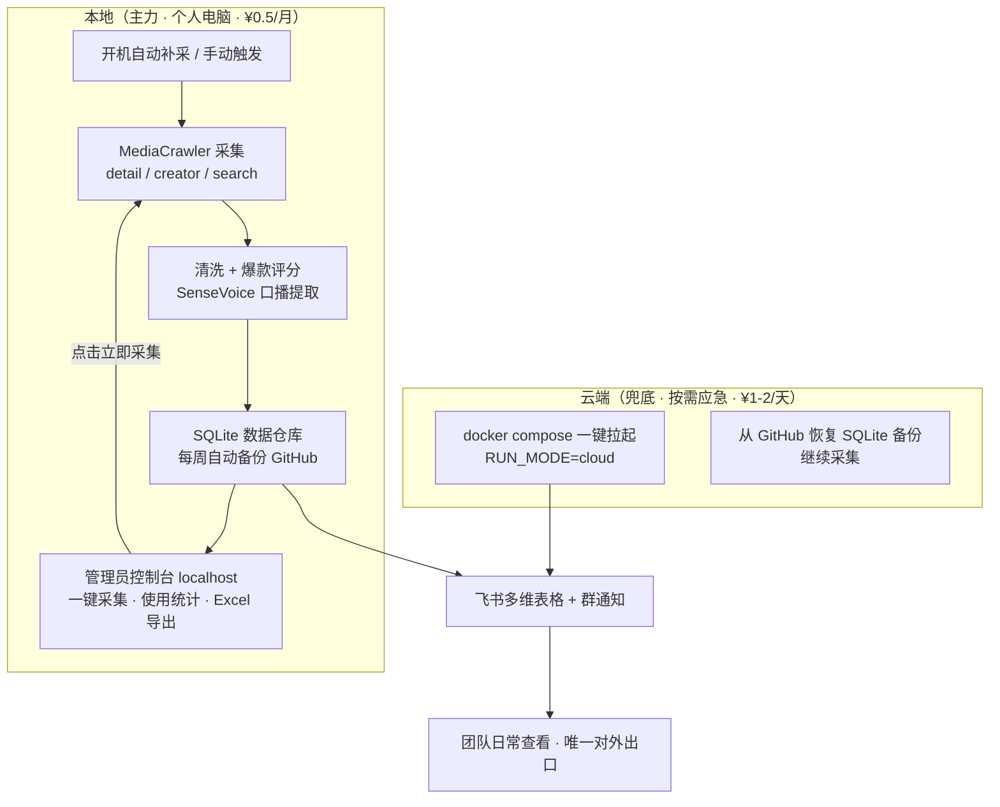

# 🏠 本地部署短视频分析程序介绍文档（改良版）

> [!note] 项目进度
> 本方案的实际落地状态、动态账号改造、云端部署与转录进度见 [[0809-爬虫开发日志]]。

> [!summary] 📌 文档说明
> - **文档定位**：在 [[本地部署短视频分析程序介绍文档|原版介绍文档]] 的基础上，结合 [[MediaCrawler深度分析与结合改进方案|MediaCrawler 深度分析]] 的 8 大改进点，按"公司性价比优先"原则重构的**最终落地方案介绍**
> - **核心决策**：🔥 **<span style="color:#e74c3c">本地部署为主力（个人电脑）+ 云端按需应急兜底 + 飞书作为唯一对外出口</span>**，直接成本 **📊 <span style="color:#e67e22">¥0.5/月</span>**（MediaCrawler 采集 ¥0 + DeepSeek 周报 ¥0.5）
> - **用途**：给 Codex（AI 编程助手）介绍改良版项目全貌，作为后续开发指令的入口文档
> - **新增能力**：管理员控制台——随时一键采集、累计调用次数与使用量统计、数据一键导出 Excel 并可直接复制

## 相关笔记

- [[MediaCrawler深度分析与结合改进方案|MediaCrawler 深度分析与结合改进方案]] — 本改良版的改进源头（8 大改进点详案）
- [[本地部署短视频分析程序介绍文档|本地部署短视频分析程序介绍文档]] — 原版介绍文档（本文档的改良基线）
- [[第三方抖音API/第三方抖音API+DeepSeek开发(本地).md|第三方抖音API+DeepSeek开发(本地)]] — 方案 v3（原最终落地方案，本改良版的评分/飞书/周报模块基座）
- [[第三方抖音API/第三方抖音API+DeepSeek开发(云端).md|第三方抖音API+DeepSeek开发(云端)]] — 方案 v2（云端常驻方案，本次经评估否决常驻）
- [[矩阵号爆款数据分析与标准定义|矩阵号爆款数据分析与标准定义]] — 爆款基准线定义（评分体系的数据依据）
- [[Coze（抖音API）+Codex共同开发（本地）.md|Coze（抖音API）+Codex共同开发（本地）]] — 方案 v1（已弃用）

## 索引

- 🎯 [[#一、改良总览：与原版相比改了什么]] — 8 大改良点对比一览
- 🏗️ [[#二、部署架构：本地主力 + 云端应急]] — 双模式架构与切换逻辑
- 🔄 [[#三、核心数据流：三模式采集 → 评分 → 飞书]] — 数据全链路与字段映射
- ⏰ [[#四、调度机制：开机补采 + 手动触发]] — 与个人电脑匹配的调度设计
- 🔘 [[#五、管理员控制台：一键采集 / 使用统计 / Excel 导出]] — 三大新增功能详解
- ☁️ [[#六、云端切换机制（兜底）]] — RUN_MODE 配置 + Docker + 应急手册
- 💰 [[#七、成本分析：为什么是 ¥0.5/月]] — 性价比论证（含人工对比）
- ⚠️ [[#八、风险清单与应对]] — 许可 / 风控 / 登录态 / 单点故障
- 🛠️ [[#九、技术栈与运行要求]] — 环境依赖清单
- 🗺️ [[#十、一期实施路线图]] — 分阶段落地计划
- ✅ [[#十一、总结]] — 一句话结论与第一步行动

---

## 一、改良总览：与原版相比改了什么

> 改良的出发点是一次**纯公司视角的性价比审视**：原版方案月成本 ¥30-40（第三方 API），存在"链接从哪来"的设计死结，且"每天 02:00 定时采集"要求主机常开——与"个人电脑不常开机"的现实直接冲突。本次改良逐项解决。

| # | 维度 | 原版（v3 方案） | 改良版 | 收益 |
|:-:|:---|:---|:---|:---|
| ① | **数据源** | ApiZero 第三方 API（¥0.01/次） | **MediaCrawler 免费采集**（浏览器扫码登录，¥0） | 年省 ~¥400，摆脱第三方 API 稳定性/额度依赖 |
| ② | **采集能力** | 仅"给链接采单条" | **抖音三模式**：detail（链接）/ creator（创作者主页全量）/ search（关键词发现） | 解锁竞品发现、历史数据自动积累 |
| ③ | **调度方式** | 每天 02:00 定时（需主机常开） | **开机补采 + 手动触发**（接受 1-3 天延迟） | 与个人电脑使用习惯匹配，漏采可自动补 |
| ④ | **部署形态** | 纯本地单机 | **本地主力 + 云端按需应急**（`RUN_MODE=local/cloud` 切换） | 常态 ¥0，出问题 10 分钟上云，团队零感知 |
| ⑤ | **团队入口** | 未明确（Web/飞书并行） | **飞书 = 唯一对外出口** | 本地/云端切换对团队完全透明，无需内网穿透/域名 |
| ⑥ | **Web 工作台** | 云端站点（chatgpt.site，需 VPN） | **仅管理员本地使用**，云端站点停用 | 砍掉 VPN 依赖与托管成本 |
| ⑦ | **登录账号** | 未定 | **运营者个人号**（离职后交接主管号），矩阵号不参与采集 | 矩阵号零风控暴露 |
| ⑧ | **合规** | 未处理 | **先本地验证 → 联系作者商用授权** | 走合规路径，风险可控 |

> 💡 **<span style="color:#2980b9">最关键的改良洞察：creator 模式（按创作者主页全量采集）一举解决了原方案"每日视频链接列表从哪来"的死结</span>**——原设计里链接列表一直是空的，导致系统永远无法真正运转。改为录入 13 个矩阵号主页 URL 后，采集器自己就能发现全部新作品，配合 SQLite 去重自动跳过已采数据。

---

## 二、部署架构：本地主力 + 云端应急



**架构要点：**

- 🔥 **<span style="color:#e74c3c">飞书是系统唯一对外出口</span>**：无论采集在本地还是云端跑，团队看到的都是同一张飞书多维表格。切换对团队零感知——这是整个兜底方案成立的地基。
- 💡 **<span style="color:#2980b9">本地与云端跑的是同一套代码</span>**：仅通过 `.env` 中的 `RUN_MODE` 切换，代码零改动。环境差异由 Docker 抹平。
- 📊 **<span style="color:#e67e22">常态成本 ¥0.5/月（仅 DeepSeek 周报），云端仅在故障时按天付费</span>**，用完即释放。

**与矩阵内容雷达的关系（管理员本地控制台）：**

- 采集管线产出 SQLite → 矩阵内容雷达 backend 读取同一 SQLite（沿用现有 `COLLECTION_PROVIDER` 抽象，扩展 `mediacrawler` 提供方）→ 管理员在本地 `localhost` 访问看板
- 看板升级为**管理员控制台**：一键采集（随时触发）、使用统计（累计调用次数/使用量）、Excel 导出，详见 [[#五、管理员控制台：一键采集 / 使用统计 / Excel 导出|第五节]]
- 控制台不做对外发布、不做内网穿透——团队不需要它，省下一切服务器/穿透费用

---

## 三、核心数据流：三模式采集 → 评分 → 飞书

### 3.1 采集模式（MediaCrawler 抖音模块）

| 模式 | 输入 | 产出 | 用途 |
|:---|:---|:---|:---|
| **detail** | 视频链接/ID 列表 | 单条视频详情 + 评论 | 定点采集（群里有同事甩链接时用） |
| **creator** | 创作者主页 URL | **全部作品** + 评论 | 13 个矩阵号每日全量追踪（主力模式） |
| **search** | 业务关键词 | 搜索结果视频 + 评论 | 竞品发现、热点选题（"论文辅导""SCI 一区"等） |

> 📌 业务关键词采集结果直接进入**选题灵感库与脚本查重库**（对应 [[总结好的大纲以及笔记/实习就业/创业黑马——数智科技部门/工作文件/脚本&推文撰写/脚本资料库/参考的资料/受众报告/受众报告|受众报告]] 的选题流程与"原创红线"查重机制），为四条内容线提供数据弹药。

### 3.2 处理管线

```
MediaCrawler 采集（¥0）
    ↓ CSV / SQLite 输出
字段映射 → 数据清洗（提取标签、标准化"1.2万"等数字）
    ↓
爆款评分（S/A/B/C 四级，各账号独立动态阈值，纯本地计算）
    ↓
SenseVoice 口播提取（默认仅对 S/A 级视频转写，转写后删除音视频文件）
    ↓
SQLite 去重落库（video_id 唯一索引）
    ↓
collection_logs 采集统计（每次运行写入一条，看板聚合展示累计调用次数与使用量）
    ↓
DeepSeek 周报（每周一次，¥0.5/月）→ 飞书多维表格 + 群通知
```

### 3.3 字段映射（MediaCrawler 抖音字段 → 统一格式）

| 统一字段 | MediaCrawler 来源 | 说明 |
|:---|:---|:---|
| video_id | `aweme_id` | 去重主键 |
| title / desc | `desc` | 文案（含 #标签） |
| tags | `desc` 中提取 | 沿用原清洗逻辑 |
| author | `nickname` | 账号名（映射到矩阵号配置） |
| likes / comments / collects / shares | `statistics.like_count` 等 | 评分四维度数据 |
| create_time | `create_time` | 发布时间 |
| cover_url / video_url | `cover` / `video` | 转写与展示用 |

### 3.4 评分体系

- 沿用 v3 方案与 [[矩阵号爆款数据分析与标准定义|矩阵号爆款数据分析与标准定义]] 的评分公式：点赞 35 分 / 评论 25 分 / 收藏 25 分 / 分享 15 分 + 加分项，等级 S/A/B/C
- 校准器：每账号数据 ≥ 30 条后自动切换为该账号自身中位数阈值（creator 模式让数据积累速度大幅提升，校准更快启用）
- 外部号（胖子、YUK）沿用独立获客类评分规则

---

## 四、调度机制：开机补采 + 手动触发

> ⚠️ **<span style="color:#e74c3c">这是与原版最大的行为差异</span>**：不再要求"每天 02:00 电脑必须开着"，而是让系统适配人的使用习惯。

**为什么可以这样做（时效性论证）：**

- 抖音的点赞/评论/收藏数据**不会因为晚采一天而消失**——晚 1-3 天采集，爆款还是爆款，数据值基本不变
- 本系统服务的是"选题参考 + 爆款追踪"，不是实时监控，**容忍 1-3 天延迟完全够用**
- 漏采不等于丢数据：下次开机时补采即可

**具体机制：**

| 触发方式 | 行为 |
|:---|:---|
| **开机自动补采** | 电脑开机/登录后自动运行采集脚本：creator 模式全量扫 13 个账号主页 → SQLite 去重自动跳过已采数据 → 缺失日期的数据自然补齐 |
| **手动触发** | `--run-now` 立即执行一次全量采集；`--test-one URL` 测试单条链接 |
| **采集完成通知** | 每次采集结束发送飞书群通知（成功数/新增数/爆款数），团队第一时间知道数据已更新 |

> 💡 **<span style="color:#2980b9">补采之所以"零成本实现"，靠的是 creator 全量采集 + SQLite 去重</span>**：全量扫一遍的成本只是重复扫描的时间（数据量小，可忽略），重复数据全部被唯一索引拦截，不会重复入库、不会重复通知。

---

## 五、管理员控制台：一键采集 / 使用统计 / Excel 导出

> 三大新增功能全部落在**矩阵内容雷达 Web 看板**（本地 localhost，管理员本人使用），让系统从"定时脚本"升级为"点一下就出结果"的工具。全部本地实现，**成本仍为 ¥0**。

### 5.1 随时一键采集

**典型场景**：今天发的视频，原计划后天统一采集——但过了一个小时你就想看数据。打开看板 → 点击"立即采集" → 📊 **<span style="color:#e67e22">数据 1 分钟内出现在表格与飞书中</span>**。

| 采集入口 | 说明 |
|:---|:---|
| **一键全量**（默认） | creator 模式扫 13 个矩阵号主页，新增数据自动入库并同步飞书 |
| **指定账号** | 下拉选择单个/多个账号，只采指定号（如"华哥组昨天发的 5 条"） |
| **单条链接** | 粘贴抖音链接 → detail 模式定点采集（同事在群里甩链接时最快） |

**技术实现要点：**

- 后端新增 `POST /api/collections/trigger` → 后台线程执行采集（与开机补采共用同一套采集函数）→ 前端轮询进度 → 完成后刷新表格 + 飞书自动同步
- ⚠️ **<span style="color:#e74c3c">任务互斥锁：同一时间只允许一个采集任务运行</span>**，防止手动采集与开机补采并发写 SQLite；重复点击时提示"采集进行中"
- 登录态失效时任务自动失败，页面提示"请重新扫码登录"
- 需要电脑在线（看板跑在本地）——与"电脑不常开"的补采机制正好互补：💡 **<span style="color:#2980b9">想采时随时采，没采时开机补</span>**

### 5.2 使用统计：累计调用次数与使用量

看板新增**统计页**，实时展示平台累计使用数据：

| 统计项 | 口径 |
|:---|:---|
| 📊 **<span style="color:#e67e22">累计调用次数</span>** | 采集任务运行总次数（自动补采 / 手动一键分开统计） |
| 累计采集视频数 | 总抓取条数 + 去重后新增条数（两个口径） |
| 累计评论数 | 采集到的评论总条数 |
| 累计口播转写数 | SenseVoice 转写成功的稿件条数 |
| 累计周报生成数 | DeepSeek 周报生成次数 |
| 各账号采集分布 | 每个矩阵号的采集条数排名 |
| 最近采集记录 | 最近 20 次任务：时间 / 类型 / 条数 / 耗时 / 状态 |
| 数据存储量 | SQLite 文件占用大小 |

**技术实现**：复用 v2 方案设计的 `collection_logs` 明细表（`run_at / total / success / failed / viral / elapsed / status`），每次采集运行写入一条，统计页实时聚合查询——无需额外维护计数表，数据量小，聚合开销可忽略。

### 5.3 Excel 导出与直接复制

| 能力 | 说明 |
|:---|:---|
| **导出 Excel** | 看板"导出 Excel"按钮 → 后端 openpyxl 生成 `.xlsx`，全字段：视频ID / 账号 / 标题 / 文案 / 标签 / 点赞 / 评论 / 收藏 / 分享 / 评分 / 等级 / 发布时间 / 采集时间 / 口播稿件 / 视频链接 |
| **直接复制** | 看板数据表格支持**框选复制** + "复制全部"按钮（CSV 格式，可直接粘贴到 Excel / 飞书 / 微信） |

> 📌 飞书多维表格本身也支持导出 Excel/CSV，两个出口互补：**团队在飞书导出，管理员在看板导出**。

---

## 六、云端切换机制（兜底）

### 5.1 设计原则

> 💡 **<span style="color:#2980b9">"切换云端"不是另一套系统，而是同一套代码换个环境跑</span>**。真出问题时你往往没有时间去部署环境——所以环境差异必须提前用 Docker 抹平。

### 5.2 配置开关

```ini
# .env
RUN_MODE=local            # local=本地运行（默认） | cloud=云端运行
DATA_SOURCE=mediacrawler  # 采集提供方（沿用 COLLECTION_PROVIDER 抽象）
COLLECTION_PROVIDER=mediacrawler   # 矩阵内容雷达 backend 对接用
```

- `RUN_MODE` 与 `DATA_SOURCE` **两个维度独立**：既支持"本地跑 MediaCrawler"，也支持"云端跑 MediaCrawler"，互不干扰
- 云端切换唯一变化：数据库连接指向云端 SQLite（恢复自备份），其余代码路径完全一致

### 5.3 Docker 化（兜底可用的前提）

- MediaCrawler 官方支持 docker compose（含 Chrome + Playwright 环境）
- 自研清洗评分管线同样打成 Docker 镜像，与 MediaCrawler 容器编排在同一 compose 文件
- 本地日常运行**不需要** Docker（直接跑脚本），Docker 只服务于"上云"场景——不增加日常使用成本

### 5.4 数据备份（切换的前提）

- **SQLite 每周自动备份**到 GitHub 私有仓库（复用现有 GitHub 账号 xieji-star 习惯），或飞书云文档
- 数据量极小（48-120 条/天 × 几百字节/条），备份文件 KB 级，上传瞬间完成
- 上云恢复 = 克隆备份文件 → 指向即可，5 分钟完成

### 5.5 应急上云手册（预案）

| 步骤 | 操作 | 耗时 |
|:---:|:---|:---:|
| ① | 判断触发条件：本地故障连续 **3 天以上**（电脑送修/长期出差/系统损坏） | — |
| ② | 购买按量付费云服务器（2C2G，Linux，约 ¥1-2/天） | 5 分钟 |
| ③ | `git clone` 项目仓库 + `docker compose up -d` 拉起整套系统 | 10 分钟 |
| ④ | 恢复 SQLite 备份（`RUN_MODE=cloud`）→ 自动开始补采 | 5 分钟 |
| ⑤ | 飞书同步自动接管，团队继续看飞书表格——**无感切换** | 0 |
| ⑥ | 本地恢复后：云端数据回传本地 → 释放云服务器（停止计费） | 10 分钟 |

> ⚠️ **<span style="color:#e74c3c">兜底档次说明</span>**：本方案采用"轻档兜底"（按需应急，平时零成本）。不做"本地心跳监控 + 自动故障转移"的重档方案——13 个号、每天百来条数据的小系统，一期做重档纯属浪费，且超出 ¥5-10/月预算红线。

---

## 七、成本分析：为什么是 ¥0.5/月

### 6.1 月度成本对比

| 项目 | 原版 v3 | 云端常驻（v2） | **改良版（本地）** |
|:---|:---:|:---:|:---:|
| 服务器 | ¥0 | ¥49-99 | **¥0** |
| 第三方 API | ¥30-40 | ¥30-40 | **¥0（MediaCrawler）** |
| DeepSeek 周报 | ¥0.5 | ¥0.5 | **¥0.5** |
| 飞书 | ¥0 | ¥0 | **¥0** |
| 内网穿透/域名 | ¥0 | ¥0-10 | **¥0（不需要）** |
| **合计** | **~¥30-40** | **~¥85-150** | **📊 <span style="color:#e67e22">~¥0.5/月</span>** |

> 📌 管理员控制台三功能（一键采集 / 使用统计 / Excel 导出）均为纯本地实现，不产生任何新增成本，总成本维持 ¥0.5/月。

### 6.2 与"人工做"对比（公司视角的本质）

> 🔥 **<span style="color:#e74c3c">这套系统的价值锚点不是"省 ¥30"，而是"替代人工"</span>**——决策标准是：系统成本 > 人工成本时，换人来。

| 方案 | 月成本 | 效果 |
|:---|:---:|:---|
| **人工做** | 每天 30 分钟 × 30 天 = **15 小时/月**（即便按 ¥10/时 计 ≈ **¥150/月**） | 易漏、不持久、无评分体系、无历史积累、无周报 |
| **系统做** | **¥0.5/月** | 自动、留痕、可校准、可分析、飞书直达 |

- 📊 **<span style="color:#e67e22">系统 vs 人工 ≈ 300 倍性价比差距</span>**，且系统产出（评分/周报/词云）是人工无法稳定提供的
- 💡 **<span style="color:#2980b9">预算红线 ¥30/月内，改良版 ¥0.5/月 大幅达标</span>**；若未来出现超 ¥30/月的诉求（如重档兜底），直接触发"换人"评估线

---

## 八、风险清单与应对

| # | 风险 | 等级 | 应对措施 |
|:-:|:---|:---:|:---|
| ① | **MediaCrawler 非商用许可**（公司业务=商用场景） | 🔴 高 | 合规三步走：**先本地验证**（个人学习用途）→ 价值确认后 **GitHub 联系作者洽谈商用授权** → 必要时**借鉴 CDP 思路自研**（思路不受版权约束，代码受协议约束） |
| ② | **主机不常开 → 采集中断** | 🟠 中 | 已通过"开机补采 + 手动触发"机制解决；接受 1-3 天延迟 |
| ③ | **账号风控/封号** | 🟠 中 | 只用**运营者个人号**扫码登录，矩阵号零暴露；控制采集频率（`CRAWLER_MAX_SLEEP_SEC` 调大）；只读行为为主，不做点赞/关注等操作 |
| ④ | **登录态失效** | 🟠 中 | Cookie 过期后采集失败 → 日志提示 + 飞书告警 → 重新扫码（约 1 分钟）；**离职交接时重新用主管号扫码** |
| ⑤ | **家庭宽带动态 IP** | 🟡 低 | 动态 IP 属常态，影响有限；若触发风控，加大请求间隔或错峰采集 |
| ⑥ | **数据合规** | 🟡 低 | 不对外公开原始数据；评论数据参考 MediaCrawler 脱敏思路（ID 哈希、昵称脱敏） |
| ⑦ | **磁盘空间** | 🟡 低 | 默认**不下载视频文件**；转写仅 S/A 级且转写后立即删除音视频，只留文本 |
| ⑧ | **单一维护者** | 🟡 低 | 应急上云手册文档化（本文档第六节），任何懂 Python 的人可接手 |
| ⑨ | **并发写库冲突** | 🟡 低 | 采集任务互斥锁：一键采集与开机补采共用同一任务队列，同一时间只跑一个任务 |

---

## 九、技术栈与运行要求

| 层次 | 技术选型 | 说明 |
|:---|:---|:---|
| 语言 | Python 3.11+（uv 包管理） | 本地已有 Python 3.13，满足 |
| 采集 | MediaCrawler + Playwright + **Chrome ≥ 144** | 独立 venv 安装，不污染其他项目环境 |
| 浏览器 | Chrome/Edge（CDP 模式复用真实登录态） | 抖音/知乎需 Node.js ≥ 16 |
| 音频转写 | SenseVoice（FunASR）+ ffmpeg | ffmpeg 用于从视频抽音频；本地免费 |
| 存储 | SQLite | 去重 + 本地缓存，零成本 |
| 评分/校准 | 自研 `cleaner.py` / `calibrator.py`（沿用 v3 设计） | 纯本地计算，不调 API |
| AI 分析 | DeepSeek API | 仅每周周报调用 |
| 团队协作 | 飞书多维表格 + 群机器人 Webhook | 唯一对外出口 |
| 调度 | Windows 任务计划（开机触发）+ 手动 CLI | 替代原 APScheduler 常驻方案 |
| 兜底 | Docker（仅上云时用）+ GitHub 私有仓库（备份） | 环境差异由容器抹平 |
| 采集统计 | `collection_logs` 明细表 + 实时聚合查询 | 累计调用次数 / 使用量展示 |
| Excel 导出 | openpyxl（后端生成 .xlsx） | 看板一键导出，全字段 |
| 任务互斥 | 采集任务锁（后台线程 + 状态标记） | 防一键采集与补采并发写库 |
| 雷达看板 | FastAPI + Next.js（现有矩阵内容雷达） | 管理员控制台：一键采集 / 统计 / 导出，仅本地 localhost |

---

## 十、一期实施路线图

| 阶段 | 内容 | 验收标准 |
|:---|:---|:---|
| **第 1 步（本周）** | 本地配置 MediaCrawler 抖音环境（venv + Playwright + Chrome）；**运营者个人号扫码登录**；detail 模式跑通 10 条真实链接 | 数据质量验证通过（合规的"个人学习验证"阶段） |
| **第 2 步** | creator 模式接入 **13 个矩阵号主页 URL** → 全量采集 + 去重 → 数据流入清洗评分管线 | 各账号历史数据自动积累，评分产出真实等级 |
| **第 3 步** | search 模式接入业务关键词 → 结果进入选题灵感库/脚本查重库 | 竞品新爆款可自动发现 |
| **第 4 步** | 开机补采调度 + 采集完成飞书通知 + SQLite 每周自动备份 GitHub | 漏采自动补齐；团队第一时间收到数据更新通知 |
| **第 5 步** | **管理员控制台三功能**：一键采集（全量 / 指定账号 / 单链接）、统计页（累计调用次数与使用量）、Excel 导出与复制 | 点击"立即采集"1 分钟内出数据；统计页数字正确；导出的 Excel 可正常打开与复制 |
| **第 6 步** | Docker 化 + 应急上云手册演练一次（按量云服务器拉起 + 释放） | 10 分钟内完成云端接管，团队无感 |
| **第 7 步** | 价值确认后联系作者洽谈商用授权（或评估自研方案） | 合规落地 |

> 📌 一期**不做**：多平台扩展（知乎/B站/小红书）、评论全量采集深度接入评分、词云分析、重档故障转移——均按优先级后置，详见 [[MediaCrawler深度分析与结合改进方案|MediaCrawler 深度分析与结合改进方案]] 第六节路线图。

---

## 十一、总结

> 🔥 **<span style="color:#e74c3c">一句话结论：本地跑（¥0.5/月）+ 云端备（¥1-2/天，出事才用）+ 飞书看（团队无感）——用最小的钱，把采集、评分、周报、协作全链路跑起来。</span>**

**改良版相比原版的核心进步：**

1. **数据源免费化**：MediaCrawler 替代 ApiZero，年省 ~¥400，摆脱第三方 API 依赖
2. **采集能力质变**：detail / creator / search 三模式，解决"链接从哪来"的死结，解锁竞品发现与历史数据积累
3. **调度适配现实**：开机补采 + 手动触发，与个人电脑使用习惯匹配
4. **控制台可操作化**：随时一键采集、累计使用统计、Excel 导出，点一下就出结果
5. **兜底真实可用**：一套代码 + Docker + 应急手册，10 分钟上云，团队零感知
6. **合规路径明确**：先验证 → 后授权 → 必要时自研

**第一步行动（本周）：** 在本地配置 MediaCrawler 抖音环境，用运营者个人号扫码登录，detail 模式跑通 10 条真实链接验证数据质量——验证通过后，按路线图推进。

> 📄 开源项目本地位置：`E:\全自动爬取短视频、推文爆款程序\MediaCrawler`（README.md / docs/ 内有官方使用文档）
