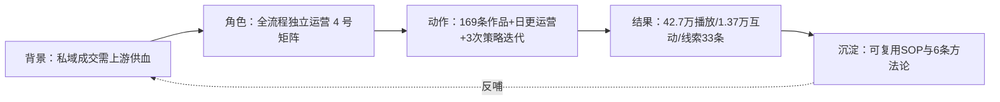

> [!summary] 概要
> 本文档是实习结束后的**账号运营数据闭环复盘**，统计范围为实习期（2026-07-24 至 2026-09-03）本人参与运营的图灵学术「华哥系列」4 个抖音矩阵账号（主责：**科研华哥、发论文的华哥**）。数据来源于抖音创作者中心作品列表导出（4 份 xlsx，导出于 2026-09-01）与工作日报/周报的人工统计，覆盖：内容产出、播放互动、获客线索、私域转化、SOP 全流程工时量化、问题诊断与方法论沉淀。**结论速览**：实习期 4 账号共产出作品 **169 条**（视频 93 + 图文 76），累计播放 **42.7 万**、互动 **1.37 万**、作品带来粉丝增长 **583**；主责双账号累计播放 **13.7 万**；灯塔录入有效销售线索**累计 33 条**（单日峰值 6 条、单周峰值 13 条）；内容全流程独立完成，累计内容制作工时约 **165 小时**。

## 📑 索引

- 🎯 [[#一、实习概览与结论速览（闭环）]] — 背景 → 角色 → 动作 → 结果 → 沉淀
- 📊 [[#二、实习期数据总览（7.24—9.03）]] — 四账号矩阵总表 + 主责账号明细 + 周度节奏
- 🔥 [[#三、TOP 内容拆解]] — 实习期爆款 TOP5 与可复用要素
- ⏱️ [[#四、SOP 全流程量化]] — 每个环节的耗时 × 累计量 → 总工时
- 💬 [[#五、获客与私域转化数据]] — 评论 / 私信 / 线索 / 粉丝群
- 🩺 [[#六、问题诊断与应对（迭代记录）]] — 3 次典型事件与改进闭环
- 🧠 [[#七、方法论沉淀]] — 可迁移的 6 条方法
- 📎 [[#八、对照口径：简历版数据（6.04—9.04）]] — 满三个月口径（仅用于简历素材，勿与实习口径混用）

---

# 📈 实习账号运营数据复盘（2026.07.24—09.03）

> [!INFO] 📌 复盘信息
> - **实习公司/部门**：创业黑马科技集团 · 数智科技部门 · 图灵学术（科研/论文辅导业务线）
> - **实习岗位**：新媒体运营（抖音矩阵账号方向，上游引流获客）
> - **实习周期**：2026-07-24 至 2026-09-03（约 6 周 / 30 个工作日）
> - **汇报对象**：mentor 韩玲
> - **运营账号**：主责「科研华哥」「发论文的华哥」；小组矩阵共 4 号（另含「华哥聊论文」「搞科研的华哥」）
> - **数据口径说明**：
>   - 作品数据来自抖音创作者中心「作品列表」导出（2026-09-01 导出，播放/互动为导出时点的累计值；实习期发布作品共 169 条全部纳入）；
>   - 线索/评论/粉丝群数据来自每日工作日报与周报的人工记录；
>   - 互动率 =（赞 + 评 + 转 + 藏）÷ 播放量。

---

## 一、实习概览与结论速览（闭环）

> [!IMPORTANT] 🎯 一段话闭环
> **背景**：图灵学术业务线靠私域成交（论文/科研辅导），上游需要抖音矩阵内容持续获取意向用户。**角色**：作为实习生在 2026-07-30 升级为**全流程独立运作**——选题、脚本、制作、发布、运营、线索登记一人闭环，主责 2 号、兼顾 4 号矩阵。**动作**：6 周内独立产出 169 条作品（日均 4 条脚本 / 2-6 条数字人视频 / 2-5 篇图文），执行「脚本 8 分剪辑 2 分」+「四条内容线 40/25/20/15 配比」+「先查重再动笔」策略，并经历 3 次平台风控/流量事件迭代。**结果**：4 账号累计播放 42.7 万、互动 1.37 万（互动率 3.2%）、作品带来粉丝 +583；大号「科研华哥」粉丝达 1.2 万；灯塔录入有效线索累计 33 条、单日峰值 6 条。**沉淀**：把「爆款拆解 → 结构化脚本 → 数据复盘」拧成一套可复用 SOP，并留下查重基线、内容线配比、私信两分法话术等 6 条方法论。

---

## 二、实习期数据总览（7.24—9.03）

### 2.1 四账号矩阵总表

| 账号 | 作品数 | 视频 | 图文 | 播放量 | 点赞 | 评论 | 转发 | 收藏 | 互动量 | 互动率 | 主页访问 | 作品带来粉丝 |
|------|:---:|:---:|:---:|------:|---:|---:|---:|---:|---:|:---:|---:|:---:|
| **科研华哥**（主责·大号） | 43 | 25 | 18 | 30,006 | 988 | 119 | 109 | 910 | 2,126 | 7.1% | 501 | 88 |
| **发论文的华哥**（主责·小号） | 41 | 23 | 18 | 107,199 | 1,364 | 158 | 65 | 950 | 2,537 | 2.4% | 612 | 118 |
| 华哥聊论文 | 43 | 24 | 19 | 212,819 | 3,258 | 440 | 303 | 2,803 | 6,804 | 3.2% | 1,893 | 289 |
| 搞科研的华哥 | 42 | 21 | 21 | 77,037 | 1,145 | 109 | 92 | 850 | 2,196 | 2.9% | 710 | 88 |
| **合计** | **169** | **93** | **76** | **427,061** | **6,755** | **826** | **569** | **5,513** | **13,663** | **3.2%** | **3,716** | **583** |

> [!NOTE] 口径备注
> ① 43 条「科研华哥」作品中 35 条为「自见」状态（存稿/审核中），公开作品 8 条承担了绝大部分播放；② 「作品带来粉丝」指作品页直接转化的关注，未含粉丝群与主页路径；③ 播放/互动为 2026-09-01 导出时点累计值；④ 线索另有**群日报追踪口径**（8 月起按人统计）：本人累计线索 08.10 为 11 条 → 08.18 为 14 条 → 08.25 为 21 条 → 08.28 为 26 条，搭档朱柏达同期 08.28 累计 38 条（其主责「华哥聊论文」「搞科研的华哥」两号）——第五节「累计 33 条」为 08.10 周报口径（含 7 月下旬贡献），两套口径统计起点不同，**并存不可混用**。

### 2.2 主责双账号关键结论

- **双账号合计**：84 条作品，播放 137,205，互动 4,663（互动率 3.4%），主页访问 1,113，作品带来粉丝 +206；
- **单条均值**：播放 1,633 条/均，互动 55.5 条/均；
- **「小号反超大号」现象**：小号「发论文的华哥」单条播放均值约 2,615，约为大号「科研华哥」的 3.7 倍（大号疑似限流，见 [[#六、问题诊断与应对（迭代记录）]]）；8/4 单条 3,963 播放、8/6 单条 4,214 播放均为小号贡献；
- **大号基本盘**：「科研华哥」实习开始时粉丝约 1.1—1.2 万，为矩阵提供信任背书；其互动率 7.1% 显著高于其他号，说明存量粉丝粘性强，问题在播放供给而非内容质量。

### 2.3 周度产出与流量节奏

| 周（ISO） | 日期范围 | 4账号作品数 | 4账号播放 | 4账号互动 | 备注 |
|------|------|:---:|---:|---:|------|
| W30 | 07.20—07.26 | 10 | 68,171 | 1,776 | 实习首周，快速接手 |
| W31 | 07.27—08.02 | 30 | 94,559 | 4,253 | **流量周峰值**（华哥聊论文 6.3 万） |
| W32 | 08.03—08.09 | 36 | 38,653 | 1,355 | 产量周峰值；限流事件后整改 |
| W33 | 08.10—08.16 | 43 | 90,351 | 3,557 | 恢复反弹 |
| W34 | 08.17—08.23 | 33 | 27,922 | 1,215 | 常规日更 |
| W35 | 08.24—08.30 | 17 | 7,605 | 571 | 实习收尾（导出截至 8.25 批次） |

- **日均产出**：作品 4.0 条/天（169 ÷ 42 自然日），工作日日均约 5.6 条；
- **节奏特征**：产量稳定在每周 30-43 条；流量呈「脉冲式」——单条爆款（5.4 万播放）可贡献单周 60%+ 播放，验证「爆款驱动型」流量结构，与「私信质量 > 播放量」的获客定位相互印证。

---

## 三、TOP 内容拆解

### 3.1 实习期 4 账号播放 TOP5

| # | 账号 | 日期 | 类型 | 标题（截取） | 播放 | 赞 | 藏 | 评 | 转 | 带粉 |
|:-:|------|------|:---:|------|---:|---:|---:|---:|---:|:---:|
| 1 | 华哥聊论文 | 07.24 | 长图文 | 第一张图没画好，论文直接挂一半 | **54,097** | 546 | 538 | 64 | 80 | 60 |
| 2 | 华哥聊论文 | 07.31 | 1-3min视频 | 消融实验指标涨了，审稿人还是质疑是"冗余堆砌"？ | 42,045 | 734 | 576 | 101 | 31 | 59 |
| 3 | 华哥聊论文 | 08.15 | 1-3min视频 | 审稿人一句"创新不足"就把你拒了？这三招让他无话可说 | 26,928 | 564 | 618 | 120 | 64 | 57 |
| 4 | 华哥聊论文 | 08.14 | 长图文 | （热门标签图文） | 22,198 | 200 | 212 | 20 | 8 | 24 |
| 5 | 华哥聊论文 | 07.28 | 1-3min视频 | 还在靠熬夜做科研？AI 已经改写规则 | 13,478 | 223 | 176 | 47 | 60 | 29 |

### 3.2 主责账号最佳单条

- **科研华哥**：07.29 长图文《引言不会写？套用这套漏斗保命架构》——播放 **16,287**，赞 374 / 藏 471 / 评 64 / 转 46，**单条带粉 42**，互动率 5.9%；
- **发论文的华哥**：08.01 视频《做了一年实验写不出论文？因为你的顺序彻底颠倒了》——播放 **11,072**，赞 210 / 藏 158 / 评 22 / 转 21，单条带粉 16；次优 07.31《论文标题吸睛三招》播放 10,150、单条带粉 21。

### 3.3 可复用爆款要素（从 TOP 内容提炼）

1. **痛点前置 + 数字承诺**：「90% 都在凑字数」「三招让他无话可说」——数字量化出现在标题首句；
2. **审稿人/导师视角冲突**：把用户恐惧具象成「审稿人质疑」「第一张图挂一半」等场景，代入感强；
3. **收藏导向型干货**：TOP 内容赞藏比普遍 > 0.9（收藏≈点赞），说明「工具型 checklist」内容天然高收藏，利于长尾流量；
4. **长图文同样是爆款载体**：54,097 播放冠军为长图文，打破「只有视频能爆」预设——图文制作成本仅为视频 1/2，性价比更高；
5. **结尾咨询钩子直接带粉**：TOP5 单条带粉 24-60，咨询钩子（留 \/ 领资料）与内容强绑定时转化最好。

---

## 四、SOP 全流程量化

> 依据 [[总结好的大纲以及笔记/实习就业/创业黑马——数智科技部门/SOP/矩阵账号日常运营SOP.md|矩阵账号日常运营SOP]] 各环节耗时基准 × 实习期实际产出量折算。

### 4.1 视频全流程（单条耗时 × 实习期累计）

| 环节 | 单条耗时 | 实习期累计量（估） | 累计工时（估） |
|------|:---:|:---:|:---:|
| Step1 脚本独立创作（查重→撰写→送审→修改） | 20-40 min | — | — |
| Step2 内部工具关键词优化 | 2-5 min | — | — |
| Step3 TTS 纠错发音预处理 | 1-3 min | — | — |
| Step4 MiniMax AI 语音生成 | 3-8 min | — | — |
| Step5 Heygen 数字人生成 | 5-10 min | — | — |
| Step6 剪映封面制作 | 5-10 min | — | — |
| Step7 剪映剪辑（字幕/特效/BGM/贴纸/钩子） | 9-15 min | — | — |
| Step8-9 组合发布 + 标签 | 2-3 min | — | — |
| **视频合计（93 条）** | **约 47-94 min/条（中值 ≈70）** | **93 条** | **≈108 h** |

### 4.2 图文流程与运营动作

| 事项 | 单次耗时/量 | 实习期累计（估） |
|------|:---:|:---:|
| 图文制作发布（脚本 20-40min + 制作 10-15min，中值 ≈45min/篇） | ≈45 min | 76 篇 ≈ **57 h** |
| 脚本创作总量 | 4-5 条/日 | **160+ 条**（含备用与拆解稿） |
| 评论巡查/回复（20-50 次/日） | 1 次以上/小时 | **1,000+ 条次**互动处理 |
| 私信转化沟通（两分法话术） | 按需 | 触达全部咨询私信 |
| 灯塔线索录入（三大必填校验） | 5-8 min/条 | **33 条**（累计） |
| 粉丝群运营（新成员推送 + 定期重复 + 扩容） | 200→500 人机制 | 4 号矩阵群日常维护 |

> [!TIP] ⏱️ 总账
> 实习期**内容制作总工时 ≈ 165 小时**（视频 108h + 图文 57h，不含运营与线索处理），折合**每个工作日约 5.5 小时纯制作**；加上每小时评论巡查与私信转化，支撑起「4 视频 + 6 图文 + 10 脚本」的日产能基准并保持 6 周不断更。

---

## 五、获客与私域转化数据

| 指标         | 数据                                                   | 说明                                   |
| ---------- | ---------------------------------------------------- | ------------------------------------ |
| 灯塔录入有效线索   | **累计 33 条**（截至 08.10 周报口径）                           | 三大必填：联系方式 + 微信昵称 + 专业方向              |
| 线索单日峰值     | **6 条**（07.30，其中 2 条高意向「保毕业」用户优先移交跟进）                |                                      |
| 线索单周峰值     | **13 条**（08.03—08.10 周报）                             | 8/3 单日 5 条                           |
| 8 月累计线索    | 11 条（08.10 日报口径，自 8 月起统计）                            |                                      |
| 日均评论/私信处理  | 20-50 条次                                             | 07.27 单日巡查 50 次                      |
| 曝光区间（日报记录） | 3,000—10,000+/日                                      | 与线索量正相关：线索随流量下滑明显（08.06 流量低谷 → 线索 0） |
| 私信话术体系     | 两分法（垂直急需 10 条直给话术 / 刚需「资料」利他话术）+ 特殊情况（不追问，同步 mentor） |                                      |
| 粉丝群机制      | 新成员推送 + 定期重复 + 200→500 人扩容                           | 4 号矩阵群日常维护                           |
| 审核金转化经验值 | 「基本上每 2 个审核金就会成交 1 单」（1000 元审核金 → Meeting → 签约链路） | mentor 8 月中旬复盘口径                    |
| 转正标准       | **每月 60-80 个线索 + 转化 5 万元**启动转正（团队拉齐）              | 08.18 mentor 明确                         |
| 大号激活提案    | 大号「纹丝不动」→ 提案「直接洗稿近一周爆款」并被采纳执行，爆款脚本登记复用 | 08.26—08.28（详见运营 SOP 第十一章）            |

> [!IMPORTANT] 转化链路结论
> 「播放 → 主页访问 → 私信/群 → 留资」四级漏斗中，**线索量与当日曝光强相关**（r≈1 的日级联动：流量谷=线索 0，流量峰 1 万+=线索 5-6 条）。因此上游内容供给的稳定性（不断更、多账号轮换发布）本身就是获客保障——这是本岗位「矩阵日更」策略的量化依据。

---

## 六、问题诊断与应对（迭代记录）

| # | 事件 | 根因诊断 | 应对措施 | 闭环结果 |
|:-:|------|---------|---------|---------|
| 1 | **限流事件**（7 月末）：1 条 1 万+ 播放视频被抖音以「内容重复」贴标签限流 | 4 号矩阵脚本月初统一生成，同质化触发平台原创判定 | 建立**「先查重再动笔」红线**：已覆盖主题清单 + 历史脚本库 + 竞品爆款库三重查重；同选题必须换角度 | 8 月再无同类处罚记录 |
| 2 | **大号增长乏力**：「科研华哥」播放卡在 1-2K，小号反超（单条 4,214 vs 大号 2 倍差距） | 疑似大号被平台限流；形象与内容调性错位 | 对标「阿彭讲SCI」调整服化道/背景，让数字人形象匹配内容；加大封面多元化与脚本开头结尾创新 | 小号持续产出 4K+ 单条，矩阵整体播放结构更均衡 |
| 3 | **私信话术转化低**：含「咨询/辅导」的回复一度一周无线索 | 营销气息触发用户防御心理 | 话术改为「免费资料 + 平台不能发文件」的利他角度，剔除敏感词；建立垂直急需/刚需两分法 | 剔除「咨询」话术后 2 天即出现新线索 |
| 4 | **大号激活攻坚**（08.26）：大号播放与粉丝「纹丝不动」，mentor 公开征集方案 | 内容供给老化，历史爆款骨架失效；大号疑似限流叠加 | 提案并执行「**直接洗稿近一周爆款**」：内容尽量少改动直接翻拍；爆款脚本登记备注供团队复用；「要抄就尽可能一样形态」；结尾钩子轻量化（「这是抖音平台，互动钩子轻一点」，删掉"陪170人走过"式长抒情结尾） | 形成大号激活打法并沉淀进 [[总结好的大纲以及笔记/实习就业/创业黑马——数智科技部门/SOP/矩阵账号日常运营SOP.md|矩阵账号日常运营SOP]] 第十一章 |

---

## 七、方法论沉淀

1. **「脚本 8 分、剪辑 2 分」**：数据验证——同制作成本下，脚本结构（黄金三秒 + 七步结构 + 结尾钩子）决定播放量级，剪辑只影响完播留存；
2. **四条内容线配比（技术痛点 40% / 方向判断 25% / 案例故事 20% / 筛选劝退 15%）**：以「私信质量 > 播放量」为判准的内容组合拳，避免流量好但线索差的虚假繁荣；
3. **AI 生产纪律**：AI 洗稿 + 人工「去 AI 味」修改必须两段式完成，直接使用 AI 原稿会导致矩阵内同质化连锁反应；
4. **爆款时效律**：对标拆解只看**一周内**爆款，过期骨架不再复用；
5. **平台风控三件套**：敏感词替换（微信→卫星/\/）、多账号轮换回复（破解 50 条陌生人回复上限）、查重基线防限流；
6. **全流程独立闭环能力**：从人设定位、选题、脚本、AI 语音、数字人、剪辑、发布到私域维护的完整链路单人可跑通——该能力可平移到任何「内容获客型」业务线；
7. **大号激活公式**：老号不起量时，用「近一周爆款直接洗稿 + 同款形态翻拍」替代原创试探，同时把结尾钩子做轻（平台互动钩子优先于转化长文案）——低成本撬动账号权重回暖。

---

## 八、对照口径：简历版数据（6.04—9.04）

> [!WARNING] ⚠️ 口径隔离
> 本节为**简历素材专用口径**（以 2026-09-04 为终点向前满 3 个月），与上文实习真实口径（7.24—9.03）**不可混用**；简历叙事中使用本表数据，内部复盘引用第二、四、五节真实数据。详细包装见 [[总结好的大纲以及笔记/实习就业/自己的素材库/简历素材库/谢积昌简历素材库|谢积昌简历素材库]]。

| 指标 | 4 账号矩阵合计（3 个月口径） |
|------|------|
| 运营账号 | 4 个（科研华哥 / 发论文的华哥 / 华哥聊论文 / 搞科研的华哥） |
| 作品产出 | **426 条** |
| 累计播放 | **176.3 万** |
| 互动总量（赞评转藏） | **9.56 万** |
| 主页访问 | 2.39 万 |
| 作品带来粉丝增长 | **5,220** |
| 单账号最佳 | 华哥聊论文：74 条作品 / 82.1 万播放 / 5.9 万互动 / +3,129 粉 |

---

## 🔗 相关笔记

- [[总结好的大纲以及笔记/实习就业/创业黑马——数智科技部门/SOP/矩阵账号日常运营SOP.md|矩阵账号日常运营SOP]] — 本复盘的数据所对应的完整操作流程
- [[总结好的大纲以及笔记/实习就业/创业黑马——数智科技部门/SOP/灯塔平台线索录入SOP.md|灯塔平台线索录入SOP]] — 线索定义与录入规范
- [[总结好的大纲以及笔记/实习就业/创业黑马——数智科技部门/业务线/科研论文辅导方向业务全景.md|科研论文辅导方向业务全景]] — 上游引流在业务线中的位置
- [[总结好的大纲以及笔记/实习就业/创业黑马——数智科技部门/跳槽/实习后跳槽方向分析.md|实习后跳槽方向分析]] — 本段经历的能力迁移去向
- [[总结好的大纲以及笔记/实习就业/自己的素材库/简历素材库/谢积昌简历素材库|谢积昌简历素材库]] — 简历口径的包装呈现
- 数据源文件（同目录）：`作品列表导出（科研华哥）.xlsx` · `作品列表导出(发论文的华哥).xlsx` · `作品列表导出（华哥聊论文）.xlsx` · `作品列表导出（搞科研的华哥）.xlsx`
