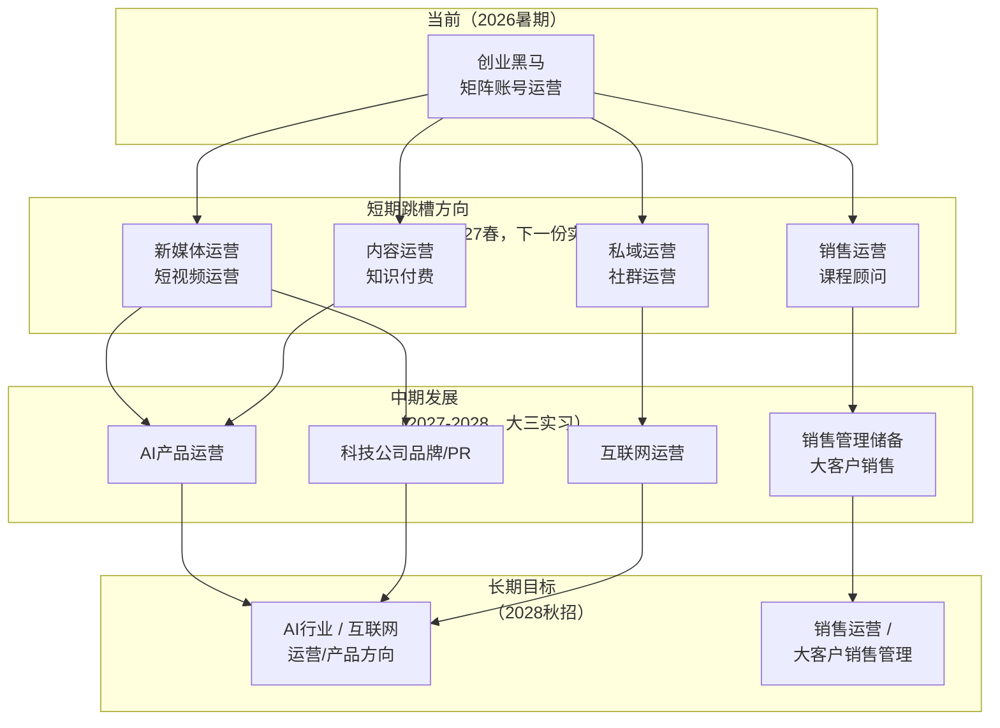

# 🚀 实习后跳槽方向分析

> [!summary] 概要
> 本文档系统拆解创业黑马实习岗位的**可迁移能力**，给出 **6 大可跳槽方向**（新媒体/短视频运营、私域/社群运营、AI 产品运营、内容运营、科技公司品牌 PR、销售运营/课程顾问）的适配度、薪资区间与待补能力，并用**三维坐标跳槽法**（行业 × 岗位 × 专业，每次只动一个轴）规划「短期 → 中期 → 长期」路径。2026-09-15 新增第五节：结合 mentor 韩玲（mt）的评价，把**「结果意识」与「稳定性」两条短板**映射到各岗位的考核门槛——结论是：**这两条短板不改变方向选择，但把「数据分析能力」从锦上添花升级为必须补的硬门槛。**

> [!INFO] 📌 文档说明
> 基于知识库「实习就业」相关内容及当前岗位经验，分析实习后可选择的跳槽方向。
> 
> **当前岗位**：创业黑马 — 数智科技部门 — 图灵学术（科研/论文辅导方向）— 矩阵账号运营
> **创始人**：雷勤
> **盈利模式**：私域转化（论文辅导/科研辅导1对1成交）
> **当前阶段**：上游引流获客（内容制作 → 矩阵发布 → 评论互动 → 私域线索录入）
> **岗位特点（2026-08-04）**：偏向**流量端**，但全链路接触销售话术（私域初筛/表单筛选/资料钩子/销售1对1通话），且 📊 **可接触总业务线销售数据**（线索量/转化率/客单价/GMV），可支撑跳槽销售类岗位

## 📑 索引

- 🧩 [[#一、当前岗位能力拆解]] — 8 项可迁移能力与对应岗位
- 🚪 [[#二、可跳槽方向]] — 6 个方向的适配度、薪资与待补能力
- 🗺️ [[#三、跳槽路径规划]] — 三维坐标跳槽法与短中长期路径
- 💡 [[#四、关键建议]] — 8 条可执行建议（含销售数据包装策略）
- 🎯 [[#五、导师评价与短板诊断（2026-09-15 新增）]] — 短板 → 岗位考核映射与面试打开方式
- 🔗 [[#🔗 相关笔记]] — 关联笔记入口

## 一、当前岗位能力拆解

| 能力维度 | 具体能力 | 可迁移性 | 对应岗位 |
|---------|---------|:--------:|---------|
| 📹 **短视频内容制作全流程** | 脚本优化→AI语音→数字人→封面→剪辑→发布 | ⭐⭐⭐ | 新媒体运营、短视频运营 |
| 🤖 **AI工具深度使用** | MiniMax语音、Heygen数字人、内部优化工具 | ⭐⭐⭐ | AI产品运营、AI工具培训 |
| 📊 **矩阵账号运营** | 4个抖音账号同步管理、内容排期、定时发布 | ⭐⭐⭐⭐ | 新媒体运营、账号矩阵管理 |
| 💬 **私域转化与社群运营** | 评论区引流、私信话术、粉丝群管理、线索获取 | ⭐⭐⭐⭐ | 私域运营、社群运营、用户运营 |
| 📝 **内容策划与关键词优化** | 脚本关键词优化、标签选取、内容调性把控 | ⭐⭐⭐ | 内容运营、文案策划 |
| 📋 **线索管理与系统录入** | 灯塔平台录入、用户信息筛选、跨小组对接 | ⭐⭐ | 运营助理、CRM运营 |
| 🔄 **多平台内容分发** | 抖音视频+图文双模式、定时发布策略 | ⭐⭐⭐ | 新媒体运营、内容分发运营 |
| 💬 **销售话术与转化链路理解** | 全链路接触私域销售话术（添加好友话术/表单筛选/资料钩子/销售1对1通话/折扣话术/分步结账）、理解多轮提纯筛选机制与可接/不接方向规则 | ⭐⭐⭐ | 销售运营、课程顾问、私域销售 |
| 📊 **销售数据敏感度** | 可接触总业务线销售数据（线索量、转化率、客单价 5w-65w、GMV），具备数据化销售思维 | ⭐⭐⭐ | 销售运营、销售管理储备、数据运营 |

## 二、可跳槽方向

### 方向1：新媒体运营 / 短视频运营（最直接对口）

- **适合公司类型**：MCN机构、教育公司、科技公司、知识付费型公司
- **薪资范围参考**：实习 100-200元/天；全职 8K-15K/月（一线城市）
- **能力匹配度**：⭐⭐⭐⭐⭐（高度匹配）
  - 短视频全流程制作经验（脚本→AI语音→数字人→剪辑→发布）直接复用
  - 矩阵号运营经验（4个账号同步管理）是差异化优势
  - 抖音平台深度使用经验
- **需要补充的能力**：
  - 小红书/微信公众号等其他平台的运营经验
  - 更高阶的剪辑能力和创意策划能力
  - 数据分析与复盘能力（从数据中提炼优化方向）

### 方向2：私域运营 / 社群运营

- **适合公司类型**：教育公司（考研/留学/考证）、知识付费、电商、大健康
- **薪资范围参考**：实习 120-200元/天；全职 8K-18K/月（一线城市）
- **能力匹配度**：⭐⭐⭐⭐
  - 私信话术转化经验 + 粉丝群管理经验直接对口
  - 评论区引流到私域的完整链路实操
  - "获取微信+研究方向"的线索筛选经验
- **需要补充的能力**：
  - 企业微信/个微私域工具的使用经验
  - 社群 SOP 和自动化运营能力
  - 用户分层管理与精细化运营思维

### 方向3：AI产品运营 / AI工具运营

- **适合公司类型**：AI创业公司、大模型厂商（如智谱、MiniMax、字节跳动）、AI工具类产品
- **薪资范围参考**：实习 150-250元/天；全职 10K-20K/月（一线城市，AI赛道溢价）
- **能力匹配度**：⭐⭐⭐
  - 深度使用 MiniMax（AI语音）、Heygen（数字人）等 AI 工具
  - 理解 AI 工具在内容生产中的应用场景和局限性
  - 能评估 AI 生成内容的质量并优化
- **需要补充的能力**：
  - AI 行业宏观认知（产业链、商业模式、竞争格局）
  - 产品思维（用户体验、需求分析、数据驱动）
  - 技术理解能力（能读懂基础 API 文档、理解 AI 模型原理）

### 方向4：内容运营 / 知识付费公司运营

- **适合公司类型**：得到、混沌学园、极客邦科技、知识星球类公司、在线教育
- **薪资范围参考**：实习 100-200元/天；全职 8K-15K/月
- **能力匹配度**：⭐⭐⭐⭐
  - 科研/论文辅导方向的内容运营经验，对学术人群有理解
  - 从脚本到成品的完整内容生产流程
  - 教育类内容的用户互动与转化经验
- **需要补充的能力**：
  - 更深度的选题策划与原创能力
  - 不同平台（公众号/小红书/知乎）的内容调性把控
  - 付费内容/课程运营经验

### 方向5：科技公司品牌 / PR / 市场运营

- **适合公司类型**：AI创业公司、科技媒体（36氪/机器之心）、企业服务SaaS公司
- **薪资范围参考**：实习 120-200元/天；全职 9K-18K/月
- **能力匹配度**：⭐⭐⭐
  - 创业黑马的行业背景（AI+创业服务）带来行业认知
  - 内容策划与制作能力可迁移到品牌内容生产
  - 跨部门协作经验
- **需要补充的能力**：
  - 品牌传播理论与方法论
  - 媒体关系管理能力
  - 活动策划与执行能力

### 方向6：销售运营 / 课程顾问 / 私域销售（流量端转销售端）

> 📌 **新增方向（2026-08-04）**：当前岗位虽偏流量端，但全链路接触销售话术（北京总部私域转化体系），且 📊 **可接触总业务线销售数据**——这是跳槽销售类岗位的 🔥 **独特优势**，可利用数据美化包装简历。

- **适合公司类型**：教育公司（考研/留学/论文辅导/职教）、知识付费、企培机构、SaaS/B2B 销售公司
- **薪资范围参考**：实习 150-250元/天（销售岗有提成空间）；全职 底薪 6K-10K + 提成，综合 10K-25K/月（一线城市）
- **能力匹配度**：⭐⭐⭐⭐
  - **销售话术资产**：掌握私域转化全套话术——添加好友开场话术（4 选项引导）、表单筛选提纯逻辑（学历/方向/时间节点）、资料钩子分层引导（扣1进入下一轮）、销售 1对1 通话（信任建立+需求放大+折扣话术）、分步结账设计（高客单价 5w-65w 的必然选择）
  - **转化链路理解**：完整理解"内容获客 → 私域引流 → 多轮提纯筛选 → 1对1转化 → 合同签订 → 交付"的销售漏斗，这是销售岗面试的 💡 **核心谈资**
  - **数据化销售思维**：能接触总业务线销售数据（线索量、录入率、转化率、客单价、GMV），可在简历中量化展示对销售业务的理解
  - **客户筛选经验**：理解"可接/不接方向"规则（AI 方向可接、文科不接）、加急标记、目标区位等销售线索分级逻辑
- **需要补充的能力**：
  - 主动销售（Outbound）与电话销售实战经验（实习岗无直接成交记录，需用"参与转化链路 + 理解销售数据"包装）
  - CRM 系统深度使用与销售漏斗管理（灯塔/企业微信仅接触部分）
  - 独立谈判与异议处理能力

## 三、跳槽路径规划

```mermaid
graph TD
    subgraph "当前（2026暑期）"
        A[创业黑马<br/>矩阵账号运营]
    end
    
    subgraph "短期跳槽方向<br/>（2026秋-2027春，下一份实习）"
        B1[新媒体运营<br/>短视频运营]
        B2[私域运营<br/>社群运营]
        B3[内容运营<br/>知识付费]
        B4[销售运营<br/>课程顾问]
    end
    
    subgraph "中期发展<br/>（2027-2028，大三实习）"
        C1[AI产品运营]
        C2[科技公司品牌/PR]
        C3[互联网运营]
        C4[销售管理储备<br/>大客户销售]
    end
    
    subgraph "长期目标<br/>（2028秋招）"
        D[AI行业 / 互联网<br/>运营/产品方向]
        E[销售运营 /<br/>大客户销售管理]
    end

    A --> B1
    A --> B2
    A --> B3
    A --> B4
    
    B1 --> C1
    B1 --> C2
    B2 --> C3
    B3 --> C1
    B4 --> C4
    
    C1 --> D
    C2 --> D
    C3 --> D
    C4 --> E
```

### 策略建议：三维坐标跳槽法

根据知识库中浪尖训练营的「三维坐标跳槽法」——行业 × 岗位 × 专业，每次只动一个轴：

| 路径 | 第一步 | 第二步 | 第三步 |
|:----|:------|:------|:------|
| **路径A：深耕运营岗** | 创业黑马（教育内容+运营） | → 去 AI 公司做运营（**行业变，岗位不变**） | → 秋招锁定 AI 行业运营岗 |
| **路径B：切入AI赛道** | 创业黑马（教育内容+运营） | → 去 AI 创业公司做内容/运营（**行业变，岗位不变**） | → 秋招锁定 AI 行业 |
| **路径C：拓宽平台经验** | 创业黑马（抖音矩阵） | → 去互联网公司做运营（**公司类型变，岗位不变**） | → 秋招互联网运营 |
| **路径D：流量转销售** | 创业黑马（流量端+全链路销售话术+销售数据） | → 教育/知识付费公司做销售运营/课程顾问（**岗位变，行业近**） | → 秋招销售运营/大客户销售 |

> 💡 **核心原则**：⭐ **岗位和行业至少要占一个，才能自由切换**。当前岗位已经占住了「运营」这个岗位轴，下一份实习建议**保持岗位不变，优先换行业**——从教育内容/创业服务跳到 AI 行业或互联网行业。
>
> 📌 **销售方向说明（2026-08-04）**：若选择路径 D（流量转销售），属于"岗位轴变动"，适合想从内容端转向业务端的路径。优势在于当前岗位**全链路接触销售话术 + 可接触总业务线销售数据**，转销售岗时不是从零开始，而是带着"流量获取 + 销售链路理解"的复合背景入场（这类复合背景在课程顾问/销售运营岗很吃香）。

## 四、关键建议

1. **下一份实习目标**：在保持「运营」岗位方向的前提下，优先跳到 💡 **AI 行业或互联网大厂**，拓宽行业视野。建议2026年底或2027年初开始投递，实习满3-4个月即可考虑切换。

2. ⚠️ **小红书平台经验是必须补的**：当前只有抖音经验，小红书运营是新媒体运营岗位的标配要求。建议利用业余时间运营一个自己的小红书账号，积累实战经验。

3. 💡 **数据分析能力是差异化竞争点**：除了内容创作，要学会看数据、做复盘。建议自学 Excel 数据分析基础 + 抖音创作者后台的数据解读方法，面试时可以展示"数据驱动内容优化"的思维。

4. **持续积累 AI 工具使用经验**：AI 领域变化极快，每出现一个新工具就第一时间去用、去体验。面试时"20+AI 工具深度使用经验"是非常强的差异化优势。

5. **利用创业黑马的品牌光环**：创业黑马是 A 股上市公司、创业服务领域的头部品牌，这段经历在简历上有足够的含金量。面试时可以用"上市公司内容运营"来定位这段经历，而非简单说"实习"。

6. **销售数据是跳槽销售岗的"金矿"（2026-08-04）**：当前岗位可接触总业务线销售数据，跳槽销售类岗位时用数据包装简历的具体策略：
   - **量化指标提炼**：线索获取量（如周/月线索条数）、线索录入率、理解的多轮筛选环节数、客单价区间（5w-65w）、产品转化链路环节数——把"接触过的数据"转化为"我理解销售业务"的证据
   - **话术体系资产**：简历中列出掌握的销售话术模块（开场话术、表单筛选、资料钩子、1对1通话、分步结账），体现"流量端出身却懂成交逻辑"的复合价值
   - **销售漏斗认知**：面试时可完整复述"内容获客 → 私域引流 → 提纯筛选 → 1对1转化 → 合同分步结账 → 导师交付"的销售闭环，这是纯销售实习生未必具备的全局视角
   - ⚠️ **数据使用注意**：简历中使用业务数据时注意脱敏（不出现公司名细节、客户隐私、内部系统截图），用能力描述代替原始数据，避免泄露公司信息

7. **销售岗位面试加分项**：如果决定走销售方向，面试前补三块——① 电话销售实战话术演练（对着镜子练开场白与异议处理）；② 学一个主流 CRM 工具（如纷享销客/销售易）的漏斗管理逻辑；③ 准备 2-3 个"如何识别高意向客户"的实战案例（可引用"加急标记、主动说咨询论文辅导即高意向"等判断经验）。

8. **实习的本质与质量衡量（2026-08-05 整理）**：实习的价值**不在于待了多少个月**，而在于你是否**了解整条业务线是怎么转换的**（引流 → 筛选 → 销售 → 交付的完整链路），以及你**当前是在这个业务线的哪个位置**；衡量实习质量的标准则是——你的工作**能不能正常的完成**、**是否可以做到熟练**。判断"何时可以换下一份实习"时，先对照这两条：🔥 **业务全貌是否看清、本职工作是否熟练**，再谈时长（参见 [[实习到什么时候可以跑路]]）。

## 五、导师评价与短板诊断（2026-09-15 新增）

> 📌 **来源**：实习结束后 mentor 韩玲（mt）给出的反馈，完整原文与拆解见 [[总结好的大纲以及笔记/实习就业/创业黑马——数智科技部门/个人自述/mt（韩玲）实习期评价与改进方向.md|mt（韩玲）实习期评价与改进方向]]。

mt 对实习期的最终判断是「**能力被认可，态度待验证**」：

| 维度 | mt 的判断 |
|------|----------|
| 基础盘 | ✅ 合格——能完成安排的基础内容制作和账号维护工作 |
| **AI 工具** | ⭐ 唯一被点名的亮点——"学习比较快""反应挺快，也愿意自己琢磨""这个能力以后会是你的优势" |
| **结果意识** | ⚠️ 待提升——"做内容时多关注最终线索和转化效果，不只是完成发布" |
| **稳定性 / 持续投入** | ⚠️ 待提升（且被郑重提醒）——"不管做什么项目，稳定性和沉下心很重要""很多事情不是聪明就够了" |

### 5.1 短板 → 岗位考核的映射

| mt 指出的短板 | 本文档中对应的「需要补充的能力」 | 受影响的跳槽方向 |
|-------------|----------------------------|----------------|
| **结果意识**（盯线索与转化） | 方向1「数据分析与复盘能力」；方向2「用户分层管理与精细化运营思维」；方向4「更深度的选题策划」；方向6「销售漏斗认知」 | 全部运营方向 + 销售方向 |
| **稳定性 / 持续投入** | 方向1「更高阶的创意策划能力」（需长期积累）；方向5「品牌传播理论与方法论」（长周期能力） | 所有长周期运营岗 |

> 💡 **关键判断**：这两条短板 🔥 **不改变跳槽方向的选择，但改变优先级与准备方式**——原先"数据分析能力是差异化竞争点"（第四节建议 3）只是锦上添花，现在升级为**必须补的硬门槛**：所有运营/私域/销售岗的核心考核都是"带来多少结果"，而不是"做了多少动作"。

### 5.2 优势侧的强化：AI 工具标签

mt 明确 AI 工具能力 ⭐ **"以后会是你的优势"**，这正好印证本文档**方向 3（AI 产品运营 / AI 工具运营）**的可行性。强化路径三步：
1. **工具使用 → 工具产出**：不只"会用 AI"，而是"能做出团队可用的提效工具"；
2. **工具产出 → 结果量化**：把提效换算成业务指标（省了多少时间 / 多产多少内容 / 多带多少线索）；
3. **结果量化 → 方法论输出**：形成"AI 提效方法论"，可跨业务线复用。

### 5.3 面试中的正确打开方式

- **短板不回避、要展示变化**：面试被问"实习中最大的不足"时，直接用 mt 的这两条评价作答，并给出具体的改进动作（对照 [[总结好的大纲以及笔记/实习就业/创业黑马——数智科技部门/个人自述/mt（韩玲）实习期评价与改进方向.md|行动清单]]），比说"我太追求完美"更真实也更有说服力；
- **优势要用结果语言讲**：不要只说"我用 AI 工具提效"，要说"我做的监控系统把选题准备从 X 小时压到 Y 分钟"——这恰好同时回应了**结果意识**这条短板；
- **导师背书可用**：mt 是带过 6000w-7000w 业务线的操盘手（见 [[总结好的大纲以及笔记/实习就业/创业黑马——数智科技部门/个人自述/mt（韩玲）工作经历自述.md|mt 工作经历自述]]），她用 ⭐ **"亮点和惊喜"** 定义 AI 工具能力，这句话本身是 🔥 **有分量的背书**。

## 🔗 相关笔记

- [[总结好的大纲以及笔记/实习就业/创业黑马——数智科技部门/个人自述/mt（韩玲）实习期评价与改进方向.md]] — mt 实习期评价原文、两条改进方向拆解与行动清单
- [[创业黑马的新媒体运营岗位剖析]] — 公司整体业务与岗位定位
- [[矩阵账号日常运营SOP]] — 日常运营标准操作流程
- [[13.第十三节：实习训练营总结课以及未来职业方向规划]] — 职业规划框架
- [[实习到什么时候可以跑路]] — 实习质量判断标准
- [[2026.07.19-新媒体岗位面试素材库-基于实习就业知识库优化]] — 面试素材库
- [[总结好的大纲以及笔记/实习就业/创业黑马——数智科技部门/个人自述/mt（韩玲）工作经历自述.md]] — mt（韩玲）工作经历自述（mentor 的个人经历与职业选择逻辑）
- [[总结好的大纲以及笔记/实习就业/创业黑马——数智科技部门/业务线/科研论文辅导方向业务全景.md#六、商业思维与职业发展启示]] — 大厂求职策略、学历贬值、面试技巧、序列号体系（2026-08-08 mt 分享）
- [[总结好的大纲以及笔记/实习就业/创业黑马——数智科技部门/业务线/科研论文辅导方向业务全景.md]] — 业务全景（含私域销售话术与转化链路，销售方向跳槽的核心依据）
- [[总结好的大纲以及笔记/实习就业/创业黑马——数智科技部门/工作文件/脚本&推文撰写/脚本资料库/参考的资料/受众报告/受众报告]] — 受众报告（当前岗位内容策略基准）
