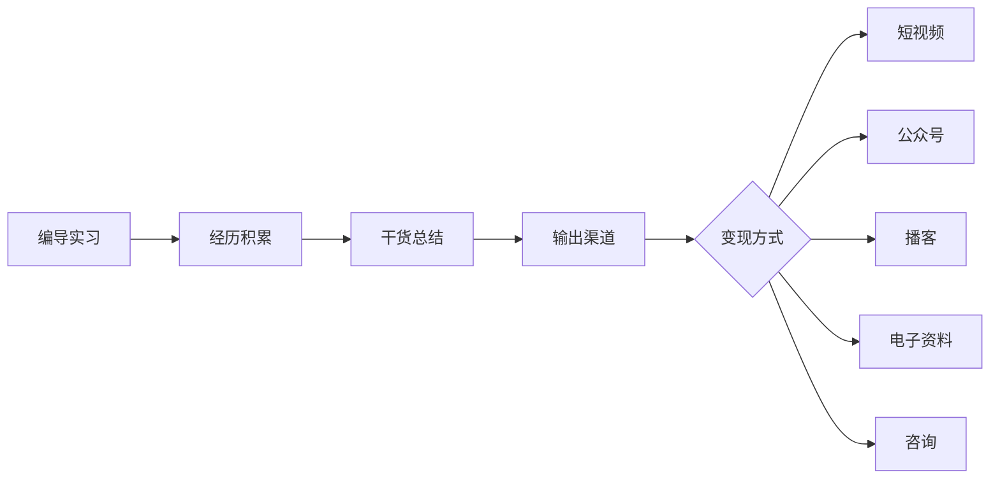

# 📋 第十二节：如何榨干暑期实习价值

> [!INFO] 📌 课程信息
> - **类型**：课程讲解
> - **日期**：2026/07/22
> - **讲师**：浪尖学长
> - **来源**：实习训练营2.0 直播课
> - **分段**：上（开场+心态篇）/ 中（人际关系+信息差）/ 下（商业模式+创业周期）/ 下2（中美AI创业对比）/ 下3（实习最终目的+作品集）/ 下4（SOP+建联+总结）

## 📑 目录

1. [[#一、开场 — 期末与实习现状]]
2. [[#二、操盘手心态 — 从实习生到项目负责人]]
3. [[#三、人大于事 — 人际关系是第一生产力]]
4. [[#四、掠夺信息 — 疯狂阅读公司内部文档]]
5. [[#五、信息差变现与工作变现能力]]
6. [[#六、新个体户的四种商业模式]]
7. [[#七、互联网创业周期与自媒体流量周期]]
8. [[#八、中美AI创业对比 — 叙事派 vs 应用派]]
9. [[#九、IP越来越不值钱，但更要做的逻辑]]
10. [[#十、提前埋种子 — 大学影响力的复利]]
11. [[#十一、实习的最终目的 — 产品·流量·资源]]
12. [[#十二、作品集·SOP·行业认知 — 从点到面的延伸]]
13. [[#十三、建联的野路子 — 主动出击建立联系]]
14. [[#十四、批评学生思维 — 别把校内荣誉当唯一]]
15. [[#十五、课程总结]]

---

## 一、开场 — 期末与实习现状

📌 **课程开场时约58人在线，大部分同学正在期末考期间。**

### 🔍 现状调研

| 问题 | 结果 |
|------|------|
| 拿到offer的同学？ | 约一半一半（1:1） |
| 正在期末考？ | 大多数同学都在期末考 |
| 同时干两份实习？ | 有部分同学同时在干两份实习 |

### 💡 关于期末与实习冲突的建议

> [!TIP] 💡 **跟老师沟通的技巧：**
> - 可以直接跟老师讲你有实习，大部分老师不会难为你
> - 如果老师不让，可以强调这份实习的价值和含金量有多高，包括能赚多少钱——**可以稍微夸张一点**
> - 学校老师不会难为你的

> [!WARNING] ⚠️ **重要提醒：**
> 如果投简历进度慢、投出去没有反馈，**一定要来找我改简历**。

---

## 二、操盘手心态 — 从实习生到项目负责人

📌 **核心要点：不要把自己当实习生，要把自己当成创业者。**

实习就像游戏里的一个副本，每个人的副本难度不同，你能刷到的经验值也不同。真正的操盘手是能够掌握三个核心要素的人：**流量、产品、交付**。能够完整掌握全流程，完成一个完整的项目闭环，才叫操盘手。

### 🔍 两种心态的对比

> [!TIP] 💡 **所有者心态 vs 打工者心态**

| ❌ 打工者心态 | ✅ 操盘手/所有者心态 |
|:------------|:-------------------|
| 害怕工作做不好、怕丢人、怕被辞退 | 把自己当作外部顾问或咨询专家 |
| 战战兢兢完成任务 | 老板付钱请你来交付结果 |
| 只关注"我能不能干好" | 关注"这个产品就是我的" |

✅ 正确做法：
不管是记一个会议纪要、运营一个群、做竞品分析报告，还是剪一条视频，都要用一个**所有者心态**去做——"这个产品就是我的"。

❌ 常见误区：
大部分同学在第一段实习时，leader 安排工作后会花很重的心思去考虑能不能把活干好、做到100分。但事实上：

- 公司不会把特别重要的活交给实习生
- 实习生拿一两千两三千的工资，公司不会太管你
- 做不好对你和公司的影响都不大
- **一般不会被辞退**，公司没这个时间精力

💡 关键认知：
> 做不好，他们比你着急。你是一个实习生，拿钱干活，如果活没干好，不影响你拿工资——除非你是销售岗。

### 📎 关联附件

> [!TIP] 📎 附件资料
> 📄 详见 [[如何压榨实习价值？.pdf]] — 第1页：课程配套资料（图片格式）

---

## 三、人大于事 — 人际关系是第一生产力

📌 **核心要点：在实习过程中，人比事情更重要。**

### 🔍 为什么人比事重要？

🔴 关键结论：
如果有一个工作你只做到了60分，但要求是80分，然而你跟这个人的关系密度很够、私下有交流，那么你做的60分影响不大。**你跟这个人的关系往往比事情本身更重要。**

什么样的实习生拿不到好结果？——只盯着事情干，不跟同事交流，不跟领导交流，单独干事，领导不知道他在干啥。

### ✅ 主动汇报的三种方式

| 汇报类型 | 说明 | 示例 |
|---------|------|------|
| 📊 **工作节点汇报** | 工作没做完但有阶段性节点 | "今天剪到哪个板块，还剩多少，明天几点前能给到" |
| ✅ **工作结果汇报** | 做完一项工作后的完整汇报 | "视频剪完了，我是按这个风格处理的" |
| 🔧 **问题+解决方案汇报** | 遇到问题+你如何判断+如何解决 | "音频有问题，我用了XX方式处理，因为我觉得这个风格适合" |

> [!WARNING] ⚠️ **禁忌**
> - ❌ 不要做一个事情就问一个问题，10分钟的工作问5-6次
> - ❌ 不要没有自己的判断力，每个小点都问
> - ❌ 不要单纯反馈问题，不带方案

💡 频率建议：平均一天一次汇报即可。哪怕今天啥也没干，也要汇报进度。

### 🎯 非正式复盘的力量

| 复盘类型 | 场景 | 收获 |
|---------|------|------|
| 🏢 **正式复盘** | 会议室、线上会议 | 工作内容、正式沟通 |
| ☕ **非正式复盘** | 约饭、咖啡、上厕所 | 私下关系、人生经历、职业思考 |

📌 关键认知：工作关系+私下关系 = 离职后还能保持联系。只有工作关系，离职后什么都没有。

### 📖 真实案例：猎头实习转正

> [!TIP] 💡 **猎头实习转正案例**
> 当时公司有3-4个实习生，转正名额只有一个。单论工作结果也是"我"转正，但让leader坚定支持的原因，是因为**私下吃饭时聊到了自己对未来的想法和想转正的意愿**。在工作关系中讲这句话和私下讲，效果完全不同——私下的沟通让leader即使面对其他leader的反对，也会尽力帮忙争取。

### 💡 人的关系是在互相麻烦中增进的

📖 案例：大学时期请一位校园风云人物来学院做讲座。表面上是"麻烦他"来分享，但实际上作为公众人物，他需要被传播和看见。主动麻烦他之后，就建立了一层关系——未来如果他需要帮助，可能会想到你。

> 不一定是最开始他就帮你，可能是你先让他帮你，你欠他人情，未来他可能会找到你。

---

## 四、掠夺信息 — 疯狂阅读公司内部文档

📌 **核心要点：疯狂地去阅读公司的信息。**

### 🔍 哪些信息值得看？

| 信息类型 | 说明 |
|---------|------|
| 📄 内部文档 | 公司业务介绍、部门职责 |
| 📋 SOP（标准作业程序） | 工作流程、规范标准 |
| 📊 数据报告 | 业务数据、运营指标 |
| 📝 会议纪要 | 跨部门沟通记录、决策背景 |
| 📁 过往案例 | 历史项目复盘 |
| 🔬 行业分析 | 竞品研究、市场趋势 |

> [!TIP] 💡 **为什么要看？**
> 如果只完成老板派给你的任务，你对实习工作的理解是比较单薄的——接一个任务，干一个活。但如果你对公司整体的业务情况有全面的了解，你会感受到：
> - 你的领导为什么要把这件事安排给你
> - 你做这件事的重要程度有多少
> - 它对公司业务的影响有多大
> - **公司是怎么赚钱的**（商业模式、业务模式）
> - 客户是什么样子的
> - 最开始是怎么做起来的

📌 这些东西能让你对手上的工作理解得更全面。

---

## 五、信息差变现与工作变现能力

📌 **核心要点：在实习过程中测试两种核心能力。**

### 1️⃣ 信息差变现能力

你在网上看到很多实习工作干货，但在真实实习过程中，肯定有跟网上不一样的地方。你要去测试：
- 网上教你的 vs 你自己做一遍之后学会的，里面有一个**信息差**
- 你能不能发现这个信息差并利用它

### 2️⃣ 工作变现能力（个人商业模式）

> [!TIP] 💡 **核心问题：你的工作能力能不能实现商业闭环？**

**传统路径：** 去MCN做编导实习 → 未来当编导

**升级路径：** 边实习边学习行业逻辑（流量逻辑、短视频逻辑）→ 把感悟拍成自己的抖音短视频 → 变成有经历、有人设、有干货分享的博主

✅ 可以尝试的测试：
- 实习后能不能自己开个账号接单？
- 能不能接到剪辑单子？
- 能不能把实习内容产品化？

**经历的复用链路：**

---

## 六、新个体户的四种商业模式

📌 **核心要点：实习之后，未来工作或创业有四种适合你们的新个体户模式。**

### 🛠️ 模式一：手艺变现

在一个**细分领域**拥有非常熟悉的技能。

> [!TIP] 💡 **什么是细分领域？**
> - ❌ "剪辑" — 太泛，不是细分领域
> - ✅ "专注于校园自媒体账号的口播剪辑" — 细分
> - ✅ "专注于文旅局宣传片剪辑" — 细分
> - ✅ "专注于电商产品切片视频" — 细分

**其他例子：**
- 健身教练 → 专注"程序员腰肌劳损康复"的健身教练
- 升学咨询 → 专注"双非文科申请英美学校"的升学咨询

> 在2026年这个时间节点，做大而全的创业已经没有太多机会了。**细分才能跑出来。**

### 📱 模式二：内容变现

通过创作内容来变现——你的作品集是你内容变现的一切。

| 手艺变现 | 内容变现 |
|---------|---------|
| 帮博主剪视频（执行层） | 出剪辑课、做代运营（业务层） |
| 靠剪辑技能赚钱 | 招实习生接企业代运营单子 |
| 类似影视飓风帮人剪辑 | 类似影视飓风出剪辑课 |

### 🔗 模式三：拉皮条（资源对接）

- 中介
- 电子资料
- 私域团长
- 微商
- 闲鱼创业

### 🌍 模式四：技能全球化

**📖 案例：摄影师朋友**
1. 在杭州西湖边接拍照单子（200元/小时）
2. 发现杭州有季节性波动（寒暑假多，平时少）
3. 跑到韩国首尔接单（500元/小时）
4. 一个月在韩国，一个月在杭州
5. 赚更多钱，人更轻松，还能顺便旅游

> **前提：** 你有一个技能 + 你有获客能力（小红书/抖音） + 能跑通这个模式

📖 更多数字游民案例：
- **演唱会化妆：** 演唱会开始前专门接化妆单子，一个人几百块钱（杭州演唱会很多）
- **迪士尼租道具：** 在迪士尼门口租周边帽子、米奇帽等拍照道具
- **AI操盘手：** 帮传统企业做AI数字化转型（线上远程）

> 💡 特别适合技能全球化的是**AI**。很多传统企业需要AI数字化转型，但付不起一线城市的高薪资，他们会找线上的AI操盘手帮你做公司的业务升级和工作流。这种情况**特别适合远程非全职**，全职也没有太大意义。

**AI操盘手的市场现状：**
- 很多公司对AI有很重的需求，但不知道在哪里找人
- 他们不知道谁能用AI、谁不能用AI
- 找到了也不知道是真的还是假的
- 没有那高的预算去招一个全职

---

## 七、互联网创业周期与自媒体流量周期

📌 **核心要点：了解行业发展周期，找准自己的位置。**

### 📊 四个发展阶段

#### 阶段1️⃣：2018-2020 — 偷流量

**特点：** 抖音快手刚起来，做了就有流量，不需要投流。你只要拍视频、只要直播，就能拉来客户。你都不知道怎么投流，因为平台刚起来。

**核心策略：** 做账号 → 拉私域 → 卖产品

> 早期谁做谁赚。前期因为都没人做，只要你做了就有人。10个博主能拉100个人。

#### 阶段2️⃣：2020-2022 — 私域深耕

**特点：** 流量越来越贵，转化率下降。做这件事的人多了，工作不好做了。一天能拉100个人变成一天只能拉20个人。

**核心策略：** 投流 + 精细化运营私域

> 人多了就比较难拉进来了，拉进来之后因为大家见得太多了，转化率也降了。

#### 阶段3️⃣：2022-2025 — IP运营

**特点：** 需要信任才能转化。流量贵了、转化率低了，能来买东西的需要对你有信任。

**核心策略：** 打造IP，代运营大量出现

> ⚠️ 这个阶段也诞生了很多被代运营割韭菜的——收你5万块钱、9万9千8，结果只给你做500个粉丝。

#### 阶段4️⃣：2026+ — 降本增效+全球化

**特点：** 利润降低，AI兴起。在这个阶段花5万做账号可能只能赚6万（以前能赚10万）。

**核心策略：** 降本、AI赋能、跨境出海

> 很多做自媒体的人看到了一些限制，收益慢慢降下来。杭州很多网红公司在这个阶段利润已经不足以支撑，纷纷跑路。

### 📊 各阶段总结对比

| 阶段 | 时间 | 特点 | 核心策略 |
|:---:|:----|:----|:--------|
| 1️⃣ | 2018-2020 | 偷流量：做了就有流量 | 做账号→拉私域→卖产品 |
| 2️⃣ | 2020-2022 | 私域深耕：流量变贵 | 投流 + 精细化运营 |
| 3️⃣ | 2022-2025 | IP运营：需要信任 | 打造IP（但也催生割韭菜） |
| 4️⃣ | 2026+ | 降本增效+全球化 | AI赋能、跨境出海 |

### 🎭 真实案例：头部博主的利润变化

- **小杨哥（三只羊）**、**广东夫妇**、**贾乃亮**、**朱梓骁**、**董先生**、**王祖蓝**等带货博主——在这些阶段利润很高，投入没那么多钱，但慢慢到这个阶段投流的钱越来越多，利润不太能够支撑了
- **向左（向佐）** 现在还可以，因为产品客单价高，利润能够撑得起来
- **李佳琦** 最开始利润率挺高的，后面因为人多了、组织多、流量没那么高了，就拖不动了
- **娱乐直播的时代已经结束了**

> 💡 **IP时代也快要结束了**——未来两三年之后人人都是IP了。到2026年甚至到2030年左右，IP会变成一个很正常的事情，博主是一个很正常的身份了，它变成**基础设施**了。AI也一样，它不是一个效率工具，它就是一个基础设施。

---

## 八、中美AI创业对比 — 叙事派 vs 应用派

📌 **核心要点：美国AI创业集中在硅谷，中国AI创业集中在杭州。两者有明显区别。**

### 🇺🇸 美国模式：信仰/资本泡沫/叙事派

| 维度 | 说明 |
|------|------|
| **集中地** | 硅谷 |
| **模式** | 靠叙事——要改变世界，用科技去融资 |
| **代表人物** | 马斯克（叙事就是趋势） |
| **口号** | 改变世界、技术愿景、融资愿景 |
| **逻辑** | 把产品做出来 → 烧钱融资 → 上市 → 通过股票收割 → 泡沫结束 |
| **参与人群** | 工程师、科学家 |
| **关键词** | 造势、资本泡沫、底层创新 |

### 🇨🇳 中国模式：应用驱动/快速变现/极度务实

| 维度 | 说明 |
|------|------|
| **集中地** | 杭州 |
| **模式** | 教你怎么用AI工具去做具体的事 |
| **典型内容** | 教你怎么用AI做短视频、做设计、做短剧 |
| **逻辑** | 发现某个具体行业的需求 → 给出AI解决方案 → 靠销售和运营推到市场 |
| **关键词** | 产品、场景、制造需求、极度务实、极度内卷 |
| **特点** | 同质化严重，慢慢过渡到拼服务、打价格战 |

### 💡 深度分析

| 对比维度 | 美国 | 中国 |
|---------|------|------|
| 核心驱动力 | 技术愿景 | 应用场景 |
| 创业门槛 | 极高（顶尖科学家/商业家） | 全民创业 |
| 风格 | 叙事派、造势 | 极度务实、内卷 |
| 能走这种路线的 | 只有DeepSeek、阿里、字节等巨头 | 大部分普通创业者 |

> 💡 中国这边适合AI创业的路线：AI+教育、AI+营销、AI+设计、AI+产品的等等。**本质是产品，本质是场景，制造需求。**

---

## 九、IP越来越不值钱，但更要做的逻辑

📌 **核心要点：未来IP越来越不值钱，所以我们更要做IP。**

### 🔍 核心逻辑

> 不是因为做IP很值钱、IP很少，所以我们要做IP；而是因为未来IP越来越不值钱，所以我们更要做IP。

**📖 案例（俞浩讲过的）：**
- 一个百万粉丝的博主，在过去一个月可能赚10万块钱
- 但在现在一个月可能只能赚1万-2万，甚至不如一个打工人赚得多

### 📊 成本效率对比

| 时间 | 1万广告费能带来的销售额 |
|:---:|:---------------------|
| 10年前 | 10万 |
| 今年 | 2万 |
| 未来2-3年（如果不做自媒体） | 连500块都卖不到 |

> 不是因为我做这件事情能帮我赚很多钱，所以我来做；而是因为未来做的人越来越多，它越来越不值钱了，它变成了一个基础设施，大家都有，所以我更要做。**如果我不做，我就没办法降本增效。**

### 📱 手机类比

以前用诺基亚的时候，有一个智能手机是你的优势。但如果你那个时候不慢慢开始用，现在你有一个手机它就不是你的优势了。不是因为手机很值钱，而是它未来越来越变成一个人人都有的东西，所以你必须做。

> 别人有的你都没有，那你的东西就少了。并且在你的学历优势、专业优势、家庭背景、家庭资源等起跑线上都没有那么多优势的情况之下，你更需要有更多优势。你多一个不够，可能得在自媒体领域、传播领域给别人拉出**10倍的优势**，才能弥补跟别人的差距。

### 💡 门槛降低的现实

剪辑门槛也在降低——很多剪辑师失业了。开拍APP出来之后，口播视频基本上不需要再用很高端的剪辑师了，一个实习生就能解决。

---

## 十、提前埋种子 — 大学影响力的复利

📌 **核心要点：你现在做的事情，未来会在大学里产生复利效应。**

### 🔍 三个可预见的未来场景

**1️⃣ 学院优秀学长学姐采访**
- 大部分学校都有"优秀学长学姐"栏目（如"财同学"）
- 如果你大一就拿到实习，大三大四一定会被采访
- 提前准备好你的履历和故事

**2️⃣ 回校宣讲**
- 如果自媒体账号做起来了，毕业可能被邀请回校做就业/创业讲座
- 优秀校友回校宣讲是很常见的

**3️⃣ 获得学校资源倾斜**
- 如果你有足够的影响力（如百万粉大学教育博主），学校会主动帮你解决问题
- 挂科？院长会直接帮你安排
- 竞赛？学院倾全院之力帮你

> 学院多少年没出一个牛逼的学生了。你出来之后，其他问题都会给你解决的。

📖 真实案例：
- **四川轻化工大学某博主**：每年学校宣传都找他
- **浙大陈贤**：四级考了很多次，不影响大学直播带货赚钱
- 这些人的共同点：**有影响力、有生产力**

---

## 十一、实习的最终目的 — 产品·流量·资源

📌 **核心要点：实习最大的目的是增加社会性，增加对商业的理解和认知，尽快完成社会化，完成商业闭环。**

> 不是单纯的说我完成一份实习之后未来一定能找到好工作，它只是一个最表层的东西。

### 🎯 实习过程中需要积累的三样东西

#### 第一步：发现你的产品

不管是你的技能还是你创作的内容，都是属于你的产品或你能做的服务。

**📖 案例：** 你一个大一的文科生，找到了一份AI的实习，成功转行了——你未来是不是有可能专门去帮人做"文科生怎么转行进入AI行业"的服务或者咨询或者这种产品？

> 你们现在做的很多东西是能够延伸到未来的产品里面的。

#### 第二步：积累流量能力/口碑/人设

| 渠道 | 说明 |
|------|------|
| 📱 自媒体账号 | 长期积累的东西 |
| 🎤 参加活动/行业论坛 | 扩大影响力 |
| 📝 朋友圈 | 日常经营个人品牌 |
| 🏆 学校结果/项目结果 | 身份背书 |

#### 第三步：吸引资源

这个资源有可能是一个产品、一个优秀的合伙人、一些投资，或者某些团队合作的机会。

> 到了这个阶段，你基本上已经能掌握创业的所有要素。到了大三大四，基本上就是大家所有人都有的。

### 💡 核心认知

> 很多同学有一个误区：刷了2个实习、3个实习，未来一定好找工作。刷了3个实习就一定比刷过1个实习的人拿的薪资更高？其实不一定。

**实习的本质是让你成为一个能赚钱的手艺人**——这个手艺需要你慢慢去摸索：你会什么东西？你喜欢做什么东西？你喜欢卖什么东西？然后慢慢地用AI、用流量、用影响力去放大，找到你的客户，慢慢地赚到钱。

> 之前很多同学跟我讲，觉得浪尖教的东西太多了——又教自媒体、又教实习、又教销售，觉得自己学不过来，又要去学校里面考四六级、考普通话证书，觉得完全顾不过来。但**本质上都是在做一件事情**。

### 🎯 训练营的本质

训练营的本质不只是教大家怎么去投简历、怎么去面试这么简单。因为只要你离开了学校、进入到社会，在工作本身当中、在业务当中，你就会发现很多之前在学校里面碰不到的东西——它真的不是单纯的怎么写简历怎么面试，它比这两个板块要多很多。**它是关于商业的、关于业务的、关于赚钱的。**

---

## 十二、作品集·SOP·行业认知 — 从点到面的延伸

📌 **核心要点：在实习过程中要尽早建立作品集，写SOP，延伸行业认知。**

### 📁 作品集

不管你是做剪辑的、AI视频的、AI海报设计的——**一定要尽早建立你的作品集**。哪怕你是在帮别人试剪一条视频，那个试剪的视频也可以成为你的作品集。

### 📝 SOP（标准作业程序）

一定要在实习过程中写SOP。浪尖学长以前做直播的时候写的SOP非常详细：

**📖 直播运营SOP示例（浪尖学长实际写过的）：**

| 板块 | 内容 |
|------|------|
| **商品部分（BD）** | 商务对接、筛选产品（品牌方给产品后怎么筛选适合的产品）、对接商家、发产品表、寄样 |
| **产品管理** | 产品集中后试吃/试用（一周一次，有单独的成名表）、反馈哪些合适哪些不合适 |
| **入库与上架** | 合适的入库、不合适的淘汰（作为员工福利）、链接审核、谈佣金和价格、审核资质 |
| **上新与比价** | 全网上架、比价（短期有无其他达人卖过且价格更低的） |
| **直播准备** | 种草视频拍摄、投流预算、买赠/福袋等 |
| **直播执行** | 排品、塑品、手卡、物料设计、助播怎么弄、中控怎么弄 |
| **画面参数** | 瘦脸、镜像、角度、亮度、光圈、距离、曝光——**写得非常详细** |
| **设备清单** | 麦、手机、降温板、插线板、灯光 |
| **产品细节** | 每个产品的保质期是否新鲜、生鲜产品需准备厨具和半成品 |
| **售后** | 对接物流、店铺维护、控价（一个月内或一周内其他直播间不能卖更低） |

> 💡 你以为你只是个直播运营，但你在做BD商务的时候，可以提前了解到品牌方那边的东西；你在做链接的时候，可以了解到不同价格、不同详情页对曝光率、点击率、转化率的影响。
>
> **以一个点为出发点，然后像蜘蛛网一样延伸，其他点都全部了解清楚，对这个行业的了解就非常完整了。**

### 🔍 行业认知延伸

| 岗位 | 可延伸了解的方向 |
|------|----------------|
| 直播运营 | BD商务、品牌方运作、链接优化、投流 |
| 私域运营 | 微信群运营、朋友圈运营 |
| 数据分析 | 曝光率、点击率、转化率的关联 |

> 包括打光——杭州有很多专门做打光的公司，大到一个打光能成为一个岗位。有卖直播设备的、有租直播灯光的、有专门帮你调光的调光师。浪尖学长当时主动付了1000块钱，找了一个杭州最牛的直播设备公司的二把手教他怎么打光。

---

## 十三、建联的野路子 — 主动出击建立联系

📌 **核心要点：只要有一个借口、有一个理由、有一个契机，你就能去建联，就值得去建联。**

### 📖 案例一：城市猎人综艺

> 有一个综艺叫《城市猎人》（类似《令人心动的offer》，讲猎头行业的）。当时浪尖学长在做猎头，看到这个综艺的官方微博发了参赛实习生的名单，就**主动私信了被@出来的所有实习生**——大概8个人中有5-6个都回了，都加了微信。其中一个人后面还玩得很好，他做新的账号都会找浪尖参考。

结果：这个综艺出来之后，有些人小火了，从几十个粉丝涨到几千个、几万个粉丝。**浪尖提前联系了一半以上的人。**

> 有些东西不是你刻意地想要有什么目的，或者刻意地想要获得什么好处做的——有可能只是你基于你现在的平台、基于你现在做的事，你能够**顺手做的**。我觉得你可以做很多。

### 📖 案例二：高顿HR头头

> 在一个线下活动认识了高顿的HR头头（一个女生）。毕业时候她还喊去他们公司面试，让自己开薪资。虽然没有去，但这就是在**非常非正式的场合、在线下活动里面取巧的方式**认识的。

### 💡 建联的核心原则

- **野路子有时候比正规军的打法有用很多**
- 只要有一个借口、有一个理由、有一个契机，你能去建联，就值得去建联
- 哪怕暂时用不到也没关系——**先建联了再说**

---

## 十四、批评学生思维 — 别把校内荣誉当唯一

📌 **核心要点：只要你在学生思维里面、在应试思维里面，你不管做得再好，都是很小儿科的。**

### 🔍 现象批判

看到网上很多专科生在毕业典礼上发一堆获奖证书，放很燃的音乐，觉得这种很扯——**一点社会性都没有**。分不清哪些东西有含金量、哪些没有含金量。

> 他们把一些很学生思维、很应试的成绩或者应试世界里面的东西，拿到商业世界里面来，还以为他拿的那个东西很有含金量、很有价值。但在商业世界里面，你哪怕拿到一点点结果，你的本质都是跟他们有本质区别的。

### ⚠️ 具体表现

| 问题 | 说明 |
|------|------|
| **学生会主席又怎样？** | 连一份完整的简历都没有，手上连几个HR都不认识 |
| **大专学生会主席？** | 含金量可能不如你剪了一条视频、写了一条文案、做了一个简历网站 |
| **你可以有这些荣誉** | 但不要把它当成你的唯一，不要觉得你比别人牛逼很多 |

> 你当真了你就输了，你当真了你就还是一个学生思维。最可怕的是——**他不知道自己哪里有问题。**

---

## 十五、课程总结

> [!CAUTION] 🔴 **核心一句话：实习最大的目的是增加你的社会性，完成你的商业闭环。**

| 维度 | 关键要点 |
|------|---------|
| 🎯 **操盘手心态** | 把自己当成项目负责人而不是实习生，用所有者心态做事 |
| 🤝 **人大于事** | 主动汇报（节点/结果/问题+方案）、建立私下关系、在互相麻烦中增进关系 |
| 📚 **掠夺信息** | 疯狂阅读公司内部文档、SOP、数据报告、会议纪要，理解商业模式 |
| 💰 **信息差+工作变现** | 测试自己的能力能否形成商业闭环 |
| 🏗️ **新个体户四种模式** | 手艺变现、内容变现、拉皮条、技能全球化——选一个细分领域深耕 |
| 📈 **理解周期** | 从偷流量→私域深耕→IP运营→降本增效/全球化，找准自己在哪个阶段 |
| 🌱 **埋种子** | 大学影响力的复利效应——优秀学长采访、回校宣讲、学校资源倾斜 |
| 📁 **作品集+SOP** | 尽早建立作品集，写SOP延伸行业认知 |
| 🔗 **建联野路子** | 只要有契机就去建联，先建联了再说 |
| ⚠️ **告别学生思维** | 别把校内荣誉当唯一，商业世界不看这个 |

---

## 🔗 相关笔记

- [[01.第一节：赋能启动课]] — 赋能启动课：训练营正确姿势与入营7件事
- [[13.第十三节：实习训练营总结课以及未来职业方向规划]]
- [[面试系列直播课总结（包括如何租房等等）]]
- [[实习到什么时候可以跑路]]
- [[面试框架]]
